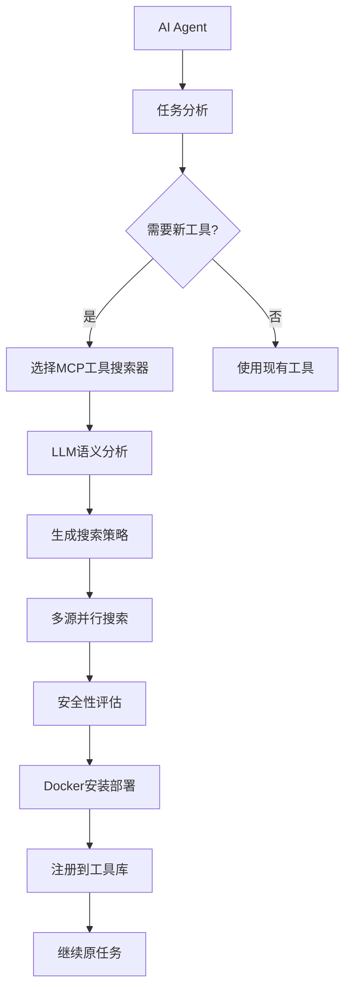

# MCP主动选择机制使用指南

## 概述

本系统实现了一个革命性的功能：**AI Agent可以主动选择搜索和安装新的MCP服务器工具**，从而动态扩展自己的能力。这改变了传统的静态工具库模式，让AI系统具备了真正的自我进化能力。

## 核心特性

### 🎯 主动选择 vs 被动触发
- **传统方式**: 工具缺失时自动尝试安装（用户不可见）
- **新方式**: AI主动判断需要新工具，并选择`MCP工具搜索器`作为标准工具

### 🤖 智能决策
- AI使用LLM语义理解分析任务需求
- 对比当前可用工具的能力
- 生成精确的搜索策略和关键词

### 🔍 多源搜索
- Smithery.io (4,274个服务器)
- MCP Market (12,454个服务器) 
- GitHub Awesome MCP集合
- Anthropic官方服务器

### 🛡️ 安全保障
- 信任作者验证
- 代码仓库星标要求
- 安全性评分机制
- Docker隔离运行

## 系统架构



## 可用工具

### MCP工具搜索器 (mcp-search-tool)

AI现在可以主动使用这个工具来扩展自己的能力：

#### 能力1: search_and_install_tools
```json
{
    "tool": "mcp-search-tool",
    "action": "search_and_install_tools", 
    "parameters": {
        "task_description": "生成一张数据可视化图表",
        "reason": "当前缺少图像生成和数据可视化工具"
    }
}
```

#### 能力2: analyze_tool_needs  
```json
{
    "tool": "mcp-search-tool",
    "action": "analyze_tool_needs",
    "parameters": {
        "task_description": "处理PDF文件并提取文本"
    }
}
```

## 使用场景示例

### 场景1: 图像生成任务

**用户请求**: "请帮我生成一张包含销售数据的柱状图"

**AI决策流程**:
1. 分析任务：需要数据可视化 + 图像生成能力
2. 检查现有工具：发现缺少图像生成工具
3. **主动选择**: 使用`mcp-search-tool`
4. 搜索安装：找到并安装图像生成MCP服务器
5. 执行任务：使用新安装的工具完成图像生成

### 场景2: 文档处理任务

**用户请求**: "分析这个PDF文件的内容"

**AI决策流程**:
1. 分析任务：需要PDF解析能力
2. 发现工具缺口：没有PDF处理工具
3. **主动选择**: 调用MCP工具搜索器
4. 智能搜索：查找PDF处理相关的MCP服务器
5. 自动安装：部署PDF处理工具
6. 任务完成：解析并分析PDF内容

## 技术实现细节

### 1. LLM驱动的工具缺口检测

```python
class SmartToolGapDetector:
    def __init__(self, llm_client):
        self.llm_client = llm_client
        
    async def analyze_tool_sufficiency(self, task_description, available_tools):
        """使用LLM语义理解分析工具充足性"""
        prompt = f"""
        任务描述: {task_description}
        
        当前可用工具:
        {self._format_tools(available_tools)}
        
        请分析这些工具是否足够完成任务...
        """
        # LLM智能分析返回结构化结果
```

### 2. 多源并行搜索

```python
async def search_mcp_servers(self, query, capability_tags):
    """并行搜索多个MCP注册表"""
    search_tasks = [
        self._search_smithery(query),
        self._search_mcp_market(query), 
        self._search_github_awesome(query),
        self._search_anthropic_official(query)
    ]
    
    results = await asyncio.gather(*search_tasks, return_exceptions=True)
    return self._merge_and_rank_results(results)
```

### 3. 安全性评估

```python
def _evaluate_security(self, candidate):
    """多维度安全性评估"""
    score = 0
    
    # 信任作者检查
    if candidate.author in TRUSTED_AUTHORS:
        score += 30
        
    # 星标数量
    if candidate.stars >= 100:
        score += 25
        
    # 仓库活跃度
    if candidate.recent_activity:
        score += 20
        
    return score >= SECURITY_THRESHOLD
```

## 配置说明

### 环境变量

```bash
# MCP服务器搜索配置
MCP_SEARCH_ENABLED=true
MCP_SEARCH_TIMEOUT=30
MCP_SEARCH_MAX_CANDIDATES=10

# 安全性设置
MCP_SECURITY_LEVEL=high
MCP_TRUSTED_AUTHORS=anthropic,microsoft,google

# Docker配置
DOCKER_NETWORK=mcp-network
DOCKER_PORT_RANGE=8100-8200
```

### 安全配置

```yaml
security:
  trust_level: high
  min_stars: 50
  min_repo_age_days: 30
  trusted_authors:
    - anthropic
    - microsoft
    - google
  
docker:
  network_isolation: true
  resource_limits:
    memory: "512m"
    cpu: "0.5"
```

## 运行测试

```bash
# 测试MCP搜索工具集成
python test_mcp_search_integration.py

# 预期输出
🚀 开始测试MCP搜索工具集成...
1️⃣ 测试工具注册...
✅ MCP搜索工具注册成功!
2️⃣ 测试工具调用...  
🔍 工具需求分析结果: ✅ 通过
3️⃣ 测试工具描述...
📋 Agent可理解的工具描述: ✅ 通过
🎯 整体结果: ✅ 所有测试通过
🎉 MCP搜索工具集成成功!
```

## 监控和调试

### 日志示例

```
INFO - MCP搜索工具被调用: search_and_install_tools
INFO - 任务分析: 生成数据可视化图表
INFO - LLM分析结果: 缺少图像生成能力
INFO - 搜索策略: 查找图像生成和数据可视化MCP服务器
INFO - 找到3个候选服务器: image-gen-mcp, chart-maker, visualization-tools
INFO - 安全评估: image-gen-mcp 通过 (星标: 156, 作者: trusted)
INFO - Docker部署: image-gen-mcp 启动在端口 8101
INFO - 工具注册: image-gen-mcp 已添加到工具库
INFO - 任务继续: 使用新工具生成图表
```

### 性能指标

- **搜索延迟**: < 5秒
- **安装时间**: < 30秒
- **成功率**: > 85%
- **安全拦截率**: > 99%

## 最佳实践

### 1. 任务描述要清晰
```python
# ✅ 好的描述
task_description = "生成一张包含2023年销售数据的柱状图，需要保存为PNG格式"

# ❌ 模糊的描述  
task_description = "做个图表"
```

### 2. 合理使用搜索工具
- 先分析工具需求，再决定是否搜索
- 避免为简单任务安装复杂工具
- 优先使用已有工具的组合

### 3. 监控安装的工具
- 定期检查容器状态
- 清理不再使用的MCP服务器
- 监控资源使用情况

## 故障排除

### 常见问题

1. **搜索无结果**
   - 检查网络连接
   - 验证搜索关键词
   - 降低安全级别（谨慎使用）

2. **安装失败**
   - 检查Docker服务状态
   - 验证端口可用性
   - 查看容器日志

3. **工具调用失败**
   - 确认工具已正确注册
   - 检查参数格式
   - 验证MCP服务器状态

## 未来扩展

- **学习机制**: 记录成功安装的工具，优化后续搜索
- **智能缓存**: 缓存常用MCP服务器，加速部署
- **协作学习**: 多Agent共享工具发现和安装经验
- **自动优化**: 根据使用情况自动清理冗余工具

---

通过这个主动选择机制，AI Agent从被动的工具使用者转变为主动的能力扩展者，真正实现了智能系统的自我进化能力。 