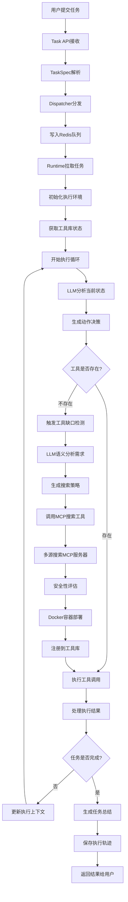

# MCP主动选择机制 - 完整任务执行流程详解

## 📋 概述

本文档详细解释了Agent Data Platform中任务从用户提交到最终完成的完整执行流程。系统的核心创新在于**AI Agent能够主动发现工具缺口、搜索并安装新的MCP服务器工具**，实现真正的自我进化能力。

## 🏗️ 系统架构总览

### 核心组件

1. **Dispatcher** - 任务分发器，负责将任务路由到对应的Runtime
2. **ReasoningRuntime** - 智能推理运行时（两个版本）
   - 基础版本：使用内置工具
   - 增强版本：支持动态MCP工具管理
3. **UnifiedToolLibrary** - 统一工具库，管理所有工具
4. **DynamicMCPManager** - 动态MCP服务器管理器
5. **MCPSearchTool** - MCP搜索和安装工具
6. **ToolGapDetector** - 智能工具缺口检测器

### 支持的Runtime类型

- **ReasoningRuntime** (`reasoning`): 智能推理，支持多工具组合
- **SandboxRuntime** (`code`): 代码执行沙盒
- **WebRuntime** (`web`): Web导航和数据抓取

## 🔄 完整执行流程图



## 阶段一：任务入口和分发

### 1.1 任务提交接收
**涉及文件**: `core/dispatcher.py`

用户通过tasks.jsonl文件提交任务：
```json
{
    "task_id": "demo_task_001",
    "task_type": "reasoning",
    "description": "请帮我生成一张销售数据的柱状图",
    "max_steps": 10
}
```

### 1.2 任务解析和分发
**涉及文件**: `core/dispatcher.py`

```python
class TaskDispatcher:
    # 队列映射关系
        queue_mapping = {
            TaskType.CODE: "tasks:code",
            TaskType.WEB: "tasks:web",
            TaskType.REASONING: "tasks:reasoning"
        }
        
    # 分发逻辑：根据任务类型写入对应Redis队列
    await redis.xadd(queue_name, {
            "task": task.json(),
            "submitted_at": time.time(),
            "priority": task.priority
        })
```

## 阶段二：运行时初始化

### 2.1 Runtime版本选择

**基础ReasoningRuntime** (`runtimes/reasoning/runtime.py`):
- 内置工具：browser, python_executor
- 适用于简单的推理任务

**增强ReasoningRuntime** (`runtimes/reasoning/enhanced_runtime.py`):
- 支持动态MCP工具管理
- 智能工具缺口检测
- 自动工具安装能力

### 2.2 任务拉取和环境准备

```python
class EnhancedReasoningRuntime:
    async def execute(self, task: TaskSpec):
        # 1. 初始化执行状态
        trajectory_id = str(uuid.uuid4())
        steps = []
        current_context = {
            "browser_state": None,
            "execution_history": [],
            "installed_tools": []
        }
        
        # 2. 获取工具库状态
        all_tools = await self.tool_library.get_all_tools()
        tools_description = await self.tool_library.get_all_tools_description_for_agent()
```

## 阶段三：智能决策循环

### 3.1 LLM推理决策
**涉及文件**: `core/llm_client.py`

每个执行步骤都会调用LLM进行智能分析：

```python
for step_id in range(1, task.max_steps + 1):
    # 生成推理决策（增强版本）
    decision = await self.client.generate_enhanced_reasoning(
        task_description=task.description,
        available_tools=available_tools_ids,
        tool_descriptions=tools_description,
        previous_steps=previous_steps,
        execution_context=current_context
    )
    
    # 解析决策结果
    action = decision.get('action')
    tool_id = decision.get('tool_id')
    params = decision.get('parameters', {})
    thinking = decision.get('thinking')
```

### 3.2 LLM决策示例

**智能工具选择**：当面对"生成销售数据柱状图"任务时，LLM的思考过程：

```json
{
    "thinking": "用户需要生成销售数据的柱状图。分析当前工具：有python_executor可以处理数据，但缺少图像生成工具。需要先搜索图像生成相关的MCP服务器。",
    "action": "search_and_install_tools",
    "tool_id": "mcp-search-tool",
    "parameters": {
        "task_description": "生成一张销售数据的柱状图",
        "reason": "缺少图像生成和数据可视化工具"
    },
    "confidence": 0.9
}
```

## 阶段四：动态工具管理（增强版本特有）

### 4.1 工具缺口检测
**涉及文件**: `core/toolscore/tool_gap_detector.py`

```python
class SmartToolGapDetector:
    async def analyze_tool_sufficiency(self, task_description, available_tools):
        """
        使用LLM语义分析：
        1. 构建详细分析提示
        2. 调用LLM智能判断
        3. 返回结构化分析结果
        """
        
        analysis_prompt = f"""
        任务描述: {task_description}
        当前工具: {available_tools}
        
        请分析：
        1. 任务需要什么功能？
        2. 现有工具能否实现？
        3. 缺少什么关键能力？
        4. 推荐搜索策略？
        """
        
        response = await self.llm_client._call_api(analysis_prompt)
        return self._parse_analysis_response(response)
```

### 4.2 MCP服务器搜索
**涉及文件**: `core/toolscore/dynamic_mcp_manager.py`

```python
async def search_mcp_servers(self, query, capability_tags):
    """多源并行搜索MCP服务器"""
    
    # 搜索源配置
    registries = {
        "mock_registry": "mock://internal/registry",
        "github_public": "https://raw.githubusercontent.com/...",
    }
    
    # 并行搜索任务
    search_tasks = []
    for registry_name, registry_url in registries.items():
        search_tasks.append(
            self._search_registry(registry_name, registry_url, query, capability_tags)
        )
    
    # 执行并合并结果
    results = await asyncio.gather(*search_tasks, return_exceptions=True)
    candidates = self._merge_and_score_candidates(results)
    
    return candidates[:10]  # 返回前10个最佳候选者
```

### 4.3 MCP搜索工具注册
**涉及文件**: `runtimes/reasoning/enhanced_runtime.py`

增强版本会自动注册MCP搜索工具：

```python
async def _register_mcp_search_tool(self):
    """注册MCP搜索工具为一个可用工具"""
    
    search_capability = ToolCapability(
        name="search_and_install_tools",
        description="立即搜索并安装新的MCP服务器工具来完成当前任务",
        parameters={
            "task_description": {
                "type": "string",
                "description": "当前任务的描述",
                "required": True
            },
            "reason": {
                "type": "string", 
                "description": "为什么需要搜索新工具的原因",
                "required": False
            }
        }
    )
```

## 阶段五：工具执行

### 5.1 标准工具调用
**涉及文件**: `core/toolscore/unified_tool_library.py`

```python
# 通过统一工具库执行
result = await self.tool_library.execute_tool(tool_id, action, params)

# 处理执行结果
if result.success:
    observation = json.dumps(result.data)
    tool_success = True
else:
    observation = result.error_message
    tool_success = False
```

### 5.2 工具调用类型

**基础版本支持的工具**：
- `browser_navigate` - 浏览器导航
- `browser_click` - 页面点击
- `browser_get_text` - 文本提取
- `python_execute` - Python代码执行
- `python_analyze` - 数据分析
- `python_visualize` - 数据可视化

**增强版本额外支持**：
- `search_and_install_tools` - 动态工具安装
- `analyze_tool_needs` - 工具需求分析
- 所有动态安装的MCP服务器工具

## 阶段六：结果处理和轨迹保存

### 6.1 任务完成检测

```python
# 检查是否完成
completion = await self.client.check_task_completion(
        task.description, 
        [s.__dict__ for s in steps], 
        current_outputs
    )
if completion.get('completed'):
    success = True
    break
```

### 6.2 轨迹数据保存

```python
trajectory = TrajectoryResult(
    task_name=task.task_id,
    task_id=trajectory_id,
    task_description=task.description,
    runtime_id=self.runtime_id,
    success=success,
    steps=steps,
    final_result=final_result,
    total_duration=total_duration,
    metadata={'confidence': confidence}
)
    
# 保存到集合文件
collection_file = os.path.join(out_dir, "trajectories_collection.json")
```

## 🔧 实际部署配置

### Docker Compose配置

当前系统通过Docker Compose部署，主要服务包括：

1. **Redis** - 任务队列
2. **Dispatcher** - 任务分发
3. **Reasoning-Runtime** - 推理运行时
4. **Sandbox-Runtime** - 代码执行运行时
5. **Web-Runtime** - Web导航运行时

### 环境变量配置

```bash
# LLM API配置
GEMINI_API_KEY=your_api_key
GEMINI_API_URL=your_api_url

# Redis配置
REDIS_URL=redis://redis:6379

# 功能开关
DISABLE_CACHE=false
SAVE_INDIVIDUAL_TRAJECTORIES=false
```

## 🚀 使用示例

### 简单任务示例
```json
{
    "task_id": "calculate_fibonacci",
    "task_type": "reasoning",
    "description": "使用Python计算5的阶乘",
    "max_steps": 3
}
```

### 复杂任务示例
```json
{
    "task_id": "research_task",
    "task_type": "reasoning", 
    "description": "搜索新加坡国立大学IORA研究所的教授信息，并生成研究领域分析图表",
    "max_steps": 15
}
```

## 📊 监控和调试

### 轨迹分析

所有任务执行都会生成详细的轨迹记录，包括：
- 每个步骤的LLM思考过程
- 工具调用参数和结果
- 错误信息和重试记录
- 总执行时间和成功率

### 性能指标

系统提供Prometheus监控指标：
- 任务完成率
- 平均执行时间
- 工具调用成功率
- 动态工具安装统计

## 🔍 故障排查

### 常见问题

1. **工具调用失败** - 检查工具服务器状态
2. **LLM决策错误** - 查看thinking日志分析
3. **MCP安装失败** - 验证Docker环境和网络
4. **任务超时** - 调整max_steps参数

### 调试技巧

- 查看`trajectories_collection.json`了解详细执行过程
- 检查容器日志排查具体错误
- 使用健康检查接口验证服务状态

## 📚 相关文档

- [MCP主动选择机制使用指南](MCP_主动选择机制使用指南.md)
- [系统架构分析](ARCHITECTURE_ANALYSIS.md)
- [快速开始指南](QUICK_START.md)
- [外部API配置指南](docs/外部API配置指南.md)

---

**总结**: Agent Data Platform通过智能的任务分发、动态工具管理和上下文感知的决策机制，实现了从简单任务执行到复杂问题解决的全自动化处理。系统的核心优势在于AI Agent能够根据任务需求主动扩展工具能力，真正实现了自我进化的智能代理系统。