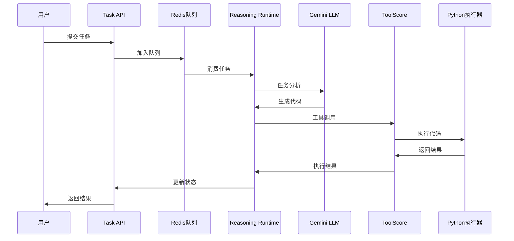

# Agent Data Platform

🚀 **智能代理数据平台** - 基于MCP协议的多模态AI任务执行框架

## 📖 项目简介

Agent Data Platform是一个先进的智能代理系统，旨在构建可扩展的AI任务执行和数据处理平台。该系统采用**模块化微服务架构**，结合**大语言模型推理**和**工具调用能力**，为复杂任务的自动化执行提供完整解决方案。

### 🎯 核心特性

- **🧠 智能推理引擎**: 基于Gemini LLM的Enhanced Reasoning Runtime
- **🔧 动态工具调用**: MCP协议驱动的工具管理和执行系统
- **⚡ 高性能调度**: Redis支持的异步任务队列处理
- **🌐 RESTful API**: 标准化的任务提交和状态查询接口
- **🔒 安全代码执行**: 沙箱化Python代码执行环境
- **📊 实时监控**: 完整的任务执行轨迹追踪和分析

## 🏗️ 系统架构

```
┌─────────────────┐    ┌──────────────────┐    ┌─────────────────┐
│   用户/客户端    │───▶│    Task API      │───▶│   Redis队列      │
│                 │    │    (端口:8000)    │    │   (端口:6379)    │
└─────────────────┘    └──────────────────┘    └─────────────────┘
                                                         │
                                                         ▼
┌─────────────────────────────────────────────────────────────────┐
│              Enhanced Reasoning Runtime                          │
│                     (推理引擎)                                   │
└─────────────────────────────────────────────────────────────────┘
                                 │
                                 ▼
┌─────────────────┐    ┌──────────────────┐    ┌─────────────────┐
│  ToolScore      │◀───│   HTTP调度接口    │───▶│  Python执行器   │
│  MCP Server     │    │   (端口:8082)     │    │  MCP Server     │
│  (端口:8081)     │    │                  │    │  (端口:8083)     │
└─────────────────┘    └──────────────────┘    └─────────────────┘
```

## 🔄 执行流程

### 1. 任务提交流程
```
用户请求 → Task API → Redis任务队列 → Enhanced Reasoning Runtime
```

### 2. 智能推理流程
```
任务分析 → LLM推理 → 代码生成 → 工具选择 → 执行计划
```

### 3. 工具执行流程
```
ToolScore调度 → MCP Server → Python执行器 → 结果返回 → 状态更新
```

### 4. 完整示例流程


## 🛠️ 技术栈

| 组件 | 技术 | 版本 | 用途 |
|------|------|------|------|
| **后端框架** | FastAPI | 最新 | HTTP API服务 |
| **任务队列** | Redis | 6+ | 异步任务调度 |
| **AI模型** | Google Gemini | 2.5-flash | 智能推理引擎 |
| **工具协议** | MCP | 1.0 | 工具管理和调用 |
| **运行时** | Python | 3.12+ | 代码执行环境 |
| **网络通信** | WebSocket/HTTP | - | 服务间通信 |

## 📦 安装指南

### 环境要求

- **Python**: 3.12+
- **Conda**: 推荐使用conda环境管理
- **Redis**: 6.0+
- **内存**: 建议4GB+
- **操作系统**: macOS/Linux/Windows

### 1. 克隆项目

```bash
git clone <your-repo-url>
cd agent-data-platform
```

### 2. 创建Conda环境

```bash
# 创建专用环境
conda create -n dpresso python=3.12 -y
conda activate dpresso
```

### 3. 安装依赖

```bash
# 安装核心依赖
pip install -r requirements.txt

# 安装额外的MCP和AI依赖
pip install fastapi uvicorn aiohttp websockets redis asyncio-mqtt
pip install google-generativeai pandas matplotlib numpy
```

### 4. 配置Redis

```bash
# macOS (使用Homebrew)
brew install redis
brew services start redis

# Ubuntu/Debian
sudo apt-get install redis-server
sudo systemctl start redis

# 验证Redis运行
redis-cli ping  # 应返回 PONG
```

### 5. 环境配置

创建 `.env` 文件（可选）：

```bash
# AI配置
GEMINI_API_KEY=your_gemini_api_key_here

# 服务端口配置
TASK_API_PORT=8000
TOOLSCORE_MCP_PORT=8081
TOOLSCORE_HTTP_PORT=8082
PYTHON_EXECUTOR_PORT=8083

# Redis配置
REDIS_URL=redis://localhost:6379

# 工具服务URL配置
TOOLSCORE_HTTP_URL=http://localhost:8082
TOOLSCORE_WS_URL=ws://localhost:8082
TOOLSCORE_URL=ws://localhost:8081/websocket
```

## 🚀 快速启动

### 一键启动（推荐）

```bash
# 激活环境并启动完整系统
conda activate dpresso
GEMINI_API_KEY=your_api_key_here python main.py
```

启动成功后，您将看到以下输出：
```
Agent Data Platform 启动成功！
✅ Redis连接正常
✅ ToolScore MCP Server启动 (端口: 8081)  
✅ ToolScore Monitoring API启动 (端口: 8082)
✅ Python Executor启动 (端口: 8083)
✅ Task API启动 (端口: 8000)
🚀 Enhanced Reasoning Runtime消费者启动
```

### 验证服务状态

```bash
# 检查核心服务
curl http://localhost:8082/health  # ToolScore监控API
curl http://localhost:8000/health  # Task API

# 检查Redis连接
redis-cli ping
```

## 🧪 测试指南

### 1. 基础功能测试

**测试简单计算任务：**

```bash
curl -X POST "http://localhost:8000/api/v1/tasks" \
  -H "Content-Type: application/json" \
  -d '{
    "input": "请用Python计算1+2+3+...+100的和", 
    "description": "数列求和测试"
  }'
```

**预期响应：**
```json
{
  "task_id": "uuid-string",
  "status": "queued",
  "message": "Task submitted successfully"
}
```

### 2. 查询任务状态

```bash
# 替换为实际的task_id
curl http://localhost:8000/api/v1/tasks/{task_id}
```

**完成后的响应：**
```json
{
  "task_id": "uuid-string",
  "status": "completed",
  "result": {
    "success": true,
    "final_result": "任务完成。生成结果：\n5050",
    "total_duration": 25.3
  }
}
```

### 3. 复杂任务测试

**数据分析任务：**
```bash
curl -X POST "http://localhost:8000/api/v1/tasks" \
  -H "Content-Type: application/json" \
  -d '{
    "input": "生成1-10的随机数列表，计算平均值、最大值和最小值",
    "description": "数据分析测试"
  }'
```

**数学计算任务：**
```bash
curl -X POST "http://localhost:8000/api/v1/tasks" \
  -H "Content-Type: application/json" \
  -d '{
    "input": "计算圆周率π的前10位小数，使用莱布尼茨公式",
    "description": "数学计算测试"
  }'
```

### 4. 性能测试脚本

使用内置测试脚本：

```bash
# 简单任务提交测试
python scripts/test_submit_task_simple.py

# 复杂任务测试
python scripts/test_submit_task.py "计算斐波那契数列前20项"
```

## 📊 监控和调试

### 日志文件

系统日志保存在 `logs/` 目录：

```bash
# 查看实时日志
tail -f logs/toolscore.log

# 查看Enhanced Runtime日志
grep "Enhanced" logs/toolscore.log

# 查看工具执行日志
grep "python_execute" logs/toolscore.log
```

### 队列监控

```bash
# 查看任务队列长度
redis-cli xlen tasks:reasoning

# 查看队列中的任务
redis-cli xrange tasks:reasoning - +
```

### 执行轨迹

完整的任务执行轨迹保存在：
```
output/trajectories/trajectories_collection.json
```

## ⚙️ 配置选项

### 端口配置

如需修改默认端口，编辑相应配置：

```python
# main.py 中的端口配置
TOOLSCORE_MCP_PORT = 8081
TOOLSCORE_HTTP_PORT = 8082  
PYTHON_EXECUTOR_PORT = 8083
TASK_API_PORT = 8000
```

### LLM配置

支持切换不同的AI模型：

```python
# core/llm_client.py
self.providers = {
    "gemini": GeminiProvider(),
    # 可添加其他提供商
}
```

## 🔧 故障排除

### 常见问题

**1. Redis连接失败**
```bash
# 检查Redis是否运行
redis-cli ping
# 重启Redis服务
brew services restart redis  # macOS
sudo systemctl restart redis # Linux
```

**2. 端口冲突**
```bash
# 检查端口占用
lsof -i :8000
lsof -i :8081
lsof -i :8082
lsof -i :8083
```

**3. Gemini API问题**
- 确认API密钥有效
- 检查网络连接
- 验证API配额

**4. 任务停留在队列**
```bash
# 检查Enhanced Runtime是否启动
grep "Enhanced Reasoning Runtime" logs/toolscore.log
```

### 完全重启

```bash
# 停止所有相关进程
pkill -f "python main.py"

# 清理Redis队列（可选）
redis-cli flushall

# 重新启动
conda activate dpresso
GEMINI_API_KEY=your_key python main.py
```

## 🤝 贡献指南

欢迎提交Issues和Pull Requests！

### 开发流程

1. Fork项目
2. 创建特性分支
3. 提交更改
4. 推送到分支
5. 创建Pull Request

### 代码风格

- 使用Python类型注解
- 遵循PEP 8代码风格
- 添加适当的日志记录
- 编写单元测试

## 📄 许可证

本项目采用 MIT 许可证 - 查看 [LICENSE](LICENSE) 文件了解详情。

## 🔗 相关链接

- [MCP协议文档](https://modelcontextprotocol.io/)
- [FastAPI文档](https://fastapi.tiangolo.com/)
- [Redis文档](https://redis.io/documentation)
- [Google Gemini API](https://ai.google.dev/)

---

**⭐ 如果这个项目对您有帮助，请给它一个Star！**
