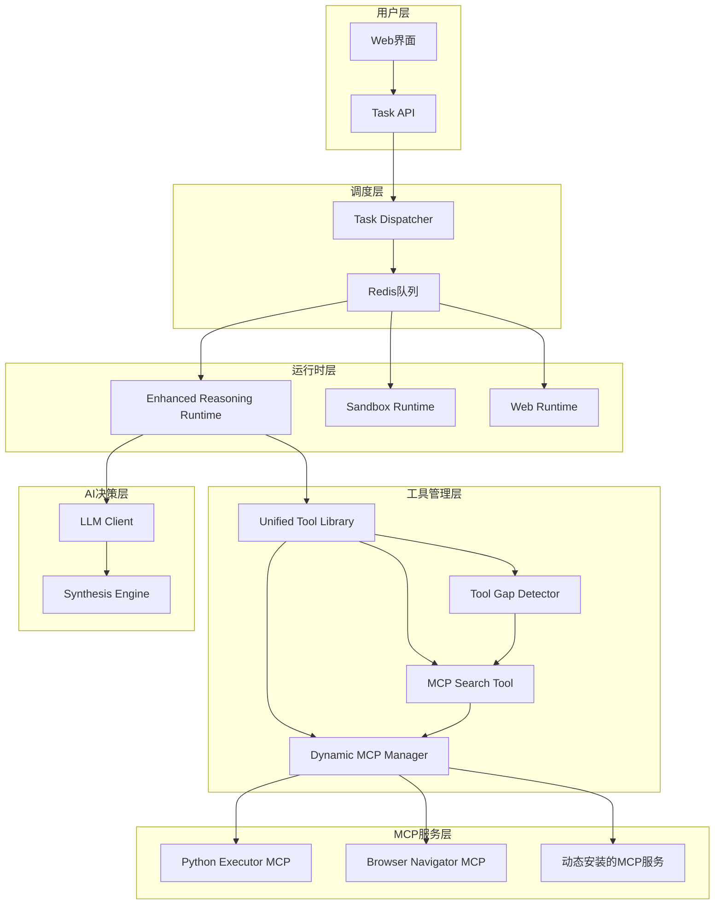
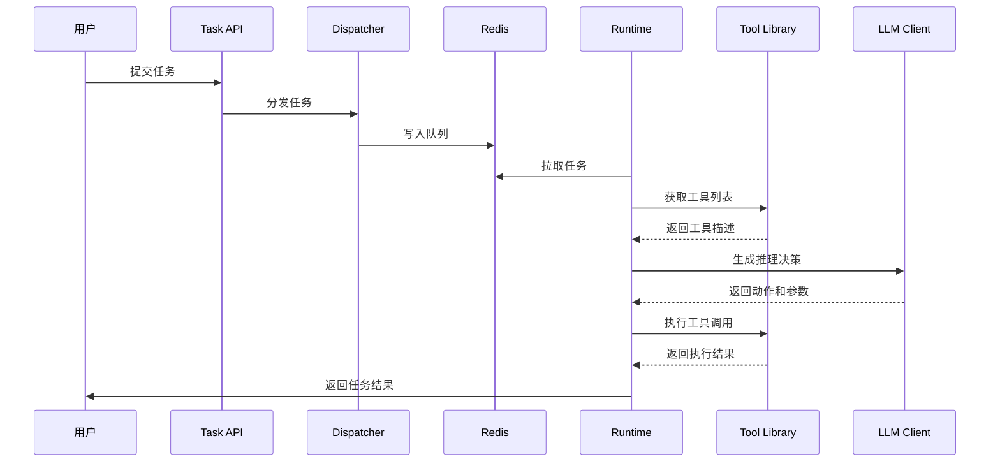
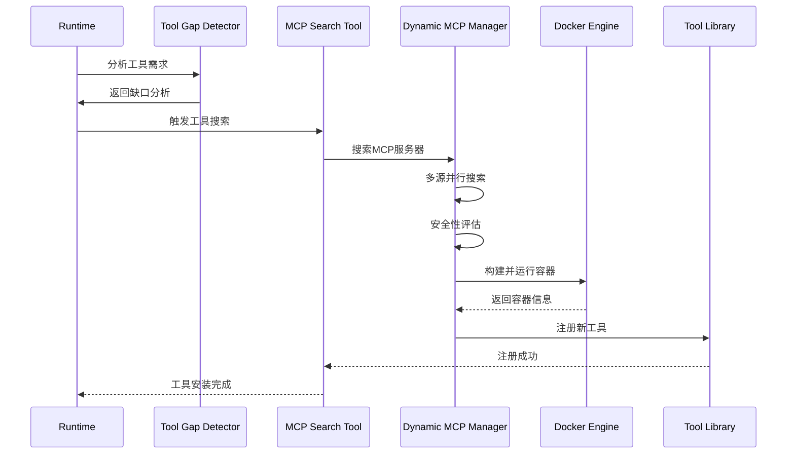
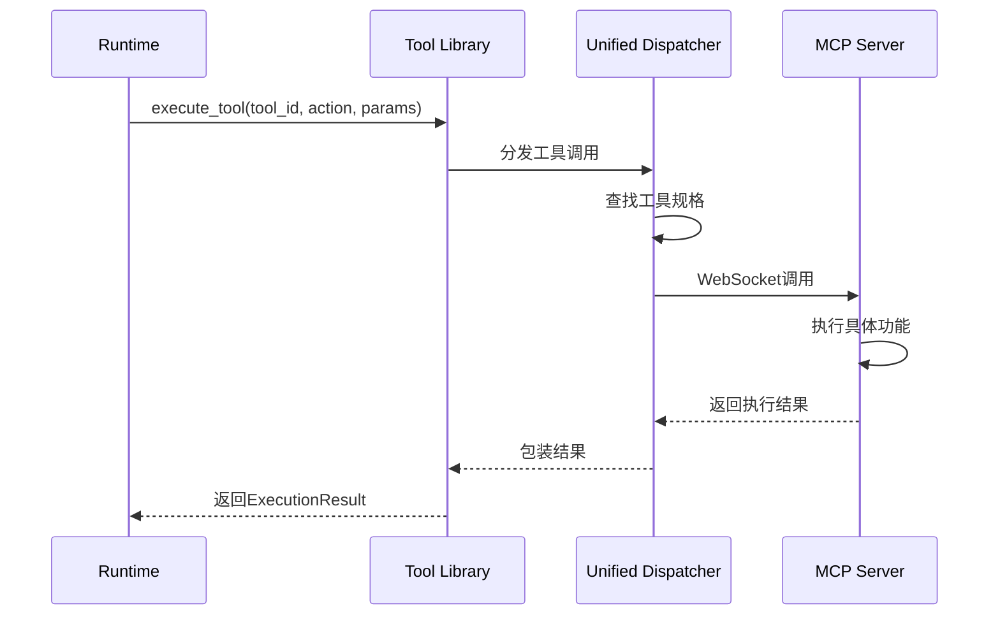

# MCP主动选择机制系统架构深度分析

## 系统概述

本系统实现了一个革命性的AI Agent动态工具扩展平台，核心特性是**AI Agent可以主动选择、搜索和安装新的MCP服务器工具**，从而实现真正的自我进化能力。系统采用微服务架构，通过Redis消息队列进行组件间通信，支持Docker容器化部署。

## 核心架构图



## 模块详细分析

### 1. 核心调度层 (Core Dispatcher)

#### 核心文件
- `core/dispatcher.py` - 任务分发器
- `core/task_api.py` - HTTP API接口
- `core/task_manager.py` - 任务管理器

#### 执行逻辑
```python
# 任务分发流程
class TaskDispatcher:
    async def _load_and_dispatch_tasks(self):
        """
        1. 监控tasks.jsonl文件变化
        2. 解析任务规格 (TaskSpec)
        3. 根据任务类型分发到不同队列:
           - TaskType.CODE → tasks:code
           - TaskType.WEB → tasks:web  
           - TaskType.REASONING → tasks:reasoning
        4. 通过Redis Stream进行异步分发
        """
```

**关键特性**：
- 支持任务优先级排序
- 队列监控和健康检查
- 指标收集和性能监控
- 容错机制和自动重试

### 2. 运行时层 (Runtimes)

#### 2.1 增强推理运行时 (Enhanced Reasoning Runtime)

**核心文件**: `runtimes/reasoning/enhanced_runtime.py`

**核心能力**:
```python
class EnhancedReasoningRuntime(RuntimeInterface):
    async def execute(self, task: TaskSpec) -> TrajectoryResult:
        """
        核心执行流程：
        1. 获取所有可用工具的ToolSpec列表
        2. 为LLM生成工具描述
        3. 循环执行推理决策：
           - LLM分析任务和上下文
           - 选择工具和动作
           - 执行工具调用
           - 处理结果和错误
           - 更新执行上下文
        4. 支持工具缺口检测和动态安装
        """
```

**关键创新**:
- 集成了动态MCP管理器
- 支持工具缺口智能检测
- 具备主动工具搜索能力
- 多轮对话和上下文保持

#### 2.2 其他运行时

- **Sandbox Runtime**: 轻量级Python代码执行环境
- **Web Runtime**: 浏览器自动化和网页交互

### 3. 工具管理核心 (Tools Core)

#### 3.1 统一工具库 (Unified Tool Library)

**核心文件**: `core/toolscore/unified_tool_library.py`

**架构设计**:
```python
class UnifiedToolLibrary:
    """
    纯粹的工具管理平台，职责分离：
    - 工具注册和发现
    - 工具描述生成  
    - 工具调用分发
    - 不涉及智能决策
    """
    
    def __init__(self, mcp_client=None):
        self.tool_registry = ToolRegistry()           # 工具注册表
        self.description_engine = DescriptionEngine() # 描述生成引擎
        self.dispatcher = UnifiedDispatcher()         # 统一分发器
        self.mcp_client = mcp_client                  # MCP客户端
```

**关键API**:
- `register_function_tool()` - 注册函数工具
- `register_mcp_server()` - 注册MCP服务器
- `get_all_tools()` - 获取所有工具
- `execute_tool()` - 执行工具调用

#### 3.2 动态MCP管理器 (Dynamic MCP Manager)

**核心文件**: `core/toolscore/dynamic_mcp_manager.py`

**核心功能**:
```python
class DynamicMCPManager:
    """
    负责MCP服务器的搜索、安装和部署
    """
    
    async def search_mcp_servers(self, query: str, capability_tags: List[str]):
        """
        多源并行搜索：
        1. 模拟注册中心 (优先)
        2. GitHub公共仓库
        3. Smithery.io (已禁用)
        4. MCP Market (已禁用)
        """
    
    async def install_mcp_server(self, candidate: MCPServerCandidate):
        """
        安装流程：
        1. 安全性检查 (作者信任度、星标数)
        2. 生成Docker配置
        3. 构建并运行容器
        4. 健康检查和端口分配
        5. 返回安装结果
        """
```

**安全机制**:
- 信任作者白名单验证
- 代码仓库星标要求
- Docker容器隔离
- 端口动态分配 (8100-8200)

#### 3.3 工具缺口检测器 (Tool Gap Detector)

**核心文件**: `core/toolscore/tool_gap_detector.py`

**智能分析**:
```python
class SmartToolGapDetector:
    """
    使用LLM语义理解判断工具充足性
    """
    
    async def analyze_tool_sufficiency(self, task_description, available_tools):
        """
        分析流程：
        1. 构建详细的分析提示
        2. 调用LLM进行语义分析
        3. 解析JSON格式的分析结果
        4. 返回结构化的工具需求分析
        
        分析维度：
        - 任务具体需要什么功能
        - 现有工具能否实现
        - 缺少什么关键能力
        - 推荐的搜索策略
        """
```

**判断原则**:
- 保守判断：优先使用现有工具组合
- 精确识别：只在确实缺少关键功能时建议新工具
- 实用导向：考虑实际可获得的MCP服务器类型

#### 3.4 MCP搜索工具 (MCP Search Tool)

**核心文件**: `core/toolscore/mcp_search_tool.py`

**主动搜索机制**:
```python
class MCPSearchTool:
    """
    AI主动调用的工具搜索接口
    """
    
    async def search_and_install_tools(self, task_description, current_tools, reason):
        """
        完整搜索安装流程：
        1. 使用工具缺口检测器分析
        2. 生成搜索策略和关键词
        3. 调用动态MCP管理器搜索
        4. 尝试安装最佳候选者
        5. 注册到工具库
        6. 返回安装结果
        """
```

### 4. 合成引擎 (Synthesis Core)

#### 核心文件
- `core/synthesiscore/synthesis.py` - 主要合成引擎
- `core/synthesiscore/synthesis_api.py` - API接口

#### 执行逻辑
```python
class SimpleSynthesizer:
    """
    基于轨迹学习的种子任务生成系统
    """
    
    async def _process_trajectory_file(self, trajectory_path: str):
        """
        轨迹处理流程：
        1. 加载执行轨迹数据
        2. 使用LLM提取任务本质
        3. 分析成功模式和关键要素
        4. 生成种子任务规格
        5. 导出为JSONL格式
        """
    
    async def _extract_essence(self, trajectory: TrajectoryResult):
        """
        本质提取：
        - 识别任务类型和领域
        - 分析工具使用模式
        - 提取成功要素
        - 生成复杂度评级
        """
```

**文件监控**:
- 使用watchdog监控轨迹文件变化
- Redis队列异步处理
- JSON文件存储 (移除数据库依赖)

### 5. LLM客户端层

#### 核心文件
- `core/llm_client.py` - LLM客户端封装

#### 核心能力
```python
class LLMClient:
    """
    多LLM提供商支持的客户端
    """
    
    async def generate_enhanced_reasoning(self, task_description, available_tools, 
                                        tool_descriptions, previous_steps, execution_context):
        """
        增强推理生成：
        1. 构建丰富的上下文提示
        2. 包含工具描述和使用示例
        3. 分析执行历史和上下文
        4. 生成结构化的决策响应
        """
```

**支持的LLM**:
- Google Gemini (主要)
- DeepSeek (备用)
- OpenAI兼容API
- 本地vLLM服务

## 关键执行流程

### 1. 任务执行主流程



### 2. 动态工具安装流程



### 3. 工具调用执行流程



## 技术特性

### 1. 微服务架构
- **松耦合设计**: 各组件独立部署和扩展
- **Redis消息队列**: 异步通信和任务分发
- **Docker容器化**: 环境隔离和部署一致性
- **健康检查**: 自动故障检测和恢复

### 2. 智能决策引擎
- **LLM驱动**: 使用大语言模型进行智能分析
- **上下文感知**: 维护执行上下文和状态
- **自适应学习**: 基于轨迹分析优化决策

### 3. 动态扩展能力
- **主动工具发现**: AI主动识别工具需求
- **多源搜索**: 支持多个MCP注册中心
- **安全验证**: 多维度安全性评估
- **容器化部署**: 隔离运行新安装的工具

### 4. 可观测性
- **结构化日志**: 支持日志分析和调试
- **指标监控**: Prometheus格式的性能指标
- **轨迹记录**: 完整的执行轨迹保存
- **健康检查**: 实时组件状态监控

## 配置和部署

### 环境变量配置
```bash
# Redis配置
REDIS_URL=redis://redis:6379

# LLM API配置
GEMINI_API_KEY=your_gemini_key
GEMINI_API_URL=https://generativelanguage.googleapis.com

# MCP搜索配置
MCP_SEARCH_ENABLED=true
MCP_SECURITY_LEVEL=high
MCP_TRUSTED_AUTHORS=anthropic,microsoft,google

# Docker配置
DOCKER_NETWORK=mcp-network
DOCKER_PORT_RANGE=8100-8200
```

### Docker Compose服务
```yaml
services:
  redis:          # 消息队列
  dispatcher:     # 任务分发器
  toolscore:      # 工具管理核心
  python-executor-server: # Python执行MCP服务
  browser-navigator-server: # 浏览器导航MCP服务
  reasoning-runtime: # 推理运行时
  synthesis:      # 合成引擎
```

## 未来扩展方向

### 1. 智能优化
- **学习机制**: 记录成功安装的工具，优化搜索
- **缓存策略**: 缓存常用MCP服务器，加速部署
- **协作学习**: 多Agent共享工具发现经验

### 2. 安全增强
- **代码审计**: 自动分析MCP服务器代码安全性
- **沙盒隔离**: 更严格的容器安全策略
- **权限控制**: 细粒度的工具访问权限管理

### 3. 性能优化
- **并行执行**: 支持多工具并行调用
- **预测加载**: 基于任务类型预加载工具
- **资源调度**: 智能的容器资源分配

### 4. 生态扩展
- **工具市场**: 建立MCP服务器的社区市场
- **标准化**: 推动MCP协议的标准化发展
- **插件系统**: 支持第三方工具插件开发

---

通过这个架构分析，可以看出系统实现了真正的AI自主进化能力，从被动工具使用者转变为主动能力扩展者，是AI Agent系统发展的重要里程碑。 