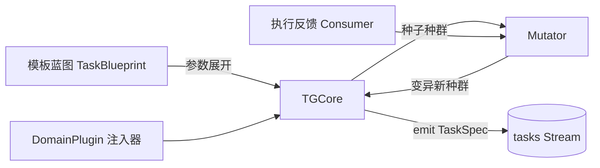

# Agent数据构建Pipeline项目文档

**摘要**

人工智能领域正处于一个转折点。大规模语言模型（LLM）在理解和生成自然语言方面展现了卓越的能力，但其真正的潜力在于转变为自主智能体。研究界和工业界都逐渐认识到，**人工智能的下一次重大突破将来自那些能够与环境交互、使用工具并执行复杂动作序列以实现目标的系统——简而言之，就是智能体**。这一变革催生出一个尚未饱和、却已显现巨大缺口的市场：面向底座大模型的 *Agent Training Data as a Service*。”工具调用+长链推理数据稀缺“是眼下所有智能体团队的焦虑，我们正踩在痛点中央” 。这种稀缺性并非小问题；它是释放LLM作为高效智能体真正潜力的主要障碍。下面这份项目文档给出从战略到技术落地的完整 Pipeline 方案。核心结论是：**通过“任务生成器-执行沙盒-评估器”三级闭环，我们可以批量制造高信噪比的步骤级轨迹数据，把自己定位成“下半场 AI 的炼油厂”——专为下一代 Agentic LLM 供应精炼燃料。**

------

## 一、行业背景与挑战

### 1. 数据需求从标注迁移到轨迹

- Scale AI 依靠大规模标注与 RLHF 服务，估值一度冲至 $25 B USD ，年收入超十亿美元[GitHub](https://github.com/microsoft/ToRA?utm_source=chatgpt.com)。然而 RLHF 只能解决对齐，“会做事”仍依赖人工写 Prompt 或插件脚本。
- 开源研究陆续证明：Tool-Integrated Reasoning（TIR）与多步 RL 才能赋予模型 **“选工具-调工具-自我纠错”** 的执行力（SWiRL、TORL 等）[ChatPaper](https://chatpaper.com/chatpaper/paper/127048?utm_source=chatgpt.com)[彭博社](https://www.bloomberg.com/news/articles/2025-04-02/scale-ai-expects-to-more-than-double-sales-to-2-billion-in-2025?utm_source=chatgpt.com)。
- 最新 InSTA 和 Deep Research 等系统把 **真实网页交互** 纳入训练闭环，成功让 1.7 B 量级模型在 GAIA Benchmark 上逼近 GPT-4 级表现[arXiv](https://arxiv.org/html/2502.06776v2?utm_source=chatgpt.com)[WIRED](https://www.wired.com/story/openais-deep-research-agent-is-coming-for-white-collar-work?utm_source=chatgpt.com)。

### 2. 商业机会：数据发动机而非 Agent 工具

- 传统 Agent 平台（LangChain、CrewAI）仍停留在编排层，无法输出可复用的学习信号。
- **头部大模型厂商的痛点**：缺少覆盖真实环境的高质量轨迹，对比生成-执行-反思全过程；内部自建成本高，且难以横跨多领域。
- **我们的定位**：只做“炼油厂”——集中火力构造、评估并销售高置信度的 TIR + Trajectory 数据。

------

## 二、战略构思：Agent三阶段递进式训练数据


第一阶段：建立基础映射

目标：让模型理解"意图→行动"的基本对应

数据形态：简单目标 → 工具序列 → 结果 

关键指标：工具调用成功率、结果正确性 

训练重点：建立工具的心智模型，理解每个工具的能力边界 

第二阶段：引入规划反思

目标：让模型学会评估和调整自己的规划

数据形态：复杂目标 → 初始规划 → 执行轨迹 → 规划调整 → 最终结果 

关键指标：规划调整的有效性、目标达成的路径优化 

训练重点：在执行中发现规划缺陷并实时修正 

第三阶段：多尺度协同

目标：让模型在不同抽象层级间自如切换

数据形态：嵌套任务 → 多层规划 → 交织执行 → 递归优化 

关键指标：跨层级的信息流通效率、全局最优vs局部最优的平衡 

训练重点：知道何时zoom in到细节，何时zoom out看全局

| 层级                       | 目标                   | 数据形态                     | 关键指标             | 训练价值               |
| -------------------------- | ---------------------- | ---------------------------- | -------------------- | ---------------------- |
| **执行层** (Tool Reasoner) | 单步选工具、填参数     | `query → tool_call → result` | 工具调用成功率       | 微调 LLM，奠定工具心智 |
| **调度层** (Dispatcher)    | 多步短链、错误回退     | 短链轨迹＋奖励               | 链成功率、重试次数   | RL 训练“何时调用”      |
| **规划层** (Macro Planner) | 多子任务分解与递归优化 | 嵌套任务轨迹                 | 全局成功率、资源消耗 | 分层 RL、价值分解      |


------

## 三、技术路径：任务生成器-沙盒执行器-评估器


### 3.1 任务生成器

**设计理念**：不是简单的prompt生成，而是任务空间的结构化探索引擎。

- 采用“大模型 + 模板”自动撰写 *query*，可调节**领域、复杂度、链长**。
- 引入 **MCP Server** 列表对外暴露工具元数据，任务模板可指定需用工具与约束。

**核心功能**：

- **复杂度控制**：从原子操作到嵌套任务的连续可调
- **领域适配**：插件式领域知识注入机制
- **失败导向**：主动探索边界案例和失败模式

**技术实现**：

```python
{
  "task_id": "唯一标识",
  "cognitive_level": "执行|调度|规划",
  "complexity": 0.0-1.0,  # 连续复杂度评分
  "domain": "数学|编程|信息检索|...",
  "failure_modes": ["工具不可用", "参数错误", "逻辑矛盾"],
  "constraints": {
    "time_limit": 300,  # 秒
    "tool_calls_limit": 10,
    "resource_limits": {...}
  }
}
```

### 3.2 执行环境

**技术方案对比与选择**：

经过深入调研，我们对比了多种执行环境方案：

| 方案              | 优势                                                         | 劣势                                                         | 适用性评分 |
| ----------------- | ------------------------------------------------------------ | ------------------------------------------------------------ | ---------- |
| **基于Cline修改** | • 成熟的VS Code集成<br>• Human-in-the-loop设计<br>• 支持MCP扩展<br>• 活跃的开源社区 | • 主要面向开发者使用<br>• 需要大量改造以适应批量数据生成<br>• 依赖VS Code环境 | 7/10       |
| **OpenHands**     | • 专为Agent设计<br>• 支持多种编程任务<br>• 有沙盒执行能力    | • 主要关注软件开发任务<br>• 文档和社区支持有限<br>• 架构复杂度高 | 6/10       |
| **SandboxFusion** | • 支持23种编程语言<br>• 高效的执行性能<br>• 字节跳动背书<br>• 专为评估设计 | • 主要面向代码执行<br>• 缺少浏览器环境<br>• 需要额外集成工作 | 8/10       |
| **自研方案**      | • 完全可控<br>• 精确匹配需求<br>• 无技术债务                 | • 开发周期长<br>• 需要解决大量工程问题<br>• 缺少社区支持     | 5/10       |

**推荐方案：混合架构**

基于上述分析，我们建议采用**模块化混合架构**：

1. **代码执行层**：采用SandboxFusion
   - 理由：SandboxFusion支持23种常用编程语言，满足不同实际使用场景（如前端开发、后端开发、ML训练）
   - 集成方式：作为独立服务部署，通过API调用
2. **浏览器交互层**：基于Playwright + 自研控制层
   - 理由：InSTA使用Playwright API实现网页自动化，支持页面导航、表单填写、错误重试等操作
   - 实现方式：封装Playwright API，添加状态管理和错误恢复机制
3. **工具扩展层**：采用MCP协议
   - 理由：MCP是Anthropic发布的开放标准，用于连接AI助手和数据所在的系统
   - 优势：标准化接口、生态系统支持、易于扩展

**执行环境架构图**：

```
┌─────────────────────────────────────────────┐
│             Agent Executor                   │
│  ┌─────────────┐  ┌──────────────┐         │
│  │   Manager   │  │  Web Agent   │         │
│  │             │  │              │         │
│  └──────┬──────┘  └──────┬───────┘         │
│         │                 │                  │
│  ┌──────▼────────────────▼────────┐        │
│  │        Execution Layer          │        │
│  │  ┌──────────┐  ┌─────────────┐ │        │
│  │  │SandboxFusion│ │ Playwright │ │        │
│  │  │   (Code)   │ │ (Browser)  │ │        │
│  │  └──────────┘  └─────────────┘ │        │
│  └─────────────────────────────────┘        │
│                                             │
│  ┌─────────────────────────────────┐        │
│  │         MCP Layer               │        │
│  │  ┌────┐ ┌────┐ ┌────┐ ┌────┐  │        │
│  │  │Tool│ │Tool│ │Tool│ │ ... │  │        │
│  │  └────┘ └────┘ └────┘ └────┘  │        │
│  └─────────────────────────────────┘        │
└─────────────────────────────────────────────┘
```

### 3.3 评估筛选器

**多维度评估体系**：

1. **任务完成度评估**
   - 结果正确性
   - 过程合理性
   - 目标对齐度
2. **工具使用效率评估**
   - 工具选择准确性
   - 参数填充合理性
   - 资源消耗效率
3. **认知连贯性评估**
   - 推理链逻辑一致性
   - 错误恢复能力
   - 策略调整灵活性
4. **创新性评估**
   - 解决方案新颖度
   - 方法泛化潜力

**评估数据结构**：

```python
{
  "trajectory_id": "轨迹标识",
  "evaluations": {
    "task_completion": {
      "score": 0.95,
      "sub_scores": {
        "correctness": 1.0,
        "process_quality": 0.9,
        "goal_alignment": 0.95
      }
    },
    "tool_efficiency": {
      "score": 0.88,
      "details": {
        "tool_selection": 0.92,
        "parameter_accuracy": 0.85,
        "resource_usage": 0.87
      }
    },
    "cognitive_coherence": {
      "score": 0.91,
      "metrics": {
        "logical_consistency": 0.93,
        "error_recovery": 0.88,
        "adaptability": 0.92
      }
    },
    "innovation": {
      "score": 0.76,
      "novelty_index": 0.82,
      "generalization_potential": 0.70
    }
  },
  "overall_quality": 0.875,
  "selection_priority": 0.92
}
```

## 四、数据流转与标准

### 4.1 统一数据格式

整个Pipeline采用扩展的JSON Lines格式，确保数据的完整性和可追溯性：

```json
{
  "id": "唯一标识符",
  "task": {
    "description": "任务描述",
    "complexity": 0.75,
    "domain": "编程",
    "constraints": {...}
  },
  "trajectory": [
    {
      "step": 1,
      "thought": "推理过程",
      "action": {
        "type": "tool_call",
        "tool": "python_executor",
        "parameters": {...}
      },
      "observation": "执行结果",
      "timestamp": "2024-04-09T10:15:30Z"
    }
  ],
  "evaluation": {
    // 评估结果
  },
  "metadata": {
    "model": "执行模型",
    "version": "系统版本",
    "environment": "执行环境配置"
  }
}
```

### 4.2 数据质量保证机制

1. **版本控制**：每个数据样本包含schema版本信息
2. **完整性校验**：关键字段的存在性和类型检查
3. **一致性验证**：跨步骤状态的连贯性验证
4. **可重现性**：保存完整的环境配置和随机种子

# 

## 五、项目组件详细说明

当前核心顾虑分成两层。第一层是执行器：Cline 只能在 VS Code 里交互式启动，缺乏批量模式；InSTA 专注浏览器导航；Tool-Star 偏重 Python 推理与自调试。三者各擅胜场，却都不足以支撑“跨领域、跨复杂度、大规模穷举”的工业化产线。第二层是任务生成：你希望的不只是写一个 prompt，而是一台能“扫描”任务空间、系统化输出 Query 的**结构化探索引擎**。

若直接把三套代码叠在一起，Cline 会被 VS Code 外壳困住；InSTA 和 Tool-Star 对轨迹格式的假设也互不兼容——前者记录 Playwright JSON，后者要解析 `<python>` / `<search>` 标签。产生的批量任务即使跑通，日志也无法汇聚评估，更谈不上自动回滚、复杂度爬坡。换言之，*单体库拼装* 会让“手工作坊”的瓶颈转移到分布式调度与数据治理层。

 把“执行”与“任务生成”各自拆成**微服务**，然后用 **MCP Schema** 做胶水，才能真正把三件工具熔进同一流水线。

------

### 一、执行环境：一条可落地的执行链

1. **Code Sandbox Runtime**
    把 Cline 的 `standalone/` 目录打进瘦容器，启动时只保留 *Command Executor + Browser Controller* 两个核心服务，入口暴露为 `POST /run-code`。Cline 内的每一步编辑、运行、调试，都写回统一的 `step_log`（JSON），因此它可以在没有 VS Code GUI 的情况下批量并行执行。Cline 架构深度分析文档

2. **Web Navigator Runtime**
    直接复用 InSTA 的 *Browser Agent + Judge* 组合，保持原生 Playwright 交互能力，并将 Judge 只负责“截图 + DOM 摘要 + 成功布尔值”，把打分权交给全局评估器。这样它一天可以滚出十几万条网页轨迹，同时与外部日志格式对齐。InSTA 架构深度分析文档

3. **Tool Reasoner Runtime**
    延用 Tool-Star 的 Python 容器与多工具推理逻辑，把 `<python>…</python>` 解析后的实际代码放进同一 Sand-Box，再把 `<search>` 调用改写成访问统一的 *MCP-Search* 服务，保证工具调用在轨迹里可追溯、可评分。推理时的自调试回溯步骤依旧保留，以提高复杂任务成功率。Tool-Star架构深度分析文档

4. **轨迹汇流 & 评估**
    三种 Runtime 全部通过 *MCP Server* 注册自身工具元数据，在执行时把 `TaskID + StepID + Tool + Input + Output + ts` 推送到 Kafka。全局评估器读取同一流，根据任务目标计算 *success / reward / diversity*，并把高质轨迹落盘 S3。这样就把 Cline 的 IDE 优势、InSTA 的并行浏览、Tool-Star 的链式推理，熔成了一条真正的“工业生产线”。Agent产品构想与技术路径

   

   ### 1 为什么先做“执行链”

   在炼油厂类 Pipeline 里，**任务生成器** 提出“我要什么”；**评估器** 负责“好不好”。两者只有在源源不断的“**执行轨迹**”出现时才有价值。于是我们先把水龙头拧开：搭好一个能同时跑代码、跑浏览器、跑多工具推理的 **批量执行环境**，让它每分钟吞下成包任务，再把完整过程与结果吐成结构化文件。等水流平稳，再回头插任务生成器和评估器也不迟。

   ------

   ### 2 从使用者视角看这条链

   1. **我准备一包任务**
       把若干行 JSON 写进 `tasks.jsonl`。每行描述一件事：写代码、查网页、或做混合推理。

      ```json
      {"task_id":"t1","domain":"coding","complexity":0.3,
       "description":"write a python fn that returns the nth fibonacci",
       "expected_tools":["python_executor"],"max_steps":6}
      
      {"task_id":"t2","domain":"web","complexity":0.5,
       "description":"find the release year of the film 'Spirited Away'",
       "expected_tools":["web_search"],"start_url":"https://en.wikipedia.org"}
      ```

   2. **我一键启动执行集群**
       执行 `docker compose up -d`，本地就会起四个容器：

      - **dispatcher**：把 `tasks.jsonl` 按行推到队列；
      - **code-sandbox**：用 Cline core 跑文件操作与 Python；
      - **web-navigator**：用 InSTA agent 驱动无头浏览器；
      - **tool-reasoner**：用 Tool-Star 模型处理需要多工具联动的请求。
         这三种运行时自动从队列各取所需任务并并行工作。

   3. **我等待几分钟**
       任务跑完后，结果会陆续写进 `output/trajectories/` 目录，每个文件对应一个 task_id，命名为 `t1.json`, `t2.json` ……

   4. **我拿走完整轨迹**
       每个 `*.json` 包含“用户描述→LLM思考→工具输入→工具输出→下一步思考”的完整链，可直接喂给训练脚本或评估脚本。

   ------

   ### 3 最小工程化架构

   下列四个服务都取自现成开源仓库的 *core* 目录，仅做轻量改造。整个系统可以在一台 16-core / 64 GB RAM 的工作站上跑通；若想扩容，只需把 `docker compose` 换成 `docker-swarm` 或 `k3d`。

   ```mermaid
   flowchart LR
     subgraph queue["任务队列 (Redis Streams)"]
     end
     subgraph runtimes["批量执行池"]
       CS["code-sandbox (Cline)"]
       WN["web-navigator (InSTA)"]
       TR["tool-reasoner (Tool-Star)"]
     end
     DISP["dispatcher CLI"] --> queue
     queue --> CS & WN & TR
     CS & WN & TR --> OUT["output/trajectories/*.json"]
     CS & WN & TR --> LOGS["output/logs/*.jsonl"]
   ```

   #### 3.1 任务队列

   最轻量的选择是 **Redis Streams**。它单进程也能轻松撑住上万 TPS，并自带消费者组。

   - docker 镜像：`redis:7-alpine`
   - stream 名：`tasks`
   - 消费组：`code-sandbox`, `web-navigator`, `tool-reasoner`

   #### 3.2 three runtimes = three containers

   | 容器          | 取用代码                             | 核心改动                                                     | 主要暴露端口 |
   | ------------- | ------------------------------------ | ------------------------------------------------------------ | ------------ |
   | code-sandbox  | `Cline` 仓库的 `./server/standalone` | 去掉 VS Code UI，仅保留命令执行、文件 API；沙盒通过 `docker-in-docker` + `gVisor`；添加 `/run` HTTP | 8001         |
   | web-navigator | `InSTA` 仓库的 `./agent`             | 把原本的 self-judger 关掉，只保留浏览器驱动；Chromium 无头   | 8002         |
   | tool-reasoner | `Tool-Star` 仓库的 `./inference`     | 换成 1.7 B 模型（vLLM）；保留 `<python>/<search>` tag 解析与自调试 | 8003         |

   

   三者启动时都会读取同一个 `REDIS_URL`，并注册各自的消费者组。当它们从流里拿到任务时，会先检查 `expected_tools` 与自身能力吻合再执行。

   #### 3.3 数据落盘格式

   每个运行时在完成任务后都向本地卷写两份文件：

   - `output/trajectories/<task_id>.json`

     ```json
     {
       "task_id":"t1",
       "runtime":"code-sandbox",
       "success":true,
       "steps":[
         {"n":1,"thought":"I'll write the function","code":"def fib(n): ..."},
         {"n":2,"exec_result":"tests passed, fib(10)=55"}
       ],
       "final_answer":"function saved as fib.py",
       "duration_sec":4.1
     }
     ```

   - `output/logs/<runtime>.jsonl`
      行粒度日志，便于后期做指标统计与回放。

   ------

   ### 4 用户完整操作流

   **第一步 克隆与构建**

   ```
   bash复制编辑git clone https://github.com/your-org/agent-exec-minimal.git
   cd agent-exec-minimal
   docker compose build
   ```

   **第二步 准备任务文件**
    把若干行 JSON 写入 `tasks.jsonl`，存放在项目根目录。

   **第三步 启动集群**

   ```
   bash
   
   
   复制编辑
   docker compose up -d
   ```

   `dispatcher` 在后台会持续把 `tasks.jsonl` 推进 Redis Streams；各 runtime 自动开跑。

   **第四步 查看运行状态**

   ```
   bash复制编辑docker compose logs -f dispatcher
   watch -n2 'ls -l output/trajectories | wc -l'
   ```

   **第五步 收取轨迹**
    所有任务跑完后，`output/trajectories/` 即为“炼油厂”产出的原油。用户可复制到训练服务器或上传对象存储。

   **第六步 关停并清理**

   ```
   bash
   
   
   复制编辑
   docker compose down
   ```

   若想追加任务，只需把新任务 append 到 `tasks.jsonl` 并重新 `up -d`；已有轨迹不会被覆盖。

   ------

   ### 5 未来向上生长的挂载点

   - 若要换队列，只需把 dispatcher 和 runtimes 的 *producer/consumer* 改掉；代码仓库已抽象成同一接口。
   - 若要横向扩容，把运行时服务的 `scale` 参数放进 Compose 或 Swarm；Redis Streams 天然支持多消费者并行。
   - 若要插入 **任务生成器**，让它直接 `XADD tasks` 即可；要插入 **评估器**，监听 `output/trajectories` 或日志流即可，无须改核心执行链。
   - 若要加新工具，例如数据库查询，只需复制 `tool-reasoner` 容器，在其解析器里认得 `<db>` 标签，再在 Dockerfile 里安装 `psql`。

   ------

   ### 6 总结

   对“只想先把任务批量跑起来”的用户，这套 **四容器 + 一份 JSONL** 的最小工程即可当天落地。它：

   - **零代码改造地复用** 了最成熟的三条开源执行链核心；
   - **单机可跑**，不依赖 Kubernetes；
   - **任务→轨迹** 的链路前后闭合，结果以 **每任务一 JSON** 的形式落盘；
   - **天然可扩容**，向右滑动只需再起几个副本或迁到云；
   - **向上兼容** 后续的任务生成与评估模块，因为所有交互都经过同一 Redis 流与统一 JSON schema。

   当你需要从一千条轨迹涨到十万条轨迹，只需要把 `docker compose` 换成 `docker-swarm`，再在云端多点几台 GPU/CPU 节点，执行链的形状完全不用动。这就是它作为“可落地执行链”最核心的价值。

### 二、任务生成器：如何造一台“任务空间探索引擎”

**设计原则**
 真正的难点不是写 prompt，而是对 **领域、复杂度、链长** 三维空间做可控采样，并在失败边界附近持续加密采样，让训练数据始终逼着模型进步。下述流水是一个可行的闭环：

1. **Task Blueprint**
    任务生成器维护一张 *模板 × 参数* 的蓝图。例如模板 `info_extraction(web)` 带形参 `{domain, novelty_level, required_tools, max_chain_len}`。它先查询 MCP-Server，拿到可用工具声明，再按参数自动拼装成 *TaskSpec JSON*。
2. **LLM Seed & Mutation**
    每个模板先让大模型写出一个“种子 query”。执行器跑完后，评估器会给出 `difficulty_score` 与 `success_rate`。任务生成器再依据这两值做**三种变异**：
   - *Depth+*：同域加长链路；
   - *Breadth+*：换相同链长但多一步工具；
   - *Shift*：领域内语义同构但工具组合不同。
      变异后的 TaskSpec 重新入队列，形成自举式 curriculum。
3. **Domain Plugin**
    对法律、医药、编程等专业域，额外挂载 *Knowledge-Injector*。它把术语表、API schema、示例对话注入 LLM 上下文，并向模板暴露 `domain_context_id`。新增领域 ≈ 新增一个 Injector，无须改核心代码。
4. **Failure-Seeking Scheduler**
    调度器实时拉取轨迹的失败原因分布：是工具调用错？还是知识漏洞？还是推理链断？如果某类 *failure_tag* 占比 < 阈值，则优先生成能触发该 tag 的 TaskSpec。这条回路让任务探索天然朝着模型薄弱点聚焦，而不会在“模型早就会的 Easy Case”里空转。

## 六、技术实现与工作流

# 任务生成器 · 施工手册

> **目标**：交付一台可落地的“任务空间探索引擎”。实施者照本手册即可在本地或集群内启动服务，持续向执行链批量投喂 TaskSpec JSON。

------

## 1 · 定位与输入 / 输出

- **输入**：
  - MCP‑Server 工具清单（HTTP JSON）
  - 执行链返回的 `evaluation-results` Kafka/Redis 流（含 `success_rate`, `difficulty_score`, `failure_tags`）
- **输出**：
  - `tasks` Redis Stream（或 Kafka topic）上的 *TaskSpec JSON*；每条即执行链可直接消费的任务描述

------

## 2 · 架构总览



- **TaskBlueprint**：静态 YAML，描述模板 × 参数空间。
- **DomainPlugin**：按需加载的知识注入器，提供专业上下文。
- **TGCore**：核心调度器，负责实例化模板、调用 LLM 产出种子 query。
- **Mutator**：根据反馈做 *Depth+ / Breadth+ / Shift* 变异。
- **Queue**：Redis Streams / Kafka，供 Runtime 消费。

------

## 3 · 目录结构

```text
task-generator/
├── Dockerfile
├── docker-compose.yml          # 与执行链共用 Redis / Kafka
├── .env                        # LLM key，Redis URL
├── blueprint/
│   └── info_extraction.web.yaml
├── domain_plugins/
│   ├── law.py
│   └── medicine.py
├── tg_core/
│   ├── __init__.py
│   ├── scheduler.py            # 复杂度 & 领域配额
│   ├── llm_client.py           # OpenAI / local vLLM
│   └── task_emitter.py         # 写入 Stream
└── mutator/
    ├── __init__.py
    └── operators.py            # Depth+, Breadth+, Shift
```

------

## 4 · 关键组件实现

### 4.1 TaskBlueprint（YAML）

```yaml
name: info_extraction.web
parameters:
  domain: ["movies", "sports", "finance"]
  novelty_level: [1, 2, 3]
  required_tools: ["web_search"]
  max_chain_len: [3, 4, 5]
analysis_schema:
  expected_answer: "string"
```

> *实现*：加载后做笛卡尔展开，生成参数组合列表交给 Scheduler。

### 4.2 DomainPlugin

```python
# domain_plugins/law.py
class LawInjector:
    id = "law"
    glossary = ["plaintiff", "defendant", "jurisdiction", ...]

    def inject(self, prompt:str)->str:
        glossary_str = "\n".join(self.glossary[:20])
        return f"You are an expert legal assistant. Useful terms:\n{glossary_str}\n---\n{prompt}"
```

加载方式：

```python
from importlib import import_module
plugin = import_module(f"domain_plugins.{domain}").LawInjector()
```

TGCore 调用 `plugin.inject(prompt)` 以获得专业化上下文。

### 4.3 Scheduler

```python
class ComplexityScheduler:
    def __init__(self, redis):
        self.redis = redis  # 订阅 evaluation-results
        self.window = {}

    def update_metrics(self, feedback):
        key = (feedback["domain"], feedback["complexity_bin"])
        self.window.setdefault(key, []).append(feedback["success_rate"])
        self.window[key] = self.window[key][-200:]  # 滑动窗口

    def pick_next_params(self, blueprint_row):
        # 根据当前窗口成功率决定复杂度采样概率
        avg = np.mean(self.window.get((blueprint_row.domain, blueprint_row.complexity_bin), [0.5]))
        shift = 0.2 if avg > 0.8 else -0.2 if avg < 0.3 else 0
        return blueprint_row.complexity + shift
```

### 4.4 LLM Seed 生成

```python
from openai import AsyncOpenAI

async def create_seed_query(template, injected_prompt):
    system = "You output only valid JSON."
    user = template.fmt(**injected_prompt)
    resp = await client.chat.completions.create(
            model="gpt-4o-mini", temperature=0.7,
            messages=[{"role":"system","content":system},{"role":"user","content":user}])
    return json.loads(resp.choices[0].message.content)
```

### 4.5 Mutator

```python
class DepthOperator:
    def apply(self, task):
        task["max_chain_len"] += 1
        task["mutation_tag"] = "depth+"
        return task

class BreadthOperator:
    ...

class ShiftOperator:
    ...

def mutate(task, feedback):
    if feedback["success_rate"] > 0.9:
        return DepthOperator().apply(task)
    if feedback["failure_tag"] == "tool_error":
        return BreadthOperator().apply(task)
    return ShiftOperator().apply(task)
```

Mutator 监听 `evaluation-results`，对同 task_id 做一次变异后重新 `XADD tasks`。

------

## 5 · 运行步骤（本地）

```bash
# 1. 构建镜像
cd task-generator
docker build -t task-generator:dev .

# 2. 启动（假设 Redis 已由执行链 docker‑compose 提供）
REDIS_URL=redis://host.docker.internal:6379 \
OPENAI_API_KEY=sk-xxx \
docker run -d --name tg \
  -e REDIS_URL -e OPENAI_API_KEY \
  task-generator:dev
```

容器日志应看到：

```
[Scheduler] emit seed task fib_movies_001 depth=0.3
[Mutator] receive feedback fib_movies_001 success_rate=0.92 -> depth+
```

------

## 6 · 常见操作

- **新增领域**：在 `domain_plugins/` 新建 `<domain>.py`，实现同 LawInjector 接口；在 Blueprint 参数列表里加入域名即可。
- **调节 LLM 成本**：`.env` 里设置 `TG_BATCH_SIZE` 与 `LLM_MODEL`（可换本地 vLLM 服务）。
- **限制总任务速率**：环境变量 `TG_QPS=5` 控制每秒入队数量，防止执行链积压。

------

## 7 · FAQ

| 问题                   | 排查要点                                       |
| ---------------------- | ---------------------------------------------- |
| Blueprint 路径加载失败 | 确认 YAML 文件后缀和 `blueprint_path` 环境变量 |
| LLM 调用超时           | 检查网络代理或降低 `temperature` 提高速率      |
| 任务堆积 Queue backlog | 增开 Runtime 副本或调低 `TG_QPS`               |

------

## 8 · 总结

*Blueprint → LLM 种子 → 执行反馈 → 变异再投入* 的回路让任务生成器自动「沿薄弱点施压」。手册中的最小实现只依赖 Redis + OpenAI 接口，三百行核心代码即可跑通；接入执行链后立刻形成 **持续产油** 的闭环。


# Agent 批量执行链 · 施工手册

> **目标**：任何熟悉 Linux / macOS 基础命令行的实施者按照本手册即可在 *一台 16‑core / 64 GB / GPU 可选* 的工作站上部署最小可跑通的执行链，对指定任务文件进行批量执行并拿到完整轨迹文件。

------

## 0 · 快速阅读索引

| 章节            | 内容                       | 所需时间 |
| --------------- | -------------------------- | -------- |
| 1. 前置条件     | 机器与软件准备列表         | ≈ 5 min  |
| 2. 目录结构     | 仓库克隆后应看到的文件布局 | ≈ 2 min  |
| 3. 一键部署流程 | 从克隆到产出轨迹的全部命令 | ≈ 15 min |
| 4. 日常操作     | 追加任务 / 查看日志 / 扩容 | ≈ 10 min |
| 5. 常见问题     | FAQ 与排障脚本             | 按需     |

------

## 1 · 前置条件

### 1.1 硬件

- **CPU** ≥ 16 逻辑核（Intel 12th i7 / AMD 5900X 级别）
- **内存** ≥ 64 GB
- **磁盘** ≥ 200 GB SSD （用于容器镜像 + 轨迹输出）
- **可选 GPU** 1× NVIDIA 30 系列 8 GB↑（用于 Tool‑Reasoner，非必须）

### 1.2 操作系统

- Ubuntu 22.04 LTS / Debian 12 / macOS 13+
- 已开启 cgroups v2（Ubuntu 22.04 默认即可）

### 1.3 必须软件

| 软件           | 推荐版本                                      | 安装链接                                |
| -------------- | --------------------------------------------- | --------------------------------------- |
| Docker Engine  | 24.0+                                         | https://docs.docker.com/engine/install/ |
| Docker Compose | 内置于 Docker Desktop 或 `docker compose` CLI | 同上                                    |
| Git            | >= 2.34                                       | `sudo apt install git -y`               |
| Python         | >= 3.10 （仅用于脚本工具）                    | 系统自带或 pyenv                        |

> *所有命令均假设以具有 sudo 权限的普通用户身份执行。*

------

## 2 · 目录结构

```text
agent-exec-minimal/
├── docker-compose.yml        # 四容器编排
├── .env                      # 可选：环境变量覆写
├── tasks.jsonl               # 批量任务文件（用户自填）
├── output/
│   ├── trajectories/         # 执行完成的轨迹 *.json
│   └── logs/                 # 各运行时增量日志 *.jsonl
└── services/
    ├── dispatcher/
    ├── code-sandbox/
    ├── web-navigator/
    └── tool-reasoner/
```

- **dispatcher/** → 读 `tasks.jsonl`，写入 Redis Streams
- **code-sandbox/** → 裁剪自 **Cline**，执行文件 / Python 工具链
- **web-navigator/** → 取自 **InSTA**，驱动 Playwright
- **tool-reasoner/** → 取自 **Tool‑Star**，解析 `<python>/<search>` 并调用工具

------

## 3 · 一键部署流程

### 3.1 克隆仓库

```bash
git clone https://github.com/your-org/agent-exec-minimal.git
cd agent-exec-minimal
```

### 3.2 （可选）编辑任务文件

`tasks.jsonl` 每行一条任务，示例如下：

```json
{"task_id": "fib_10", "domain": "coding", "description": "write a python function that prints the 10th fibonacci number", "expected_tools": ["python_executor"], "max_steps": 6}
{"task_id": "spirited", "domain": "web", "description": "find the release year of the film 'Spirited Away'", "expected_tools": ["web_search"], "start_url": "https://en.wikipedia.org"}
```

> 若文件很大，可分批追加；dispatcher 会自动递增读取。

### 3.3 构建镜像（首次）

```bash
docker compose build
```

*耗时约 8‑15 min，取决于网络与 GPU 镜像体积。*

### 3.4 启动所有服务

```bash
docker compose up -d          # -d 表示后台运行
```

容器列表：

```bash
docker compose ps
```

| Service       | Port | 功能               |
| ------------- | ---- | ------------------ |
| dispatcher    | 无   | 写任务到 Redis     |
| redis         | 6379 | Stream 队列        |
| code-sandbox  | 8001 | 代码执行 Runtime   |
| web-navigator | 8002 | 浏览器 Runtime     |
| tool-reasoner | 8003 | 多工具推理 Runtime |

### 3.5 实时查看日志

```bash
# 全局流
stern .           # 若已安装 stern
# 单服务
docker compose logs -f code-sandbox
```

*log 输出默认挂载至 `output/logs/`，每行 JSON 便于后处理。*

### 3.6 监控任务进度

```bash
watch -n5 'ls output/trajectories | wc -l'
```

> 文件数量 == 已完成任务数。失败任务会在日志中标 `success:false`。

### 3.7 获取轨迹

轨迹产出路径：`output/trajectories/<task_id>.json`，结构：

```json
{
  "task_id": "spirited",
  "runtime": "web-navigator",
  "success": true,
  "steps": [...],
  "final_answer": "2001",
  "duration_sec": 11.4
}
```

将整个目录打包或上传对象存储即可供后续 SFT / RLHF / 评估。

### 3.8 关停 & 清理

```bash
docker compose down
# 如需清镜像/卷
docker system prune -af
```

------

## 4 · 日常运维操作

### 4.1 追加任务

1. 向 `tasks.jsonl` 追加新行。
2. `docker compose restart dispatcher`（或等待 1 min 自动检测）。

### 4.2 横向扩容

```bash
# 把 code-sandbox 副本扩为 4
docker compose up -d --scale code-sandbox=4
```

Redis Streams 会自动将新任务分配给新副本。

### 4.3 自定义 Runtime

- 复制 `services/code-sandbox` 目录 → `services/my-runtime`
- 修改其 `Dockerfile` 和 `entrypoint.sh`；确保
  - 读取 `REDIS_URL`
  - 消费 `tasks` Stream
  - 写结果至 `output/trajectories/`
- 在 `docker-compose.yml` 新增服务条目即可。

### 4.4 查看资源占用

```bash
docker stats
```

或安装 **cAdvisor + Prometheus**，本手册已预留 ports 8080, 9090 可挂监控。

------

## 5 · 常见问题（FAQ）

| 症状                                   | 可能原因                | 解决方案                                                   |
| -------------------------------------- | ----------------------- | ---------------------------------------------------------- |
| `tool-reasoner` 无法启动，报 CUDA 错误 | 宿主机无 NVIDIA 驱动    | 安装 `nvidia-docker2` 或改用 CPU 镜像（修改 compose 文件） |
| `web-navigator` 执行慢、截图超时       | 带宽过低 / 目标站点限制 | 在 `.env` 里设置 `HTTP_PROXY`；或用 `start_url` 指向轻站点 |
| 输出目录为空                           | dispatcher 未写任务     | 检查 `tasks.jsonl` 是否 UTF‑8 & 每行合法 JSON              |
| Redis 内存暴涨                         | 长时间不消费            | 确认所有 Runtime 正常，或手动 `XTRIM tasks MAXLEN 10000`   |

------

## 6 · 附录：核心文件示例

### 6.1 `docker-compose.yml` 摘要

```yaml
version: "3.9"
services:
  redis:
    image: redis:7-alpine
    command: ["redis-server", "--save", "" , "--appendonly", "no"]
    ports: ["6379:6379"]

  dispatcher:
    build: services/dispatcher
    volumes:
      - ./tasks.jsonl:/app/tasks.jsonl:ro
      - ./output/logs:/app/logs
    environment:
      - REDIS_URL=redis://redis:6379

  code-sandbox:
    build: services/code-sandbox
    volumes:
      - ./output:/app/output
      - /var/run/docker.sock:/var/run/docker.sock   # 需执行内部沙盒
    environment:
      - REDIS_URL=redis://redis:6379
    ports: ["8001:8001"]

  web-navigator:
    build: services/web-navigator
    volumes:
      - ./output:/app/output
    environment:
      - REDIS_URL=redis://redis:6379
    ports: ["8002:8002"]

  tool-reasoner:
    build: services/tool-reasoner
    volumes:
      - ./output:/app/output
    environment:
      - REDIS_URL=redis://redis:6379
    ports: ["8003:8003"]
```

### 6.2 示例 Runtime 入口片段

```python
# services/code-sandbox/entrypoint.py
import os, json, redis, time
r = redis.from_url(os.getenv("REDIS_URL"))
GROUP = "code-sandbox"
STREAM = "tasks"

try:
    r.xgroup_create(STREAM, GROUP, mkstream=True)
except redis.ResponseError:
    pass  # 组已存在

while True:
    resp = r.xreadgroup(GROUP, GROUP+"_1", {STREAM: ">"}, count=1, block=5000)
    if not resp:
        continue
    for _, msgs in resp:
        for msg_id, msg in msgs:
            task = json.loads(msg[b'task'].decode())
            if 'python_executor' not in task['expected_tools']:
                r.xack(STREAM, GROUP, msg_id)
                continue
            # === 执行核心逻辑 ===
            # 1. 生成代码 → 2. 调用本地 sandbox → 3. 汇整结果
            result = {
                "task_id": task['task_id'],
                "runtime": "code-sandbox",
                "success": True,
                "steps": [],
                "final_answer": "...",
                "duration_sec": 1.23
            }
            with open(f"/app/output/trajectories/{task['task_id']}.json", "w") as f:
                json.dump(result, f)
            r.xack(STREAM, GROUP, msg_id)
```

------

### 7 · 总结一句话

> **把任务写进 `tasks.jsonl` → `docker compose up -d` → 轨迹自动出现在 `output/trajectories/`。** 只要会改 JSON 和看日志，你就能持续产油。