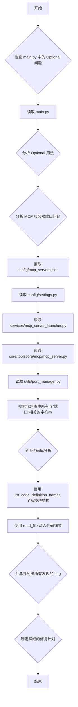

# Agent Data Platform Bug 修复计划

## 概述
本计划旨在解决当前 Agent Data Platform 代码库中发现的多个 bug，主要集中在导入问题、端口管理和硬编码配置上。修复这些问题将提高系统的稳定性、可维护性和端口分配的正确性。

## Mermaid 流程图

## 发现的 Bug 列表及修复计划

### 1. Bug 1: `Optional` 未导入
*   **位置**: `main.py:43`
*   **表现**: `mcp_launcher: Optional[MCPServerLauncher] = None` 这一行中的 `Optional` 可能会有波浪线，表明 `Optional` 类型未被正确导入。
*   **影响**: 如果 `Optional` 未导入，代码在运行时可能会因为 `NameError` 而失败，或者类型检查工具会发出警告。
*   **修复计划**: 在 `main.py` 文件顶部添加 `from typing import Optional`。

### 2. Bug 2: `TOOLSCORE_MCP_WS_URL` 定义可能存在混淆
*   **位置**: `config/settings.py:97`
*   **表现**: `TOOLSCORE_MCP_WS_URL` 被定义为 `ws://0.0.0.0:{TOOLSCORE_MCP_PORT}/websocket`，并注释为“MCP Server 自己的 endpoint”。然而，`TOOLSCORE_MCP_PORT` (8081) 实际上是 ToolScore 核心服务用于接收 MCP 客户端连接的端口，而不是 MCP Server 自身启动的端口。MCP Server 应该从 `MCP_SERVER_PORT_RANGE_START` 到 `MCP_SERVER_PORT_RANGE_END` 范围内获取动态端口。这个命名和注释可能会导致混淆，甚至在 MCP Server 尝试绑定到 8081 端口时引发冲突，如果 ToolScore 核心服务已经占用了该端口。
*   **影响**: 可能导致 MCP Server 启动失败或连接问题。
*   **修复计划**: 澄清 `TOOLSCORE_MCP_WS_URL` 的用途，如果它确实是 ToolScore 核心服务的 WebSocket URL，则注释应更准确。确认 MCP Server 启动时是否正确地从动态端口范围获取端口，而不是尝试使用 `TOOLSCORE_MCP_PORT`。

### 3. Bug 3: `PortManager` 导入路径问题
*   **位置**: `services/mcp_server_launcher.py:11`
*   **表现**: `from scripts.port_manager import PortManager`。根据文件结构，`port_manager.py` 位于 `utils/` 目录下，而不是 `scripts/` 目录下。这可能导致 `ModuleNotFoundError`。
*   **影响**: `MCPServerLauncher` 无法正确初始化 `PortManager`，从而导致 MCP 服务器无法启动。
*   **修复计划**: 将 `from scripts.port_manager import PortManager` 修改为 `from utils.port_manager import PortManager`。

### 4. Bug 4: `MCPServer` 的 `endpoint` 参数与 `main.py` 中的 `TOOLSCORE_MCP_WS_URL` 冲突
*   **位置**: `core/toolscore/mcp/mcp_server.py:711`
*   **表现**: 在 `core/toolscore/mcp/mcp_server.py` 的 `main` 函数中，`MCPServer` 被实例化为 `toolscore` 服务器，其 `endpoint` 被硬编码为 `"ws://0.0.0.0:8081/websocket"`。这与 `config/settings.py` 中 `TOOLSCORE_MCP_PORT` 定义的端口冲突。
*   **影响**: 端口冲突会导致其中一个服务启动失败。
*   **修复计划**: 确认 `core/toolscore/mcp/mcp_server.py` 中的 `main` 函数是否预期作为独立的 ToolScore 服务器启动。如果 `main.py` 是唯一的入口点，并且 `start_toolscore_services` 负责启动 ToolScore 服务器，那么 `core/toolscore/mcp/mcp_server.py` 中的 `main` 函数可能只是一个示例或测试入口，不应该在生产环境中直接运行。在这种情况下，可以考虑移除或明确标记此 `main` 函数，以避免混淆。如果 `core/toolscore/mcp/mcp_server.py` 的 `main` 函数确实需要作为独立的 ToolScore 服务器运行，那么它应该从 `config.settings` 中获取端口，而不是硬编码，以保持一致性。

### 5. Bug 5: `mcp_tools.json` 文件路径硬编码
*   **位置**: `core/toolscore/mcp/mcp_server.py:609`
*   **表现**: `mcp_tools_file = '/app/mcp_tools.json'`。这个路径是硬编码的，并且看起来是为 Docker 环境设计的。在非 Docker 环境下，这个路径很可能不存在，导致无法加载基础工具库。
*   **影响**: 基础工具无法被 ToolScore 服务器加载和注册，影响系统功能。
*   **修复计划**: 将 `mcp_tools_file` 的路径改为相对路径，或者从 `config.settings` 中获取项目根目录来构建正确的文件路径。例如，使用 `config.settings.project_root / 'mcp_tools.json'`。

### 6. Bug 6: `ToolCapability` 和 `FunctionToolSpec` 导入路径问题
*   **位置**: `core/toolscore/mcp/mcp_server.py:554` 和 `core/toolscore/mcp/mcp_server.py:628`
*   **表现**: `main` 函数内部重复导入了文件顶部已经导入的类型。
*   **影响**: 主要是代码风格和可维护性问题，可能不会直接导致运行时错误，但会使代码更难理解和维护。
*   **修复计划**: 移除 `main` 函数内部的重复导入，确保所有必要的导入都在文件顶部完成。

### 7. Bug 7: `PortManager` 类未定义 (更新)
*   **位置**: `utils/port_manager.py` 和 `scripts/port_manager.py`
*   **表现**: `services/mcp_server_launcher.py` 尝试实例化 `PortManager` 类，但 `utils/port_manager.py` 中只提供了函数，没有类定义。而 `scripts/port_manager.py` 中定义了 `PortManager` 类。
*   **影响**: 导致 `TypeError: 'module' object is not callable` 或 `NameError: name 'PortManager' is not defined`。
*   **修复计划**: 将 `scripts/port_manager.py` 中的 `PortManager` 类及其相关函数移动到 `utils/port_manager.py` 中。确保 `utils/port_manager.py` 成为唯一的端口管理模块，并移除 `scripts/port_manager.py`。

### 8. Bug 8: `main.py` 中 `port_manager.cleanup_ports` 的导入路径问题
*   **位置**: `main.py:12` 和 `main.py:55`
*   **表现**: `main.py` 导入 `from utils import port_manager`，然后调用 `port_manager.cleanup_ports`。如果 `utils/port_manager.py` 被修改为包含 `PortManager` 类，那么 `cleanup_ports` 将成为 `PortManager` 类的一个方法，而不是模块级别的函数。
*   **影响**: 端口清理功能失效。
*   **修复计划**: 在 `main.py` 中，实例化 `PortManager` 类并调用其 `cleanup_ports` 方法。

### 9. Bug 9: `core/metrics/metrics.py` 中的硬编码端口
*   **位置**: 多个 `runtime` 文件中 (`runtimes/reasoning/runtime.py:19`, `runtimes/sandbox/runtime.py:30`, `runtimes/web_navigator/runtime.py:20`, `runtimes/reasoning/enhanced_runtime.py:39`)
*   **表现**: 多个 `runtime` 文件中都硬编码了 `EnhancedMetrics` 的端口。
*   **影响**: 端口分配不灵活，可能导致冲突，且难以通过统一配置进行管理。
*   **修复计划**: 将这些硬编码的端口定义移动到 `config/settings.py` 中，并从那里导入使用。

### 10. Bug 10: `core/synthesiscore/synthesis_api.py` 中的硬编码端口
*   **位置**: `core/synthesiscore/synthesis_api.py:220`
*   **表现**: 硬编码了 8081 作为默认端口，这与 `TOOLSCORE_MCP_PORT` 冲突。
*   **影响**: 端口冲突，导致服务启动失败。
*   **修复计划**: 将 `core/synthesiscore/synthesis_api.py` 中的默认端口改为一个不冲突的端口，或者从 `config/settings.py` 中获取一个专门为 Synthesis API 定义的端口。

### 11. Bug 11: `core/task_management/task_api.py` 中的硬编码端口
*   **位置**: `core/task_management/task_api.py:210`
*   **表现**: 硬编码了 8000 作为默认端口，这与 `TASK_API_PORT` 冲突。
*   **影响**: 端口冲突，导致服务启动失败。
*   **修复计划**: 将 `core/task_management/task_api.py` 中的默认端口改为从 `config/settings.py` 中获取 `TASK_API_PORT`。

### 12. Bug 12: `core/toolscore/runners/process_runner.py` 中的硬编码端口范围
*   **位置**: `core/toolscore/runners/process_runner.py:27`
*   **表现**: 硬编码了进程运行器的端口范围，与 `config/settings.py` 中定义的 `MCP_SERVER_PORT_RANGE_START` 和 `MCP_SERVER_PORT_RANGE_END` 不一致。
*   **影响**: 端口范围不一致，可能导致 MCP 服务器启动时端口分配混乱或冲突。
*   **修复计划**: 让 `ProcessRunner` 从 `config/settings.py` 中获取 `MCP_SERVER_PORT_RANGE_START` 和 `MCP_SERVER_PORT_RANGE_END`，而不是使用硬编码的默认值或独立的 `PROCESS_PORT_RANGE_START/END` 环境变量。