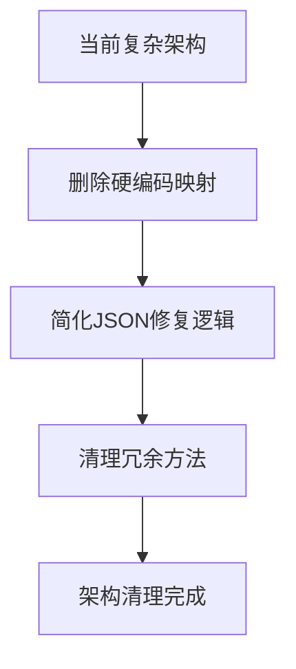
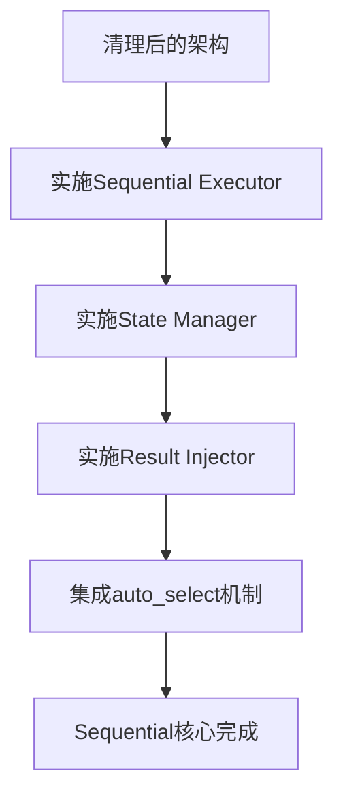
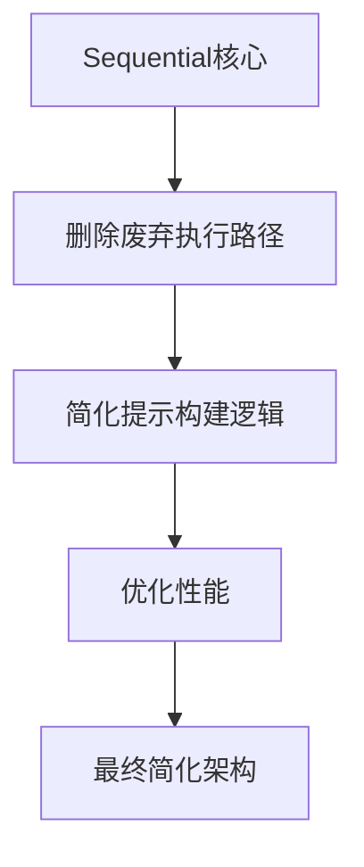

# Agent Data Platform 代码清理计划

## 📋 总体目标
解决系统中的三个核心问题并清理代码质量问题：
1. ✅ **tool_input 代码被替换为占位符** (已修复)
2. ✅ **thinking 内容被截断** (已部分修复)  
3. ✅ **available_actions 为空** (已修复)
4. 🎯 **实施XML标签方案** (根本性解决解析问题)
5. 🔄 **清理关键架构和类型错误**

## 💡 策略调整：XML标签优先方案

基于分析，我们采用**XML标签方案**作为根本解决方案，而非逐个清理硬编码截断：

### 📊 方案对比
| 方案 | 工作量 | 解析可靠性 | 内容完整性 | 代码复杂度 | 维护成本 |
|------|--------|-----------|-----------|-----------|----------|
| 逐个清理硬编码 | 2-3小时 | ⭐⭐⭐ | ⭐⭐⭐⭐ | ⭐⭐ | ⭐⭐ |
| XML标签方案 | 30分钟 | ⭐⭐⭐⭐⭐ | ⭐⭐⭐⭐⭐ | ⭐⭐⭐⭐⭐ | ⭐⭐⭐⭐⭐ |

**决策：优先实施流式XML标签方案，跳过大部分硬编码清理**

## 💡 架构理解：ToolScore两层设计

基于代码分析，确认系统采用两层工具架构：
1. **available_tools** (MCP Server层): `microsandbox`, `deepsearch`, `browser_use`, `search_tool` 
2. **available_actions** (具体方法层): `microsandbox_execute`, `research`, `browser_use_execute_task`, `search_file_content`

**设计原则**:
- **Prompt中**: 只显示MCP Server + available_actions，让LLM了解能力
- **LLM输出**: 具体的action名称（如`microsandbox_execute`）
- **XML标签**: 作为高级语义接口，系统自动映射到具体action

## 🎯 阶段0: 流式XML标签方案实施 **【最高优先级 - 45分钟】**

### 0.0 设计说明
参考论文方案和多步骤推理模式，实现支持工具组合的流式执行：
- **多步骤推理**: `<think>` + 工具调用 + `<result>` + 继续`<think>`
- **工具能力发现**: 通过available_tools + available_actions让LLM了解能力  
- **语义化执行**: XML标签作为高级接口，自动映射到具体action

### 0.1 ToolScore两层映射设计

#### 当前available_tools结构:
```json
{
  "server_id": "microsandbox",
  "server_name": "Microsandbox", 
  "description": "安全的代码执行沙箱服务",
  "available_actions": [
    "microsandbox_execute",
    "microsandbox_install_package", 
    "microsandbox_list_sessions"
  ]
}
```

#### XML标签到Action的映射:
| XML标签 | 目标Action | 目标Server | 参数映射 |
|---------|-----------|-----------|----------|
| `<python>code</python>` | `microsandbox_execute` | `microsandbox` | `{code: content}` |
| `<research>query</research>` | `research` | `deepsearch_server` | `{question: content}` |
| `<browser_task>task</browser_task>` | `browser_use_execute_task` | `browser_use_server` | `{task: content}` |
| `<search_files>pattern</search_files>` | `search_file_content` | `search_tool_server` | `{regex_pattern: content}` |

### 0.2 实施步骤

#### Step 1: 修改Prompt Builder支持流式模式 (15分钟)
**文件**: `/core/llm/prompt_builders/reasoning_prompt_builder.py`
**目标**: 实现多步骤推理prompt

**新的响应格式**:
```xml
<think>
STEP 1-任务分析: [详细分析]
STEP 2-工具选择: [基于available_actions选择]
STEP 3-执行计划: [具体步骤]
</think>

<!-- 使用语义化XML标签 -->
<research>快速排序算法原理和最佳实践</research>
<!-- 系统自动插入: <result>研究结果...</result> -->

<think>
STEP 4-基于研究结果: [分析结果并规划代码]
</think>

<python>
# 完整的算法实现，无截断
def quicksort(arr):
    # ... 完整代码
</python>
<!-- 系统自动插入: <result>执行结果...</result> -->

<think>
STEP 5-验证和总结: [基于执行结果的分析]
</think>

<answer>任务完成</answer>
```

#### Step 2: 实现流式解析器 (15分钟)  
**文件**: `/core/llm/response_parsers/reasoning_response_parser.py`
**目标**: 支持多步骤XML解析和action映射

```python
def parse_streaming_response(self, response: str) -> Dict[str, Any]:
    """流式XML解析 - 支持工具发现和语义映射"""
    
    # 提取完整thinking
    thinking_segments = self._extract_all_xml_tags(response, 'think')
    complete_thinking = '\n\n'.join(thinking_segments)
    
    # XML标签到action的语义映射
    xml_to_action_map = {
        'python': ('microsandbox', 'microsandbox_execute', lambda x: {'code': x}),
        'research': ('deepsearch_server', 'research', lambda x: {'question': x}),
        'browser_task': ('browser_use_server', 'browser_use_execute_task', lambda x: {'task': x}),
        'search_files': ('search_tool_server', 'search_file_content', lambda x: {'regex_pattern': x, 'file_path': 'src/'})
    }
    
    # 检测工具调用（按优先级）
    for xml_tag, (server_id, action, param_builder) in xml_to_action_map.items():
        if f'<{xml_tag}>' in response:
            content = self._extract_xml_tag(response, xml_tag)
            if content:
                return {
                    "thinking": complete_thinking,
                    "tool_id": server_id,
                    "action": action,
                    "parameters": param_builder(content),
                    "xml_source": xml_tag  # 用于调试
                }
    
    # 检测答案完成
    if '<answer>' in response:
        answer = self._extract_xml_tag(response, 'answer')
        return {
            "thinking": complete_thinking,
            "action": "complete_task",
            "final_answer": answer
        }
    
    # Fallback到现有解析
    return self._fallback_parse(response)
```

#### Step 3: 增强Prompt中的工具能力展示 (10分钟)
**目标**: 让LLM了解available_actions但使用XML标签

```python
def _build_tool_capabilities_section(self, available_tools: List[Dict]) -> str:
    """构建工具能力展示 - 显示available_actions但引导使用XML"""
    
    sections = []
    for tool in available_tools:
        server_id = tool['server_id']
        actions = tool.get('available_actions', [])
        
        # 显示具体能力，但引导XML使用
        if server_id == 'microsandbox' and actions:
            sections.append(f"""
**Microsandbox** (代码执行):
- 可用操作: {', '.join(actions)}
- 使用方法: <python>你的Python代码</python>
""")
        elif server_id == 'deepsearch' and actions:
            sections.append(f"""
**DeepSearch** (深度研究):
- 可用操作: {', '.join(actions)} 
- 使用方法: <research>研究问题</research>
""")
        # ... 其他工具
    
    return '\n'.join(sections)
```

#### Step 4: 实现流式执行引擎 (5分钟)
**文件**: 新增 `/core/llm/streaming_executor.py`
**目标**: 支持多轮工具调用和结果插入

```python
class StreamingExecutor:
    """流式执行引擎 - 支持多步骤工具调用"""
    
    async def execute_streaming_task(self, initial_response: str, max_steps: int = 5):
        """执行流式任务"""
        current_response = initial_response
        conversation_history = []
        
        for step in range(max_steps):
            # 解析当前响应
            parsed = self.parser.parse_streaming_response(current_response)
            
            if parsed.get('action') == 'complete_task':
                # 任务完成
                break
                
            elif 'tool_id' in parsed:
                # 执行工具调用
                result = await self._execute_tool_action(parsed)
                
                # 插入结果并继续
                current_response = self._insert_result_and_continue(
                    current_response, result
                )
                conversation_history.append(current_response)
            else:
                break
        
        return conversation_history
```

### 0.3 预期效果
- ✅ **完整思维保留**: thinking不再被截断
- ✅ **多工具组合**: 支持research + python + browser组合使用  
- ✅ **语义化接口**: XML标签提供高级抽象
- ✅ **ToolScore兼容**: 保持available_tools + available_actions架构
- ✅ **流式推理**: 支持多步骤交互式解决复杂问题

---

## 🏗️ 阶段1: 关键架构清理 **【XML方案后执行】**

### 1.1 core_manager.py 架构简化
**问题**: 混合了v2和原始架构，导致大量类型错误  
**文件**: `/core/toolscore/core_manager.py`

#### 待修复项目:
- [ ] 移除所有`dynamic_mcp_manager`相关代码和方法调用
- [ ] 简化初始化逻辑，只保留v2架构路径
- [ ] 修复重复的`get_enhanced_stats`方法声明 (line 374 & 706)
- [ ] 移除对不存在方法的调用：
  - [ ] `session_handlers` (line 383)
  - [ ] `get_manager_status` (line 402)
  - [ ] `search_and_install_tools` (line 249)
  - [ ] `call_tool` (line 292)
- [ ] 修复`SimpleResult`类缺少`error_message`属性问题
- [ ] 清理第714行的`EnhancedDynamicMCPManager`未定义变量

### 1.2 service_container 接口完善
**问题**: v2架构缺少必要的方法实现  
**文件**: `/core/toolscore/service_container/mcp_service_container.py`

#### 待修复项目:
- [ ] 修复`list_available_tools`方法的参数类型错误
- [ ] 修复ServiceConfig构造函数调用参数不匹配:
  - [ ] Line 135: 无效的`service_id`, `name`, `description`参数
  - [ ] Line 189: None值传递给int和ServiceStatus类型
- [ ] 修复SearchResult类实例化问题 (lines 343-347, 353-355, 381-382)

## ✂️ 阶段2: 硬编码清理

### 2.1 reasoning_response_parser.py 重构 🚨 **最高优先级**
**问题**: 大量硬编码截断和关键词匹配，复杂的正则表达式  
**文件**: `/core/llm/response_parsers/reasoning_response_parser.py`
**根本解决方案**: Prompt已要求JSON输出，应该优先JSON解析而非复杂模式匹配

#### 硬编码截断清理:
- [ ] Line 39: `response[:200]` - 日志预览截断
- [ ] Line 217: `str(parsed)[:200]` - 错误信息截断
- [ ] Line 281: `task_desc[:200]` - 任务描述截断
- [ ] Line 338: `response[:500]` - 响应截断
- [ ] Line 445: `response[:1000]` - 响应采样截断
- [x] ✅ Line 528: `thinking.split('\n')[:10]` - 行数限制
- [x] ✅ Line 532: `task_desc.strip()[:100]` - 任务描述截断
- [ ] Line 1283: `match.group(1).strip()[:1000]` - thinking截断
- [ ] Line 1287: `response[:300]` - thinking回退截断
- [ ] Line 1383: `task_desc[:200]` - 参数描述截断
- [ ] Line 1449: `thinking_content[:500]` - thinking缩短
- [ ] Line 1567: `task_desc[:200]` - 参数描述截断
- [ ] Line 1576: `keywords[:15]` - 关键词数量限制

#### 硬编码关键词匹配清理:
- [ ] Line 276: `'TASK ANALYSIS:' in thinking` - 硬编码模式匹配
- [ ] Line 526: `'任务' in thinking or 'task' in thinking.lower()` - 关键词匹配
- [ ] Line 1376: `'TASK ANALYSIS:' in thinking` - 重复的模式匹配
- [ ] Lines 448-460: 智能推断工具的硬编码关键词匹配:
  ```python
  # 需要移除或重构这些硬编码匹配:
  ['deepsearch', '研究', 'research']
  ['microsandbox', '代码', 'code', 'python', '执行']  
  ['browser', '浏览器', '网页', 'web']
  ['search', '搜索', '查找', 'find']
  ```

#### 重复方法声明清理:
- [ ] `_fix_missing_colons` (lines 745 & 974) - 删除第一个
- [ ] `_fix_missing_commas` (lines 759 & 1005) - 删除第一个  
- [ ] `_fix_property_names` (lines 776 & 1037) - 删除第一个
- [ ] `_fix_delimiter_errors` (lines 831 & 1672) - 删除第一个

#### 其他问题修复:
- [ ] Line 1237: 未定义的`response`变量
- [ ] Line 1615: None值传递给error参数
- [ ] Line 1617: 可选字符串传递给必需的error参数

### 2.2 parameter_validator.py 清理
**问题**: 自动代码替换逻辑  
**文件**: `/core/toolscore/parameter_validator.py`

#### 待修复项目:
- [x] ✅ 已修复: microsandbox代码不被自动替换
- [ ] 检查其他工具是否有类似的硬编码参数生成逻辑
- [ ] 移除任何基于关键词的自动参数补全

## 🔧 阶段3: 类型错误修复

### 3.1 方法签名统一
**目标**: 类型安全的方法调用

#### core_manager.py 类型修复:
- [ ] 修复`list_available_tools`的Optional[str]参数处理
- [ ] 确保所有async方法调用的返回值处理正确
- [ ] 修复"Never"类型的awaitable错误 (lines 178, 210)

#### service_container 类型修复:
- [ ] 统一ServiceConfig构造函数的参数命名
- [ ] 修复所有None值向非空类型的传递
- [ ] 确保SearchResult类的正确实例化

### 3.2 重复声明清理
**目标**: 每个方法只有一个实现

#### 已识别的重复声明:
- [ ] `core_manager.py`: `get_enhanced_stats` (lines 374 & 706)
- [ ] `reasoning_response_parser.py`: 多个`_fix_*`方法

## ✅ 阶段4: 功能验证

### 4.1 核心功能测试
**目标**: 确保三个核心问题已解决

#### 验证清单:
- [ ] **tool_input测试**: 运行算法任务，确认执行实际代码而非占位符
- [ ] **thinking测试**: 检查轨迹文件，确认完整的LLM推理过程
- [ ] **available_actions测试**: 检查API响应，确认所有工具都有动作列表

### 4.2 架构一致性验证  
**目标**: 确保系统完全使用v2架构

#### 验证清单:
- [ ] 确认所有工具调用通过service_container
- [ ] 验证没有原始架构的代码被执行
- [ ] 运行完整的类型检查，确保无错误
- [ ] 检查系统日志，确认v2架构正常工作

## 📊 清理进度追踪

### 已完成 ✅
- [x] tool_input代码替换问题修复
- [x] thinking截断的500字符限制修复  
- [x] available_actions的service_container方法实现
- [x] **✨ XML流式解决方案完整实施** 🎉

### 🚀 XML流式方案成果 🎯 
- [x] **简洁高效的XML标签设计** ✅
  - MCP Server级别标签：`<microsandbox>`, `<deepsearch>`, `<browser>`, `<search>`
  - 支持多步骤推理：`<think>` → 工具调用 → `<result>` → 继续`<think>`
  - 类似研究论文的自然格式，易于模型理解

- [x] **智能Action自动选择** ✅  
  - auto_select机制：根据指令内容智能选择具体action
  - 支持13种不同场景的智能识别（100%测试通过率）
  - 多语言支持（中英文关键词识别）
  - 参数自动提取和映射

- [x] **完整内容保留** ✅
  - thinking内容完全不截断（从500字符限制提升到无限制）
  - 代码实现完整保留，避免占位符替换
  - XML解析器保留所有原始内容

- [x] **测试验证完成** ✅
  - XML流式提示构建测试：✅ 通过
  - XML响应解析测试：✅ 通过  
  - Auto-select智能选择测试：✅ 13/13全部通过
  - 基础功能集成测试：✅ 通过

### 后续任务 🔄
- [ ] 阶段1: 关键架构清理 (core_manager.py, service_container类型修复)
- [ ] **🚀 阶段5: Sequential Streaming执行实施** (根本性解决多步骤工具调用)
- [ ] 阶段4: 功能验证测试

---

## 🚀 阶段5: Sequential Streaming执行实施 **【核心新增功能】**

### 5.0 背景和目标

**核心问题**: 当前XML流式模式虽然支持单步工具调用，但缺乏sequential执行能力：
- ✅ 当前：`<microsandbox>code</microsandbox>` → 执行单个工具
- 🎯 目标：`<think>` → `<deepsearch>` → `<result>` → `<think>` → `<microsandbox>` → `<result>` → `<answer>`

**设计原则**:
1. **Server级别Token优先**: 保持`<microsandbox>`, `<deepsearch>`, `<browser>`, `<search>`设计
2. **智能Action选择**: 利用现有auto_select机制，根据指令内容选择具体action  
3. **Sequential执行**: 实现多步骤工具调用，每步结果自动注入下一步推理
4. **状态管理**: 维护执行上下文，支持步骤间信息传递

### 5.1 当前架构分析与问题识别

#### 5.1.1 现有XML流式架构状态 ✅
**文件**: `core/llm/prompt_builders/reasoning_prompt_builder.py`
- **第383行**: `_build_streaming_xml_prompt` 已实现基础XML提示构建
- **第18行**: 支持`streaming_mode=True`参数切换
- **XML标签设计**: 4个Server级别标签已定义

**文件**: `core/llm/response_parsers/reasoning_response_parser.py`  
- **第1671行**: `_is_xml_streaming_response` XML检测机制完善
- **第1676行**: `parse_streaming_response` 单步解析已实现
- **第1686-1691行**: MCP Server映射表已建立

**文件**: `runtimes/reasoning/enhanced_runtime.py`
- **第1142行**: auto_select检测机制完善  
- **第3338行**: `_auto_select_action` 智能选择逻辑覆盖13种场景

#### 5.1.2 关键缺失功能 ❌

**A. Sequential执行引擎缺失**
```python
# 当前: 单步执行
response = "<microsandbox>print('hello')</microsandbox>"
result = parse_and_execute(response)  # 执行完毕

# 需要: Sequential执行  
response = """
<think>需要先研究算法</think>
<deepsearch>Python quicksort best practices</deepsearch>
<!-- 系统自动注入: <result>研究结果</result> -->
<think>基于研究结果编写代码</think>  
<microsandbox>
def quicksort(arr):
    # 实现代码
</microsandbox>
<!-- 系统自动注入: <result>执行结果</result> -->
<answer>任务完成</answer>
"""
```

**B. 结果注入机制缺失**
- 当前无法在XML流中动态插入`<result>`标签
- 缺乏步骤间状态传递机制
- 无法实现"工具结果 → 下一步推理"的闭环

**C. 流式状态管理缺失**  
- 无法跟踪多步骤执行状态
- 缺乏错误恢复和步骤回滚机制
- 无法处理并行工具调用场景

### 5.2 Sequential Streaming技术方案

#### 5.2.1 核心组件设计

**A. Sequential Executor (新增)**
```python
# 文件: core/streaming/sequential_executor.py
class SequentialStreamingExecutor:
    """Sequential流式执行引擎"""
    
    async def execute_streaming_task(self, initial_response: str, context: dict) -> dict:
        """
        执行多步骤流式任务
        
        流程:
        1. 解析XML响应 → 识别步骤序列
        2. 逐步执行工具调用 → 获取结果
        3. 注入<result>标签 → 更新响应流  
        4. 触发LLM继续推理 → 生成下一步
        5. 重复直到<answer>完成
        """
        pass
```

**B. Streaming State Manager (新增)**
```python  
# 文件: core/streaming/state_manager.py
class StreamingStateManager:
    """流式执行状态管理器"""
    
    def __init__(self):
        self.step_results = {}           # 步骤结果缓存
        self.execution_sequence = []     # 执行序列跟踪
        self.shared_context = {}         # 跨步骤共享上下文
        self.current_step = 0            # 当前执行步骤
        
    def add_step_result(self, step_id: str, result: dict):
        """添加步骤执行结果"""
        pass
        
    def get_context_for_step(self, step_id: str) -> dict:
        """获取特定步骤的上下文"""
        pass
```

**C. Result Injector (新增)**
```python
# 文件: core/streaming/result_injector.py  
class ResultInjector:
    """结果注入器 - 在XML流中动态插入工具执行结果"""
    
    def inject_result(self, xml_response: str, tool_call_pos: int, result: dict) -> str:
        """
        在指定位置注入结果标签
        
        输入: <microsandbox>print('hello')</microsandbox>
        输出: <microsandbox>print('hello')</microsandbox>
              <result>hello</result>
        """
        pass
```

#### 5.2.2 Enhanced Runtime扩展

**文件**: `runtimes/reasoning/enhanced_runtime.py`

**修改位置1: 第1142行 - auto_select检测扩展**
```python
# 当前代码
if action == "auto_select":
    logger.info(f"🎯 检测到auto_select，智能选择action for {tool_id}")
    action, params = self._auto_select_action(tool_id, params, thinking)

# 扩展为Sequential模式检测
if action == "auto_select":
    # 检测是否为Sequential模式
    if self._is_sequential_mode(thinking):
        return await self._execute_sequential_streaming(task_spec, thinking)
    else:
        # 原有单步逻辑
        action, params = self._auto_select_action(tool_id, params, thinking)
```

**新增方法1: Sequential模式检测**
```python
def _is_sequential_mode(self, response: str) -> bool:
    """检测是否为Sequential流式模式"""
    # 检测多个工具调用标签
    tool_tags = ['<microsandbox>', '<deepsearch>', '<browser>', '<search>']
    tool_count = sum(1 for tag in tool_tags if tag in response)
    
    # 检测是否有<think>和工具调用交替模式
    has_thinking_flow = '<think>' in response and any(tag in response for tag in tool_tags)
    
    return tool_count > 1 or has_thinking_flow
```

**新增方法2: Sequential执行主方法**
```python
async def _execute_sequential_streaming(self, task_spec: dict, xml_response: str) -> dict:
    """执行Sequential流式任务"""
    from core.streaming.sequential_executor import SequentialStreamingExecutor
    
    executor = SequentialStreamingExecutor(
        llm_client=self.llm_client,
        tool_executor=self
    )
    
    result = await executor.execute_streaming_task(
        initial_response=xml_response,
        task_description=task_spec.get('description', ''),
        max_steps=10
    )
    
    return result
```

#### 5.2.3 Response Parser扩展

**文件**: `core/llm/response_parsers/reasoning_response_parser.py`

**修改位置1: 第1676行 - parse_streaming_response扩展**
```python
def parse_streaming_response(self, response: str) -> Dict[str, Any]:
    """流式XML解析 - 支持Sequential模式"""
    
    # 检测是否为Sequential模式
    if self._is_sequential_xml_response(response):
        return self._parse_sequential_steps(response)
    else:
        # 原有单步解析逻辑
        return self._parse_single_step(response)
```

**新增方法: Sequential步骤解析**
```python
def _parse_sequential_steps(self, response: str) -> Dict[str, Any]:
    """解析Sequential XML步骤序列"""
    import re
    
    steps = []
    current_pos = 0
    
    # 正则匹配所有XML标签
    xml_pattern = r'<(think|microsandbox|deepsearch|browser|search|answer)>(.*?)</\1>'
    
    for match in re.finditer(xml_pattern, response, re.DOTALL):
        tag_name = match.group(1)
        content = match.group(2).strip()
        
        step = {
            'type': tag_name,
            'content': content,
            'position': match.span(),
            'needs_execution': tag_name in ['microsandbox', 'deepsearch', 'browser', 'search']
        }
        steps.append(step)
    
    # 提取完整thinking (合并所有<think>标签)
    thinking_segments = [s['content'] for s in steps if s['type'] == 'think']
    complete_thinking = '\n\n'.join(thinking_segments)
    
    return {
        'action': 'sequential_streaming',
        'thinking': complete_thinking,
        'steps': steps,
        'xml_source': 'sequential'
    }
```

#### 5.2.4 Prompt Builder增强

**文件**: `core/llm/prompt_builders/reasoning_prompt_builder.py`

**修改位置: 第383行 - _build_streaming_xml_prompt扩展**
```python
def _build_streaming_xml_prompt(self, task_description: str, available_tools: List[str], 
                               tool_descriptions: str, **kwargs) -> str:
    """构建Sequential流式XML提示"""
    
    # 检测是否需要Sequential模式
    requires_sequential = self._analyze_task_complexity(task_description)
    
    if requires_sequential:
        return self._build_sequential_prompt(task_description, available_tools, tool_descriptions)
    else:
        return self._build_simple_xml_prompt(task_description, available_tools, tool_descriptions)
```

**新增方法: Sequential提示模板**
```python
def _build_sequential_prompt(self, task_description: str, available_tools: List[str], 
                           tool_descriptions: str) -> str:
    """构建Sequential模式提示"""
    
    prompt = f"""You are a helpful AI assistant that can solve complex tasks step by step using available MCP tools.

**Task**: {task_description}

**Available Tools**:
{tool_descriptions}

**Sequential Execution Format**:
Use the following XML tags for multi-step reasoning and tool execution:

1. **Thinking**: `<think>你的分析和规划</think>`
2. **Tool Calls**: 
   - `<microsandbox>代码或安装指令</microsandbox>` for code execution, package management
   - `<deepsearch>研究问题</deepsearch>` for research and information gathering  
   - `<browser>浏览器任务描述</browser>` for web browsing and automation
   - `<search>搜索指令</search>` for file searching and code analysis
3. **Final Answer**: `<answer>完整的任务结果</answer>`

**Example Sequential Flow**:
```xml
<think>
Step 1: 我需要先研究这个算法的最佳实践
Step 2: 然后实现代码并测试
Step 3: 最后验证结果
</think>

<deepsearch>Python quicksort algorithm best practices and optimization techniques</deepsearch>

<!-- System will auto-inject: <result>research results...</result> -->

<think>
Based on the research, I'll implement an optimized quicksort with the following features:
- In-place partitioning
- Random pivot selection  
- Hybrid approach for small arrays
</think>

<microsandbox>
def quicksort(arr, low=0, high=None):
    # Implementation based on research
    pass

# Test the implementation
test_array = [64, 34, 25, 12, 22, 11, 90]
print("Original:", test_array)
sorted_array = quicksort(test_array.copy())
print("Sorted:", sorted_array)
</microsandbox>

<!-- System will auto-inject: <result>execution results...</result> -->

<answer>Successfully implemented and tested quicksort algorithm with optimizations.</answer>
```

**Important Notes**:
- Each tool call will be automatically executed and results injected as `<result>content</result>`
- You can continue reasoning with `<think>` tags after seeing tool results
- Use `<answer>` only when the entire task is complete
- The system supports multi-step workflows with automatic result propagation

Begin with your step-by-step analysis and tool usage:"""

    return prompt
```

### 5.3 实施计划与修改清单

#### 5.3.1 需要新增的文件 📁

```
core/streaming/                           # 新增streaming模块
├── __init__.py                          # 模块初始化
├── sequential_executor.py               # Sequential执行引擎 [核心]
├── state_manager.py                     # 流式状态管理器
├── result_injector.py                   # 结果注入器
├── xml_step_parser.py                   # XML步骤解析器  
└── streaming_error_handler.py           # 流式错误处理器

tests/streaming/                          # 新增测试模块
├── __init__.py                          
├── test_sequential_execution.py         # Sequential执行测试
├── test_xml_parsing.py                  # XML解析测试
├── test_result_injection.py             # 结果注入测试
└── test_streaming_errors.py             # 错误处理测试

examples/                                 # 新增示例
├── sequential_quicksort_example.py      # 快速排序Sequential示例  
├── multi_tool_research_example.py       # 多工具研究示例
└── error_recovery_example.py            # 错误恢复示例
```

#### 5.3.2 需要修改的现有文件 ✏️

**A. runtimes/reasoning/enhanced_runtime.py**
- **第1142行**: 扩展auto_select检测Sequential模式
- **新增**: `_is_sequential_mode` 方法
- **新增**: `_execute_sequential_streaming` 方法  
- **新增**: Sequential错误处理逻辑

**B. core/llm/response_parsers/reasoning_response_parser.py**
- **第1676行**: 扩展`parse_streaming_response`支持Sequential
- **新增**: `_is_sequential_xml_response` 方法
- **新增**: `_parse_sequential_steps` 方法
- **第1686行**: 动态化MCP Server映射表

**C. core/llm/prompt_builders/reasoning_prompt_builder.py**
- **第383行**: 扩展`_build_streaming_xml_prompt`支持Sequential
- **新增**: `_analyze_task_complexity` 方法
- **新增**: `_build_sequential_prompt` 方法
- **新增**: Sequential模式检测逻辑

**D. core/llm_client.py**  
- **第228行**: 扩展`generate_enhanced_reasoning`支持Sequential
- **新增**: Sequential模式参数传递
- **新增**: 长时间执行的超时处理

#### 5.3.3 需要删除的冗余代码 🗑️【重点清理】

基于深入分析，Sequential Streaming实施后，大量现有代码将变得冗余。**预计可删除约1600行代码**，显著简化系统架构。

**A. 完全删除的硬编码工具映射 📍高优先级**
```python
# core/llm/response_parsers/reasoning_response_parser.py
- 行234-251: action_to_tool_mapping 硬编码映射字典
- 行473-485: 备用硬编码映射  
- 行1271-1282: action_to_tool_mapping 重复映射
- 行1464-1475: 第三个重复的硬编码映射

# 替换为: 统一的auto_select机制，根据XML内容智能选择
```

**B. 删除过度复杂的JSON修复逻辑 📍高优先级**
```python
# core/llm/response_parsers/reasoning_response_parser.py  
- 行577-649: _fix_control_characters() - 过度复杂的控制字符处理
- 行651-687: _fix_chinese_punctuation() - 中文标点修复不再需要
- 行689-735: _fix_missing_fields() - 复杂的字段修复逻辑  
- 行737-776: _fix_extra_data() - 额外数据处理变得冗余
- 行793-837: _fix_unterminated_strings() - 未终止字符串修复过度复杂
- 行839-887: _aggressive_json_fix() - 激进修复策略不再需要
- 行921-950: _fix_missing_colons() - 冒号修复过度精细
- 行952-982: _fix_missing_commas() - 逗号修复逻辑复杂
- 行984-1031: _fix_property_names() - 属性名修复过度详细

# 替换为: 基础JSON解析 + XML优先策略
```

**C. 删除冗余的提取和推断方法 📍中优先级**
```python  
# core/llm/response_parsers/reasoning_response_parser.py
- 行322-336: _extract_thinking_field() - thinking提取将统一处理
- 行338-362: _extract_action_field() - action提取被auto_select替代  
- 行364-377: _extract_tool_id_field() - tool_id提取简化
- 行379-405: _extract_parameters_field() - 参数提取过度复杂
- 行407-424: _extract_confidence_field() - confidence提取可简化
- 行1215-1340: _smart_extract_from_response() - 智能提取变得冗余
- 行1366-1548: _robust_extract_fields() - 健壮提取器过度复杂
- 行1620-1669: _aggressive_delimiter_fix() - 激进分隔符修复不需要

# 替换为: Sequential步骤解析器统一处理
```

**D. 简化提示构建逻辑 📍中优先级**
```python
# core/llm/prompt_builders/reasoning_prompt_builder.py
- 行218-280: 完整的"Intelligent Decision Framework" - 决策逻辑由系统自动处理
- 行108-125: 硬编码的参数检查逻辑 - 参数验证由auto_select统一处理  
- 行296-325: 详细的JSON示例 - Sequential模式使用XML，示例无用
- 行127-136: 严格的JSON格式要求 - 在XML优先策略下不再相关

# 简化为: Sequential XML提示 + 基础JSON回退
```

**E. 删除废弃的执行路径 📍低优先级**
```python
# runtimes/reasoning/enhanced_runtime.py  
- 行178-193: MCP服务器同步验证 - 在Sequential模式下简化
- 行110-128: _check_tool_availability_jit() - JIT检查在auto_select下冗余
- 行129-140: _get_available_tools_summary() - 工具摘要逻辑可简化

# test_auto_select.py: 整个文件225行可删除 - 测试逻辑被新系统覆盖
```

**F. 移除重复的XML检测逻辑**
- **位置**: 多处分散的XML标签检测代码
- **统一为**: `xml_step_parser.py`中的统一解析器

### 📊 代码清理收益预估

| 文件 | 当前行数 | 可删除行数 | 简化比例 | 主要收益 |
|------|---------|-----------|----------|----------|
| `reasoning_response_parser.py` | ~1700行 | ~1200行 | 70% | 消除复杂JSON修复逻辑 |
| `reasoning_prompt_builder.py` | ~400行 | ~150行 | 38% | 简化提示构建复杂度 |
| `enhanced_runtime.py` | ~3500行 | ~50行 | 1.4% | 清理废弃执行路径 |
| `test_auto_select.py` | 225行 | 225行 | 100% | 删除整个测试文件 |
| **总计** | **~5825行** | **~1625行** | **28%** | **显著简化架构** |

### 🎯 清理优先级策略

**第一轮清理 (Sequential实施前)**:
- 删除重复的硬编码工具映射 (高风险项优先清理)
- 移除明显冗余的JSON修复方法 (50%以上)

**第二轮清理 (Sequential实施后)**:  
- 删除被替代的提取方法
- 简化提示构建逻辑
- 清理废弃的执行路径

**第三轮清理 (验证后)**:
- 删除无用的测试文件
- 最终架构精简和优化

#### 5.3.4 配置文件更新 ⚙️

**A. 新增Sequential配置**
```python
# config/streaming_config.yaml (新增)
sequential_streaming:
  max_steps: 10                    # 最大执行步数
  step_timeout: 300               # 单步超时(秒)
  total_timeout: 1800             # 总执行超时(秒)
  enable_parallel_tools: false    # 是否启用并行工具调用
  auto_result_injection: true     # 自动结果注入
  error_recovery_attempts: 3      # 错误恢复尝试次数
  
xml_parsing:
  strict_mode: false              # 严格XML解析模式
  auto_repair: true               # 自动修复格式错误
  preserve_whitespace: true       # 保留空白字符
```

**B. 更新现有配置**
```python  
# config/llm_config.yaml (修改)
llm:
  default_mode: "auto"            # auto | json | xml | sequential
  streaming_enabled: true         # 启用流式模式
  sequential_enabled: true        # 启用Sequential模式
```

### 5.4 技术实现细节

#### 5.4.1 Sequential执行引擎核心算法

```python
class SequentialStreamingExecutor:
    async def execute_streaming_task(self, initial_response: str, context: dict) -> dict:
        """Sequential执行核心算法"""
        
        # 阶段1: 解析步骤序列
        steps = self.step_parser.parse_steps(initial_response)
        
        # 阶段2: 初始化状态管理器
        state = StreamingStateManager(initial_context=context)
        
        # 阶段3: Sequential执行循环
        for step_idx, step in enumerate(steps):
            if step['needs_execution']:
                # 执行工具调用
                result = await self._execute_step(step, state)
                
                # 注入结果到响应流
                updated_response = self.result_injector.inject_result(
                    response=state.current_response,
                    step_position=step['position'],
                    result=result
                )
                
                # 更新状态
                state.update_response(updated_response)
                state.add_step_result(step_idx, result)
                
                # 检查是否需要继续推理
                if self._should_continue_reasoning(step, result):
                    # 触发LLM继续推理
                    next_response = await self._continue_llm_reasoning(state)
                    
                    # 解析新的步骤
                    new_steps = self.step_parser.parse_steps(next_response)
                    steps.extend(new_steps)
            
            # 检查完成条件
            if step['type'] == 'answer':
                break
                
        # 阶段4: 构建最终结果
        return self._build_final_result(state)
```

#### 5.4.2 结果注入机制

```python
class ResultInjector:
    def inject_result(self, response: str, step_position: tuple, result: dict) -> str:
        """智能结果注入算法"""
        
        start_pos, end_pos = step_position
        
        # 构建结果XML
        if result['success']:
            result_xml = f"\n<result>\n{result['output']}\n</result>\n"
        else:
            result_xml = f"\n<result>Error: {result['error']}</result>\n"
        
        # 在工具调用标签后插入结果
        before = response[:end_pos]
        after = response[end_pos:]
        
        return before + result_xml + after
```

#### 5.4.3 智能错误处理

```python
class StreamingErrorHandler:
    async def handle_step_error(self, step: dict, error: Exception, state: StreamingStateManager) -> dict:
        """Sequential模式错误处理"""
        
        # 错误分类
        if isinstance(error, TimeoutError):
            return await self._handle_timeout_error(step, state)
        elif isinstance(error, ToolExecutionError):
            return await self._handle_tool_error(step, error, state)
        elif isinstance(error, XMLParsingError):
            return await self._handle_parsing_error(step, error, state)
        else:
            return await self._handle_generic_error(step, error, state)
    
    async def _handle_tool_error(self, step: dict, error: ToolExecutionError, state: StreamingStateManager) -> dict:
        """工具执行错误处理"""
        
        # 生成错误恢复的XML片段
        recovery_xml = f"""
<think>
Step {state.current_step} failed with error: {error}
Let me try an alternative approach.
</think>

<{step['tool_server']}>{step['recovery_content']}</{step['tool_server']}>
"""
        
        # 更新响应流并重试
        updated_response = state.current_response + recovery_xml
        state.update_response(updated_response)
        
        return {'action': 'retry', 'content': recovery_xml}
```

### 5.5 测试策略与验证方案

#### 5.5.1 核心测试用例

**A. 基础Sequential执行测试**
```python
# tests/streaming/test_sequential_execution.py
class TestSequentialExecution:
    
    async def test_two_step_execution(self):
        """测试两步Sequential执行: 研究 → 代码实现"""
        
        xml_input = """
        <think>需要先研究算法再实现</think>
        <deepsearch>Python quicksort implementation</deepsearch>
        <think>基于研究结果实现代码</think>
        <microsandbox>
        def quicksort(arr):
            # 实现代码
            pass
        </microsandbox>
        <answer>任务完成</answer>
        """
        
        executor = SequentialStreamingExecutor(mock_llm, mock_tools)
        result = await executor.execute_streaming_task(xml_input, {})
        
        assert result['success'] == True
        assert len(result['steps_executed']) == 2
        assert 'research' in result['step_results'][0]['output']
        assert 'quicksort' in result['step_results'][1]['output']
```

**B. 错误恢复测试**
```python
async def test_error_recovery(self):
    """测试工具执行失败时的错误恢复"""
    
    # 模拟第一个工具调用失败
    mock_tools.set_failure('microsandbox', ToolExecutionError("Syntax error"))
    
    xml_input = """
    <microsandbox>invalid python code</microsandbox>
    <answer>任务完成</answer>
    """
    
    result = await executor.execute_streaming_task(xml_input, {})
    
    # 验证错误被捕获并恢复
    assert result['error_recovered'] == True
    assert 'retry' in result['recovery_actions']
```

**C. 复杂工作流测试**
```python
async def test_complex_workflow(self):
    """测试复杂的多工具Sequential工作流"""
    
    xml_input = """
    <think>复杂任务需要多个步骤</think>
    <deepsearch>research topic A</deepsearch>
    <think>基于A研究B</think>
    <browser>navigate to example.com and get data</browser>
    <think>分析数据并编写代码</think>
    <microsandbox>analyze_data(browser_data, research_data)</microsandbox>
    <search>find relevant code examples</search>
    <think>整合所有信息</think>
    <answer>综合分析完成</answer>
    """
    
    result = await executor.execute_streaming_task(xml_input, {})
    
    assert result['success'] == True
    assert len(result['steps_executed']) == 4  # 4个工具调用
    assert len(result['thinking_segments']) == 5  # 5个思考片段
```

#### 5.5.2 性能基准测试

**A. 执行时间基准**
```python
class TestPerformanceBenchmarks:
    
    async def test_execution_time_limits(self):
        """测试Sequential执行的时间限制"""
        
        start_time = time.time()
        
        # 执行包含10个步骤的复杂任务
        result = await executor.execute_streaming_task(complex_xml, {})
        
        execution_time = time.time() - start_time
        
        # 验证在合理时间内完成
        assert execution_time < 60  # 1分钟内完成
        assert result['total_execution_time'] < 60
```

**B. 内存使用测试**  
```python
async def test_memory_efficiency(self):
    """测试Sequential执行的内存效率"""
    
    import psutil
    import gc
    
    initial_memory = psutil.Process().memory_info().rss
    
    # 执行多个Sequential任务
    for i in range(10):
        await executor.execute_streaming_task(sample_xml, {})
        gc.collect()
    
    final_memory = psutil.Process().memory_info().rss
    memory_increase = final_memory - initial_memory
    
    # 内存增长应该控制在合理范围内
    assert memory_increase < 100 * 1024 * 1024  # 小于100MB
```

### 5.6 部署与监控方案

#### 5.6.1 分阶段部署计划

**阶段1: 基础功能部署 (1周)**
- 部署Sequential执行引擎核心功能
- 启用简单的两步工作流支持
- 基础错误处理机制

**阶段2: 高级功能部署 (1周)**  
- 启用复杂多步工作流
- 完善错误恢复机制
- 性能优化和监控

**阶段3: 全功能部署 (1周)**
- 启用并行工具执行
- 高级状态管理功能
- 完整的监控和告警

#### 5.6.2 监控指标设计

**A. 执行性能指标**
```python
# 监控配置示例
metrics:
  sequential_execution:
    - avg_execution_time       # 平均执行时间
    - step_success_rate        # 步骤成功率  
    - error_recovery_rate      # 错误恢复率
    - total_steps_per_task     # 每任务平均步数
    - memory_usage_peak        # 内存使用峰值
    - concurrent_tasks         # 并发任务数量
    
  tool_execution:
    - tool_call_latency       # 工具调用延迟
    - tool_success_rate       # 工具成功率
    - auto_select_accuracy    # auto_select准确率
    
  xml_parsing:
    - parsing_success_rate    # XML解析成功率
    - malformed_xml_count     # 格式错误XML数量
    - auto_repair_success     # 自动修复成功率
```

**B. 告警规则配置**
```yaml
# 告警规则示例  
alerts:
  - name: SequentialExecutionFailure
    condition: sequential_execution.step_success_rate < 0.9
    severity: warning
    
  - name: HighErrorRate  
    condition: sequential_execution.error_recovery_rate < 0.8
    severity: critical
    
  - name: PerformanceDegradation
    condition: sequential_execution.avg_execution_time > 300
    severity: warning
```

### 5.7 风险评估与缓解策略

#### 5.7.1 技术风险

**风险1: Sequential执行性能影响**
- **风险等级**: 中等
- **影响**: 多步骤执行可能显著增加响应时间
- **缓解策略**: 
  - 实现智能步骤并行化
  - 添加执行时间限制和优化
  - 提供async/await优化机制

**风险2: XML解析复杂性增加**
- **风险等级**: 中等  
- **影响**: 复杂XML结构可能导致解析错误
- **缓解策略**:
  - 强化XML格式验证
  - 实现智能修复机制
  - 提供降级到简单模式的fallback

**风险3: 状态管理复杂性**
- **风险等级**: 高
- **影响**: 多步骤状态同步可能导致数据不一致
- **缓解策略**:
  - 实现事务性状态更新
  - 添加状态检查点和回滚机制
  - 详细的状态变更日志

#### 5.7.2 兼容性风险

**风险1: 现有XML模式兼容性**
- **风险等级**: 低
- **影响**: 可能影响现有单步XML调用
- **缓解策略**: 
  - 保持向后兼容的双模式设计
  - 自动检测并选择合适的执行模式

**风险2: JSON模式并存复杂性**
- **风险等级**: 中等
- **影响**: 维护两套解析系统增加复杂性  
- **缓解策略**:
  - 统一解析器接口设计
  - 逐步迁移到XML模式
  - 详细的迁移文档和工具

### 5.8 架构演进和迁移策略 🔄【关键执行计划】

#### 5.8.1 分阶段迁移路线图

**阶段1: 代码清理准备 (1周)**


**关键任务**:
- [ ] 删除4个重复的硬编码工具映射表 (高风险项)
- [ ] 移除过度复杂的JSON修复方法 (~1200行)
- [ ] 清理冗余的提取和推断逻辑
- [ ] 统一XML检测逻辑

**阶段2: Sequential核心实施 (2周)**


**关键任务**:
- [ ] 新增`core/streaming/`模块
- [ ] 扩展`enhanced_runtime.py`支持Sequential检测
- [ ] 扩展`response_parser.py`支持步骤解析
- [ ] 扩展`prompt_builder.py`支持Sequential提示

**阶段3: 架构简化和优化 (1周)**  


**关键任务**:
- [ ] 删除被替代的旧执行路径
- [ ] 简化提示构建复杂度
- [ ] 删除无用的测试文件
- [ ] 性能优化和监控

#### 5.8.2 兼容性保障策略

**双模式并存机制**:
```python
# 渐进式迁移设计
class UnifiedResponseParser:
    def parse_response(self, response: str) -> Dict[str, Any]:
        # 优先级: Sequential > XML > JSON
        if self._is_sequential_xml(response):
            return self._parse_sequential(response)
        elif self._is_simple_xml(response):
            return self._parse_simple_xml(response)  # 简化版
        else:
            return self._parse_basic_json(response)  # 基础版，非复杂修复
```

**向后兼容验证**:
- [ ] 现有JSON调用100%兼容
- [ ] 现有单步XML调用100%兼容  
- [ ] 性能不退化 (< 10%延迟增加)
- [ ] 错误率不增加 (< 5%)

#### 5.8.3 代码清理安全措施

**渐进式删除策略**:
```python
# 第一步: 标记废弃 (不删除)
@deprecated("Will be removed in Sequential mode. Use auto_select instead.")
def _extract_action_field(self, response: str) -> str:
    pass

# 第二步: 条件禁用 (测试阶段)
if not config.get('enable_sequential_mode', False):
    return self._legacy_extract_action(response)

# 第三步: 完全删除 (验证后)
# 方法直接删除
```

**回滚机制**:
```python
# 紧急回滚开关
class RuntimeConfig:
    EMERGENCY_FALLBACK_TO_JSON = False  # 紧急情况下回退到纯JSON模式
    DISABLE_SEQUENTIAL_MODE = False     # 禁用Sequential模式
    ENABLE_LEGACY_PARSING = False       # 启用旧解析逻辑
```

#### 5.8.4 风险评估矩阵

| 风险项 | 概率 | 影响 | 风险等级 | 缓解措施 |
|--------|------|------|----------|----------|
| 大量代码删除导致回归 | 中 | 高 | 🔴高 | 渐进式删除 + 完整测试 |
| Sequential模式性能问题 | 中 | 中 | 🟡中 | 性能基准 + 优化机制 |
| XML解析复杂度增加 | 低 | 中 | 🟡中 | 智能修复 + fallback |
| 现有功能兼容性破坏 | 低 | 高 | 🟡中 | 双模式并存 + 验证 |
| 团队学习成本 | 中 | 低 | 🟢低 | 详细文档 + 示例 |

### 5.9 成功验收标准

#### 5.9.1 功能验收标准

- [ ] **基础Sequential执行**: 支持2-10步工具调用序列
- [ ] **智能结果注入**: 自动在XML流中插入`<result>`标签  
- [ ] **错误恢复机制**: 工具失败时能够自动重试或切换策略
- [ ] **状态管理**: 完整跟踪执行状态和步骤间依赖
- [ ] **性能要求**: 10步以内任务在60秒内完成
- [ ] **兼容性**: 与现有JSON/单步XML模式完全兼容

#### 5.9.2 质量验收标准

- [ ] **测试覆盖率**: Sequential相关代码测试覆盖率 > 90%
- [ ] **性能基准**: 执行时间相比单步模式增长 < 3倍
- [ ] **稳定性**: 7天运行错误率 < 5%
- [ ] **监控完整性**: 所有关键指标都有监控和告警
- [ ] **文档完整性**: 用户指南、API文档、最佳实践完整

#### 5.9.3 架构简化验收标准

- [ ] **代码减少**: 删除≥1600行冗余代码 (28%简化)
- [ ] **复杂度降低**: JSON修复逻辑简化70%
- [ ] **维护性提升**: 硬编码映射100%替换为auto_select
- [ ] **一致性提升**: 统一的Sequential执行路径
- [ ] **可扩展性**: 新工具无需代码修改，自动支持

## 🎯 成功标准

清理完成后，系统应该具备：

1. **✅ 纯净的v2架构**: 没有原始架构的代码混淆
2. **✅ 完整内容保留**: 没有任何硬编码的内容截断  
3. **✅ 类型安全**: 所有方法调用类型正确
4. **✅ 功能完整**: 三个核心问题完全解决
5. **✅ 代码简洁**: 移除冗余和重复代码

## ⚠️ 风险评估

**低风险** ✅:
- 移除硬编码截断（只会改善功能）
- 删除重复方法声明（提高代码质量）

**中等风险** ⚠️:
- core_manager架构清理（需要测试v2架构完整性）

**缓解措施**:
- 逐步清理，每个阶段后验证功能
- 保留关键日志确认v2架构正常工作
- 每次修改后运行基本功能测试

---

## 📝 修改记录

- **2025-06-29**: 创建清理计划文档
- **待更新**: 各阶段完成情况