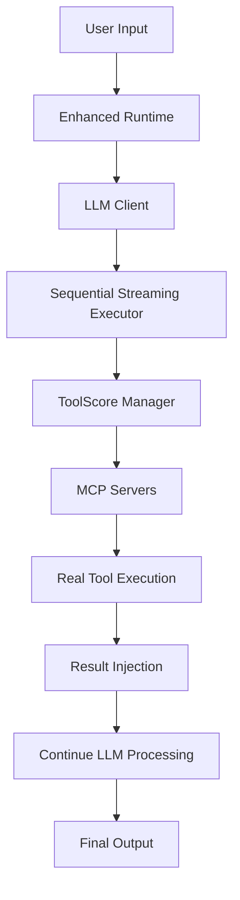
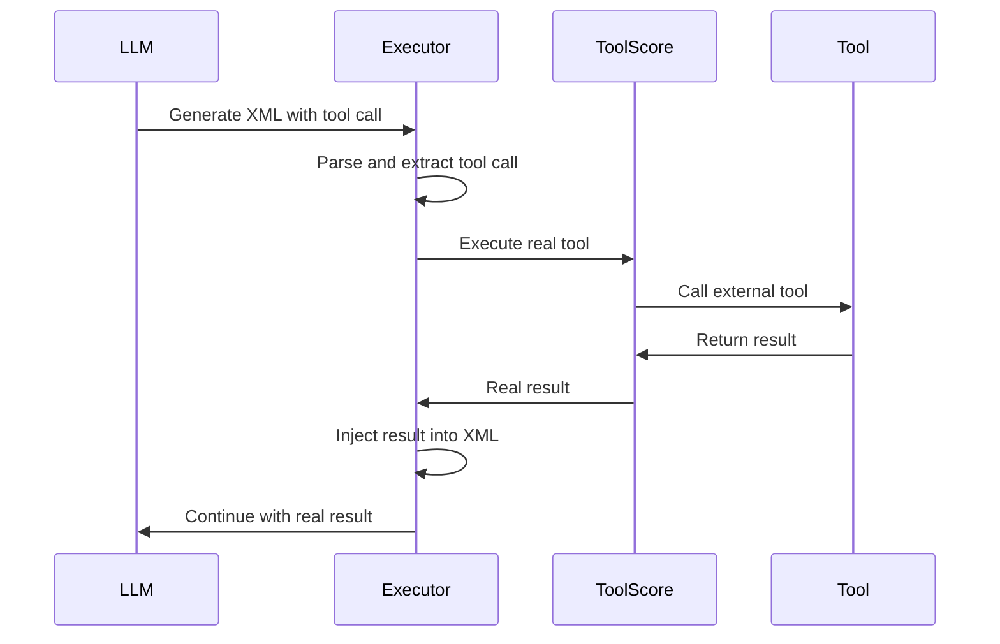
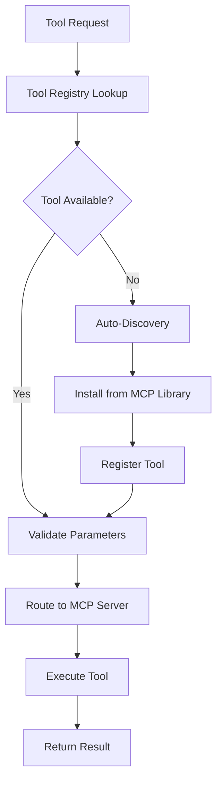
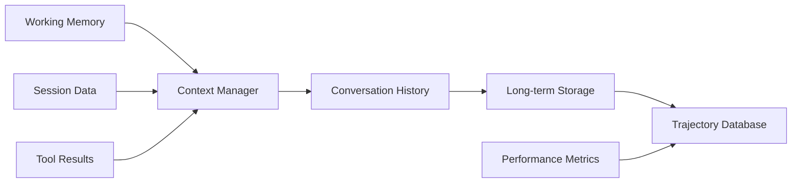

# Agent Data Platform - System Architecture Documentation

## Table of Contents

1. [Overview](#overview)
2. [System Architecture](#system-architecture)
3. [Core Components](#core-components)
4. [Anti-Hallucination System](#anti-hallucination-system)
5. [Tool Management](#tool-management)
6. [LLM Integration](#llm-integration)
7. [Data Flow](#data-flow)
8. [Error Handling](#error-handling)
9. [Performance & Monitoring](#performance--monitoring)
10. [Configuration](#configuration)
11. [Deployment](#deployment)

## Overview

The Agent Data Platform is a sophisticated multi-agent system that combines Large Language Model (LLM) reasoning with real tool execution through an anti-hallucination framework. The system ensures that LLMs cannot generate fake tool execution results by implementing a true "stop-and-wait" mechanism where the LLM must pause after each tool call and wait for real execution results.

### Key Features

- **Anti-Hallucination Framework**: Prevents LLMs from generating fake tool results
- **XML Streaming Execution**: Real-time tool execution with result injection
- **Multi-Provider LLM Support**: OpenAI, Gemini, DeepSeek, vLLM
- **MCP (Model Context Protocol) Integration**: Standardized tool communication
- **Intelligent Caching**: Performance optimization with semantic matching
- **Comprehensive Error Recovery**: Multi-layer error handling and correction
- **Performance Monitoring**: Detailed metrics and trajectory tracking

## System Architecture

### High-Level Architecture



### Component Layers

1. **Presentation Layer**: User interface and input handling
2. **Runtime Layer**: Enhanced runtime with anti-hallucination logic
3. **LLM Layer**: Unified client with multiple provider support
4. **Execution Layer**: Sequential streaming executor and XML processing
5. **Tool Layer**: ToolScore manager and MCP server integration
6. **Service Layer**: External tools and services
7. **Data Layer**: Trajectory storage and performance metrics

## Core Components

### Enhanced Runtime (`/runtimes/reasoning/enhanced_runtime.py`)

The Enhanced Runtime is the core orchestrator that implements the anti-hallucination framework.

**Key Features:**
- XML streaming mode with iterative execution
- Stop-and-wait mechanism for tool calls
- Memory management and context preservation
- Trajectory enhancement and storage
- Performance monitoring and optimization

**Execution Flow:**
1. Initialize runtime with task specification
2. Generate initial LLM response with XML tool calls
3. Parse XML to extract tool calls sequentially
4. Execute each tool call via ToolScore
5. Inject real results back into XML stream
6. Continue LLM processing until completion

### LLM Client (`/core/llm_client.py`)

Unified interface for multiple LLM providers with validation and error handling.

**Supported Providers:**
- **OpenAI**: GPT models with function calling
- **Gemini**: Google's language models
- **DeepSeek**: Specialized reasoning models
- **vLLM**: Local model serving

**Components:**
- **Prompt Builders**: Task-specific prompt construction
- **Response Parsers**: Structured output parsing
- **Validation Middleware**: Input/output validation
- **Provider Detection**: Automatic provider selection

### Sequential Streaming Executor (`/core/streaming/sequential_executor.py`)

Implements the core anti-hallucination logic through real-time XML processing.

**Anti-Hallucination Features:**
- Detects and removes hallucinated `<result>` tags
- Enforces sequential tool execution
- Injects real tool results at correct positions
- Validates XML structure integrity
- Handles tool execution errors gracefully

### ToolScore Manager (`/core/toolscore/`)

Central tool management system with MCP server integration.

**Capabilities:**
- Dynamic tool discovery and registration
- Tool capability mapping and validation
- MCP server lifecycle management
- Session pooling and connection management
- Tool gap detection and installation

## Anti-Hallucination System

### Problem Statement

Traditional LLM agents often generate fake tool execution results when they encounter tool calls, leading to unreliable and potentially dangerous behavior. The Agent Data Platform solves this through a comprehensive anti-hallucination framework.

### Solution Architecture

#### 1. Stop-and-Wait Mechanism



#### 2. Multi-Layer Validation

**Layer 1: Input Validation**
- Message structure validation
- Parameter type checking
- Content sanitization

**Layer 2: XML Processing**
- Real-time XML parsing
- Hallucination detection
- Structure validation

**Layer 3: Tool Execution**
- Parameter mapping and validation
- Real tool execution via MCP
- Result validation and injection

**Layer 4: Output Validation**
- Response structure checking
- Mock object detection
- Error recovery mechanisms

#### 3. Implementation Details

**Tool Call Detection:**
```python
def _extract_tool_call(self, response: str) -> Optional[Dict[str, Any]]:
    """Extract tool calls from LLM response"""
    # Regex patterns for different tool formats
    patterns = [
        r'<(\w+)>(.*?)</\1>',
        r'<(\w+)([^>]*)>(.*?)</\1>'
    ]
    # Parse and validate tool calls
```

**Real Tool Execution:**
```python
async def _execute_real_tool(self, tool_name: str, instruction: str) -> Dict[str, Any]:
    """Execute tool via ToolScore with parameter mapping"""
    # Map parameters based on tool type
    if tool_name == 'deepsearch':
        parameters = {'question': instruction}
    elif tool_name == 'microsandbox':
        parameters = {'code': instruction}
    # Execute via ToolScore client
```

**Result Injection:**
```python
def inject_result(self, xml_content: str, result: str, position: int) -> str:
    """Inject real tool result into XML stream"""
    # Remove any hallucinated results
    # Insert real result at correct position
    # Validate XML structure
```

## Tool Management

### MCP Server Architecture

The platform uses Model Context Protocol (MCP) for standardized tool communication.

**Available MCP Servers:**

#### Browser Use Server (Port 8084)
- AI-powered browser automation
- Web scraping and interaction
- Form filling and navigation
- Screenshot and content extraction

#### DeepSearch Server (Port 8086)
- Advanced search and research
- Multi-source information aggregation
- Intelligent query optimization
- Result synthesis and analysis

#### MicroSandbox Server (Port 8085)
- Secure code execution environment
- Multiple language support
- Resource isolation and monitoring
- Result capture and validation

#### Search Tool Server (Port 8087)
- File system search and indexing
- Content pattern matching
- Repository exploration
- Code analysis and documentation

### Tool Discovery and Registration



### Tool Configuration

Tools are configured through structured JSON definitions:

```json
{
  "name": "deepsearch",
  "description": "Advanced search and research tool",
  "parameters": {
    "question": {
      "type": "string",
      "description": "Research question or query",
      "required": true
    }
  },
  "server": "deepsearch_server",
  "port": 8086,
  "capabilities": ["research", "search", "analysis"]
}
```

## LLM Integration

### Multi-Provider Support

The system supports multiple LLM providers through a unified interface:

#### Provider Configuration

```python
# Environment-based provider detection
providers = {
    'gemini': GeminiProvider(config),
    'openai': OpenAIProvider(config),
    'deepseek': DeepSeekProvider(config),
    'vllm': VLLMProvider(config)
}
```

#### Prompt Building

Task-specific prompt builders ensure optimal LLM performance:

**Reasoning Prompt Builder:**
```python
def build_prompt(self, task_description: str, available_tools: List[str], 
                previous_steps: List[Dict], execution_context: Dict) -> List[Dict]:
    """Build reasoning prompt with anti-hallucination instructions"""
    system_prompt = """
    **CRITICAL ANTI-HALLUCINATION RULES:**
    1. **Think First**: Start with a `<think>` block
    2. **Use ONE Tool**: Use exactly ONE tool with proper format
    3. **STOP IMMEDIATELY**: After tool use, you MUST STOP
    4. **NEVER Generate Fake Results**: Only system provides real results
    """
```

#### Response Parsing

Structured parsers extract meaningful data from LLM responses:

```python
def parse_response(self, response: str) -> Dict[str, Any]:
    """Parse LLM response into structured format"""
    return {
        "thinking": self._extract_thinking(response),
        "action": self._extract_action(response),
        "tool": self._extract_tool(response),
        "parameters": self._extract_parameters(response),
        "confidence": self._calculate_confidence(response)
    }
```

## Data Flow

### Request Processing Pipeline

1. **Input Reception**: User request received and validated
2. **Task Enhancement**: Request enriched with context and metadata
3. **LLM Processing**: Initial response generated with tool calls
4. **Tool Execution**: Sequential execution of real tools
5. **Result Integration**: Real results injected into response stream
6. **Output Generation**: Final response compiled and returned

### Memory Management



### Trajectory Storage

Execution trajectories are stored in multiple formats:

**Raw Trajectory:**
```json
{
  "task_id": "uuid",
  "timestamp": "2025-06-30T01:32:21.770731",
  "task_description": "Search Python creator and calculate 2^5",
  "duration": 2.625,
  "success": true,
  "raw_response": "<think>...</think><deepsearch>...</deepsearch>",
  "steps": [...],
  "performance_metrics": {...}
}
```

**Grouped Storage:**
- Daily grouping: `/output/trajectories/grouped/2025-06-30/`
- Weekly grouping: `/output/trajectories/weekly/2025-W26/`
- Monthly grouping: `/output/trajectories/monthly/2025-06/`

## Error Handling

### Error Classification

#### Tool Execution Errors
- Parameter validation failures
- Tool unavailability
- Execution timeouts
- Resource limitations

#### LLM Response Errors
- Invalid XML structure
- Missing required tags
- Hallucinated results
- Token limit exceeded

#### System Errors
- Network connectivity issues
- Service unavailability
- Configuration errors
- Resource exhaustion

### Recovery Strategies

#### Automatic Recovery
```python
async def handle_tool_error(self, error: Exception, tool_name: str, 
                           parameters: Dict) -> Dict[str, Any]:
    """Implement automatic error recovery"""
    if isinstance(error, ParameterValidationError):
        # Auto-correct parameters
        corrected_params = await self._correct_parameters(parameters)
        return await self._retry_tool_execution(tool_name, corrected_params)
    
    elif isinstance(error, TimeoutError):
        # Increase timeout and retry
        return await self._retry_with_timeout(tool_name, parameters, 
                                            timeout=self.default_timeout * 2)
```

#### LLM Reflection
When tool execution fails, the system can request LLM reflection:

```python
async def request_llm_reflection(self, error: str, context: Dict) -> str:
    """Request LLM to reflect on error and suggest correction"""
    reflection_prompt = f"""
    The following error occurred during tool execution:
    Error: {error}
    Context: {context}
    
    Please analyze the error and suggest a corrected approach.
    """
    return await self.llm_client.generate_reflection(reflection_prompt)
```

## Performance & Monitoring

### Metrics Collection

The system collects comprehensive performance metrics:

#### Execution Metrics
- Task completion time
- Tool execution latency
- LLM response time
- Memory usage
- Error rates

#### Quality Metrics
- Anti-hallucination effectiveness
- Tool success rates
- Response accuracy
- User satisfaction scores

#### System Metrics
- Server resource utilization
- MCP server availability
- Cache hit rates
- Throughput measurements

### Monitoring Dashboard

Key performance indicators are tracked in real-time:

```python
class PerformanceMonitor:
    def __init__(self):
        self.metrics = {
            'total_tasks': 0,
            'successful_tasks': 0,
            'avg_completion_time': 0.0,
            'tool_execution_stats': {},
            'error_distribution': {},
            'anti_hallucination_interventions': 0
        }
    
    def record_task_completion(self, duration: float, success: bool, 
                              tools_used: List[str]):
        """Record task completion metrics"""
        self.metrics['total_tasks'] += 1
        if success:
            self.metrics['successful_tasks'] += 1
        
        # Update rolling average
        self._update_avg_completion_time(duration)
        
        # Record tool usage
        for tool in tools_used:
            self._record_tool_usage(tool, success)
```

### Intelligent Caching

The system implements intelligent caching with semantic matching:

```python
class IntelligentCache:
    async def get_cached_result(self, question: str, 
                               similarity_threshold: float = 0.7) -> Optional[Dict]:
        """Retrieve cached result with semantic matching"""
        # Exact match check
        exact_match = await self._exact_match_lookup(question)
        if exact_match:
            return exact_match
        
        # Semantic similarity matching
        similar_results = await self._semantic_similarity_search(question)
        best_match = self._find_best_match(similar_results, similarity_threshold)
        
        return best_match
```

## Configuration

### Environment Variables

```bash
# LLM Provider Configuration
GEMINI_API_KEY=your_gemini_api_key
OPENAI_API_KEY=your_openai_api_key
DEEPSEEK_API_KEY=your_deepseek_api_key
VLLM_BASE_URL=http://localhost:8000

# System Configuration
DISABLE_CACHE=false
DEFAULT_PROVIDER=gemini
XML_STREAMING_MODE=true
ANTI_HALLUCINATION_ENABLED=true

# MCP Server Configuration
BROWSER_USE_PORT=8084
DEEPSEARCH_PORT=8086
MICROSANDBOX_PORT=8085
SEARCH_TOOL_PORT=8087

# Performance Configuration
DEFAULT_TIMEOUT=120
MAX_CONCURRENT_TOOLS=5
CACHE_TTL_HOURS=24
```

### Runtime Configuration

```json
{
  "runtime_mode": "enhanced",
  "streaming_mode": true,
  "anti_hallucination": {
    "enabled": true,
    "stop_and_wait": true,
    "result_injection": true,
    "xml_validation": true
  },
  "tool_management": {
    "auto_discovery": true,
    "parameter_validation": true,
    "timeout_seconds": 120,
    "retry_attempts": 3
  },
  "performance": {
    "cache_enabled": true,
    "parallel_execution": false,
    "memory_optimization": true,
    "trajectory_storage": "grouped_daily"
  }
}
```

## Deployment

### System Requirements

#### Minimum Requirements
- Python 3.8+
- 8GB RAM
- 2 CPU cores
- 10GB storage

#### Recommended Requirements
- Python 3.11+
- 16GB RAM
- 4 CPU cores
- 50GB SSD storage

### Installation

```bash
# Clone repository
git clone <repository-url>
cd agent-data-platform

# Install dependencies
pip install -r requirements.txt

# Configure environment
cp .env.example .env
# Edit .env with your configuration

# Initialize MCP servers
python scripts/setup_mcp_servers.py

# Start the system
python main.py
```

### Docker Deployment

```dockerfile
FROM python:3.11-slim

WORKDIR /app
COPY . .

RUN pip install -r requirements.txt

EXPOSE 8080
CMD ["python", "main.py"]
```

### Service Management

```bash
# Start all services
python scripts/start_services.py

# Check service status
python scripts/check_health.py

# Stop all services
python scripts/stop_services.py

# View logs
python scripts/view_logs.py --service=enhanced_runtime
```

### Monitoring Setup

```bash
# Install monitoring dependencies
pip install prometheus-client grafana-api

# Start monitoring
python scripts/start_monitoring.py

# Access dashboards
# Metrics: http://localhost:9090
# Dashboards: http://localhost:3000
```

## Best Practices

### Development Guidelines

1. **Anti-Hallucination First**: Always implement real tool execution
2. **Error Handling**: Comprehensive error recovery mechanisms
3. **Performance Monitoring**: Track all key metrics
4. **Testing**: Unit tests for all critical components
5. **Documentation**: Keep docs updated with code changes

### Security Considerations

1. **Input Validation**: Sanitize all user inputs
2. **Tool Permissions**: Restrict tool access based on context
3. **Resource Limits**: Implement proper resource constraints
4. **Audit Logging**: Log all tool executions and decisions
5. **Secret Management**: Secure API key and credential handling

### Performance Optimization

1. **Caching Strategy**: Implement intelligent caching
2. **Parallel Execution**: Use parallel processing where safe
3. **Resource Management**: Monitor and optimize resource usage
4. **Timeout Configuration**: Set appropriate timeouts
5. **Memory Management**: Implement proper memory cleanup

## Troubleshooting

### Common Issues

#### Tool Execution Failures
```bash
# Check MCP server status
python scripts/check_mcp_servers.py

# Restart specific server
python scripts/restart_server.py --server=deepsearch

# View tool execution logs
tail -f logs/tool_execution.log
```

#### LLM Provider Issues
```bash
# Test provider connectivity
python scripts/test_providers.py

# Switch to backup provider
export FALLBACK_PROVIDER=openai

# Check API key configuration
python scripts/verify_credentials.py
```

#### Performance Issues
```bash
# Check system resources
python scripts/system_health.py

# Clear cache
python scripts/clear_cache.py

# Optimize configuration
python scripts/optimize_config.py
```

### Debugging Mode

```bash
# Enable debug logging
export LOG_LEVEL=DEBUG

# Enable performance profiling
export ENABLE_PROFILING=true

# Start with debug mode
python main.py --debug --verbose
```

## Conclusion

The Agent Data Platform provides a robust, scalable solution for building reliable AI agents with strong anti-hallucination guarantees. The system's architecture ensures that LLMs cannot generate fake tool results, leading to more trustworthy and reliable AI agent behavior.

Key benefits include:
- **Reliability**: True tool execution prevents hallucinations
- **Scalability**: Modular architecture supports growth
- **Flexibility**: Multi-provider LLM support
- **Observability**: Comprehensive monitoring and metrics
- **Maintainability**: Clean, documented codebase

For additional support and documentation, please refer to the project repository and community resources.