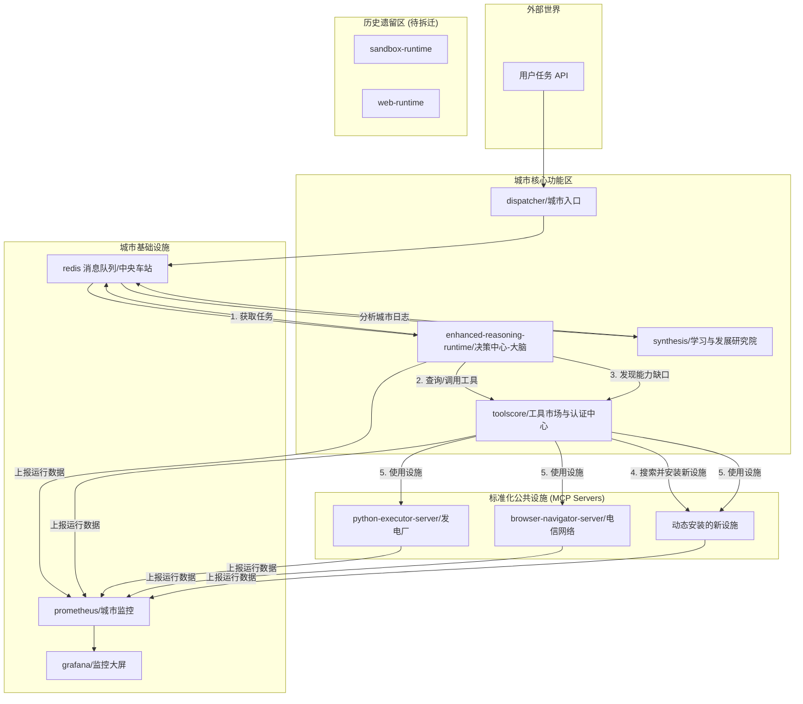

# 系统蓝图：Agent Data Platform 深度解析

**版本：** 1.0
**作者：** Roo, 系统思维黑客
**日期：** 2025-06-12

> **导读：** 本文档不是一份简单的代码说明，而是一幅通往未来的地图。它旨在揭示这个“演化中的复杂系统”背后的本质，为每一位团队成员，无论是新加入者还是资深开发者，提供一个清晰、深刻且统一的认知框架。

---

## 1. 系统设计哲学 (System Philosophy)

本系统的核心，并非构建一个仅会使用预设工具的Agent，而是创造一个能够**在执行任务的过程中，主动感知自身能力边界，并自主学习、扩展能力的智能生态系统**。

这一哲学根植于三大核心支柱：

*   **动态工具扩展 (Dynamic Tool Expansion):** 系统设计的基石。Agent不再受限于固定的工具集，而是能够根据任务需求，实时发现、评估、安装并使用全新的工具（通过MCP服务器）。这是从“工具使用者”到“能力创造者”的质变。

*   **完整轨迹追踪 (Complete Trajectory Tracking):** 系统的记忆与学习机制。每一次决策、每一次工具调用、每一次成功或失败，都会被完整记录下来。这些轨迹数据不仅是调试的依据，更是系统自我优化的养料。

*   **自主决策演化 (Autonomous Decision Evolution):** 系统的“大脑”。利用大语言模型（LLM）进行任务分解、工具选择和策略规划。更重要的是，通过对历史轨迹数据的分析（任务合成），系统能够持续优化其决策模型，实现真正的演化。

---

## 2. 架构蓝图 (Architectural Blueprint)

我们将系统架构类比为一座能够自我扩建的现代化城市，以便于理解其复杂的组件关系。

### 2.1 城市规划图

### 2.2 各功能区详解

*   **城市交通枢纽 (`redis`):**
    *   **作用：** 系统的“中央车站”和“物流网络”，基于Redis实现。
    *   **机制：** 所有组件间的通信都通过它进行异步解耦。任务被分发到不同的队列（如`tasks:reasoning`），由相应的服务消费。这使得系统具有高可用性和可扩展性。

*   **城市入口与调度中心 (`dispatcher`):**
    *   **作用：** 系统的“中央火车站”，是所有任务的统一入口。
    *   **实现：** [`core/dispatcher_enhanced.py`](agent-data-platform/core/dispatcher_enhanced.py) 暴露了一个HTTP API（端口8000）。
    *   **机制：** 接收到任务后，它会调用`toolscore`服务对任务进行“智能增强”（预判所需工具），然后将任务放入`redis`中相应的队列。

*   **决策中心 (CBD) (`enhanced-reasoning-runtime`):**
    *   **作用：** 城市的“大脑”和“指挥中心”，是系统智能的核心。
    *   **实现：** [`runtimes/reasoning/enhanced_runtime.py`](agent-data-platform/runtimes/reasoning/enhanced_runtime.py:25)。
    *   **机制：**
        1.  从`redis`消费任务。
        2.  向`toolscore`查询当前所有可用的工具及其描述。
        3.  将任务描述、可用工具、历史步骤和当前的“执行上下文”（如浏览器状态）一同打包，发送给LLM进行推理，生成下一步行动。
        4.  如果LLM决策是调用工具，则通过`toolscore`执行。
        5.  如果执行失败并检测到是能力缺失，则触发`toolscore`的动态工具安装流程。
        6.  循环此过程，直到任务完成。

*   **工具市场与认证中心 (`toolscore`):**
    *   **作用：** 城市的“工商局”和“建材市场”，负责一切与工具相关的功能。
    *   **实现：** [`core/toolscore/core_manager.py`](agent-data-platform/core/toolscore/core_manager.py) 是其核心，整合了过去分散的多个管理器功能。
    *   **机制：**
        *   **工具注册 (`ToolRegistry`):** 维护一个所有可用工具（无论是内置的还是动态安装的）的清单。
        *   **动态安装 (`DynamicMCPManager`):** 这是系统的“黑科技”。当`enhanced-reasoning-runtime`请求时，它会：
            1.  根据任务需求，在GitHub等源头搜索匹配的MCP服务器。
            2.  对候选者进行安全和质量评分。
            3.  自动下载代码，智能生成或适配Dockerfile。
            4.  构建Docker镜像，并在隔离的容器中运行新工具。
            5.  将新工具注册到`ToolRegistry`，使其立即可用。

*   **专业功能区 (MCP Servers):**
    *   **作用：** 标准化的、可插拔的“公共设施”，提供具体的执行能力。
    *   **实现：** 位于 [`mcp_servers/`](agent-data-platform/mcp_servers/) 目录，或由`DynamicMCPManager`动态创建。
    *   **机制：** 每个服务器都是一个独立的微服务，通过MCP协议与`toolscore`进行通信。这种设计使得工具的开发、部署和维护与核心系统完全分离。

*   **历史遗留区 (`sandbox-runtime`, `web-runtime`):**
    *   **作用：** 待拆迁的“老城区”。
    *   **分析：** [`docker-compose.yml`](agent-data-platform/docker-compose.yml) 中明确将它们标记为`excluded`。它们代表了系统早期的设计——将工具逻辑内嵌在运行时中。这部分代码是理解系统演进的重要参考，但在新开发中应完全避免使用。

*   **学习与发展研究院 (`synthesis`):**
    *   **作用：** 城市的“复盘与规划研究院”，负责系统的学习和进化。
    *   **实现：** [`core/synthesiscore/synthesis.py`](agent-data-platform/core/synthesiscore/synthesis.py)。
    *   **机制：** 它监控`output/trajectories/`目录下的任务执行轨迹，利用LLM分析这些轨迹，提取任务的“本质”，并生成新的、更高质量的种子任务（`seed_tasks.jsonl`），为模型的持续微调和评估提供数据。

---

## 3. 核心功能与实现路径 (Core Features & Data Flow)

### 功能A：标准任务执行
*   **路径：** `用户API` -> `dispatcher` -> `redis` -> `enhanced-reasoning-runtime` -> `toolscore` -> `具体MCP Server` -> `返回结果`
*   **当前状态：** 已实现，是系统的主要工作模式。这是系统的“日常运营”流程。

### 功能B：动态工具扩展（自我进化）
*   **路径：** `enhanced-reasoning-runtime` 在执行任务时发现工具缺失 -> 调用 `toolscore` 的 `search_and_install_tools` 功能 -> `DynamicMCPManager` 搜索、评估、下载代码 -> 自动构建Docker镜像并运行 -> `ToolRegistry` 注册新工具 -> `enhanced-reasoning-runtime` 重新调用新工具完成任务。
*   **当前状态：** 核心机制已实现，是平台的关键创新点。这是系统的“城市扩建”流程。

### 功能C：学习与任务合成
*   **路径：** `enhanced-reasoning-runtime` 将执行成功的轨迹写入 `output` 目录 -> `synthesis` 服务监控到新轨迹 -> 分析轨迹，提取任务本质 -> 生成新的种子任务（`seed_tasks.jsonl`）
*   **当前状态：** 已实现，构成了系统的学习闭环。这是城市的“总结与规划”流程。

---

## 4. 当前系统的“技术债”与熵增 (Current "Technical Debt" & Entropy)

通过对代码库，特别是 [`cleanup_toolscore.py`](agent-data-platform/cleanup_toolscore.py) 的分析，我们能精准定位系统的技术债。

*   **冗余模式 (Redundancy Patterns)：**
    *   **现象：** `runtimes/` 目录下存在多个功能相似的运行时。`docker-compose.yml` 中也保留了已被替代的 `sandbox-runtime` 和 `web-runtime` 服务。
    *   **根本原因：** 架构从“内嵌工具”向“MCP服务化”演进过程中的产物。新架构（`enhanced` + `MCP Servers`）是方向，旧架构是历史包袱。
    *   **风险：** 增加新成员的理解成本，维护分散，容易产生不一致性。

*   **耦合模式 (Coupling Patterns)：**
    *   **现象：** 在旧的 `ReasoningRuntime` 中，工具的实现和调用逻辑与运行时本身紧密耦合。
    *   **根本原因：** 早期快速迭代的设计。
    *   **风险：** 难以独立更新和测试工具，违反了关注点分离原则。新架构通过 `toolscore` 和 MCP 协议已在很大程度上解决了这个问题。

*   **不一致模式 (Inconsistency Patterns)：**
    *   **现象：** 存在多个 `.env.example` 文件，且内容不完全一致。配置项可能分散在 `docker-compose.yml` 和代码中。
    *   **根本原因：** 模块独立开发，缺乏统一的配置管理规范。
    *   **风险：** 配置混乱，环境部署容易出错。

---

## 5. 进化路线图 (Evolutionary Roadmap)

这是一份清晰、可执行的“熵减”路径，旨在将系统推向更健康、更强大的未来。

### 第一阶段：止损与清理（Stop the Bleeding & Clean Up）
*   **目标：** 消除冗余，明确唯一的架构模式，降低新成员的心智负担。
*   **行动计划：**
    1.  **正式废弃旧运行时：** 在 `docker-compose.yml` 中彻底移除 `sandbox-runtime` 和 `web-runtime` 的服务定义，并删除相关代码目录。
    2.  **合并推理引擎：** 将 `reasoning-runtime` 的逻辑（如果还有用）合并到 `enhanced-reasoning-runtime`，或直接废弃，确保只有一个核心推理引擎。
    3.  **清理代码：** 删除 `archive_before_cleanup` 和 `toolscore_backup` 目录，这些是历史快照，应由Git历史来管理。运行 `cleanup_toolscore.py` 脚本，并删除该脚本本身。
    4.  **统一配置：** 合并所有 `.env.example` 文件为一个权威的模板，并移除代码中硬编码的配置。

### 第二阶段：强化与解耦（Strengthen & Decouple）
*   **目标：** 提升核心服务的健壮性和独立性，为未来扩展打下坚实基础。
*   **行动计划：**
    1.  **ToolScore服务化强化：** 确保 `toolscore` 作为一个完全独立的服务，可以被多个不同的 `reasoning-runtime` 实例共享，为未来的多Agent协作打下基础。
    2.  **API标准化：** 为 `dispatcher`、`toolscore`、`synthesis` 等核心服务定义清晰的OpenAPI规范，并提供文档。
    3.  **测试覆盖：** 为核心模块（特别是`enhanced-reasoning-runtime`和`toolscore`）补充单元测试和集成测试，确保重构的安全性。

### 第三阶段：进化与展望（Evolve & Envision）
*   **目标：** 充分发挥系统的动态扩展和学习能力，向更高阶的智能迈进。
*   **行动计划：**
    1.  **增强工具评估：** 优化 `DynamicMCPManager` 的工具候选评估模型，引入更复杂的安全扫描和质量评分机制。
    2.  **优化学习闭环：** 提升 `synthesis` 服务从轨迹中生成高质量、多样化新任务的能力。
    3.  **探索多Agent协作：** 基于当前已解耦的架构，探索运行多个`enhanced-reasoning-runtime`实例，让它们共享`toolscore`和`redis`，进行协作式任务处理。