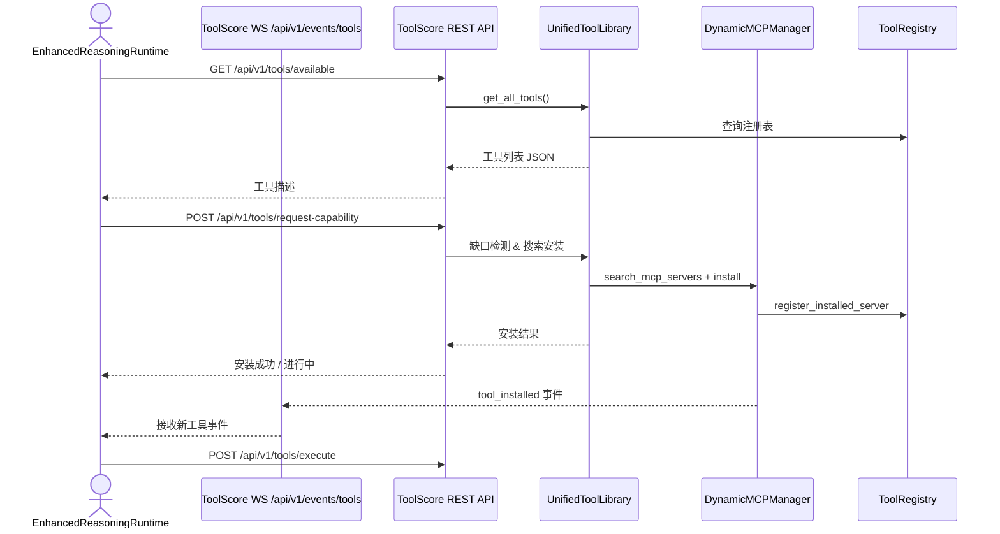

## 项目架构与运行机制概览

### 1. 顶层目录结构

```
agent-data-platform/
├── core/                 # 核心抽象层（接口、统一工具库、LLM 客户端等）
├── runtimes/             # 多种运行时实现（reasoning / web_navigator / sandbox）
├── mcp_servers/          # （可选）外部 Micro-Service-Tool Docker 镜像目录
├── data/ / output/       # 运行数据与输出
├── docs/                 # 文档目录（当前文件）
└── ...                   # 其它脚本、CI、Docker 配置
```

### 2. ToolScore（核心工具服务）

| 组件 | 角色 | 关键文件 |
|------|------|-----------|
| UnifiedToolLibrary | 统一入口，聚合所有管理能力 | `core/toolscore/unified_tool_library.py` |
| CoreManager | 容器 / Redis / 缓存 / WS 统一管理 | `core/toolscore/core_manager.py` |
| ToolRegistry | 工具元数据注册表 | `core/toolscore/tool_registry.py` |
| DynamicMCPManager | 自动搜索、安装、部署 MCP Server | `core/toolscore/dynamic_mcp_manager.py` |
| ToolGapDetector | LLM 驱动的工具缺口分析 | `core/toolscore/tool_gap_detector.py` |
| MCPSearchTool | 基于缺口分析，选型并安装工具 | `core/toolscore/mcp_search_tool.py` |
| MonitoringAPI | aiohttp 实现的 REST + WebSocket 网关 | `core/toolscore/monitoring_api.py` |

#### 2.1 UnifiedToolLibrary 工作流

1. 初始化时创建 `CoreManager`、`ToolRegistry`、`DynamicMCPManager` 等子组件。
2. 对外暴露 API：注册 / 查询 / 执行工具 & 动态安装 MCP Server。
3. 维护 `tool_gap_detector` + `mcp_search_tool`，在缺口场景下自动调用安装逻辑。

#### 2.2 CoreManager 重要职责

- **Docker**：容器、镜像生命周期管理 + 自动恢复。
- **Redis**：工具/服务器信息持久化 & 事件发布。
- **WebSocket**：统一维护客户端连接，广播工具事件。
- **预置服务器**：启动时检测/自动注册一些常用 MCP Server。

### 3. 运行时（以 `EnhancedReasoningRuntime` 为例）

| 步骤 | 行为 |
|------|------|
| 初始化 | 等待 ToolScore `/health`，建立 WebSocket 订阅工具事件。 |
| 任务执行 | 1) 拉取 `/api/v1/tools/available`<br/>2) LLM 任务分析 → 若能力不足则调用 `/api/v1/tools/request-capability`<br/>3) 等待 WebSocket 推送 `tool_installed` 事件<br/>4) 调用新工具完成任务，记录 `ExecutionStep` & LLM 交互。 |

### 4. 关键交互时序



### 5. 已实现核心能力

1. **自动化工具全生命周期管理**：注册 / 查询 / 调用 / 卸载。
2. **智能缺口检测 & 动态安装**：LLM 判定 → 从 GitHub 等仓库拉取 Docker → 自动部署。
3. **运行时解耦**：Reasoning / Browser / Sandbox 运行时均通过 HTTP/WS 使用工具，无需关心底层部署。
4. **WebSocket 实时通知**：新工具 / 更新 / 卸载事件秒级广播，运行时可即时恢复任务。
5. **持久化与自愈**：Redis + Docker Labels，重启后自动恢复已安装服务器与容器状态。
6. **监控与指标**：`EnhancedMetrics` + MonitoringAPI `/stats` 端点，便于 Prometheus 采集。

### 6. 扩展指南

| 场景 | 操作 |
|------|------|
| 新增本地函数工具 | 定义 `FunctionToolSpec` → `await tool_library.register_function_tool()` |
| 引入外部服务 | 编写符合 MCP 协议的 Server（WebSocket）→ 推送到仓库 → ToolScore 自动安装 |
| 自定义缺口策略 | 改写 `ToolGapDetector.analyze_tool_sufficiency()` 或替换 LLM 提示语 |
| UI 监控 | 把 MonitoringAPI 暴露端口映射到宿主机，用 Prometheus/Grafana 采集可视化 |

---

> 本文档旨在帮助开发者快速理解 agent-data-platform 工程的整体设计、运行流程与可扩展点。 