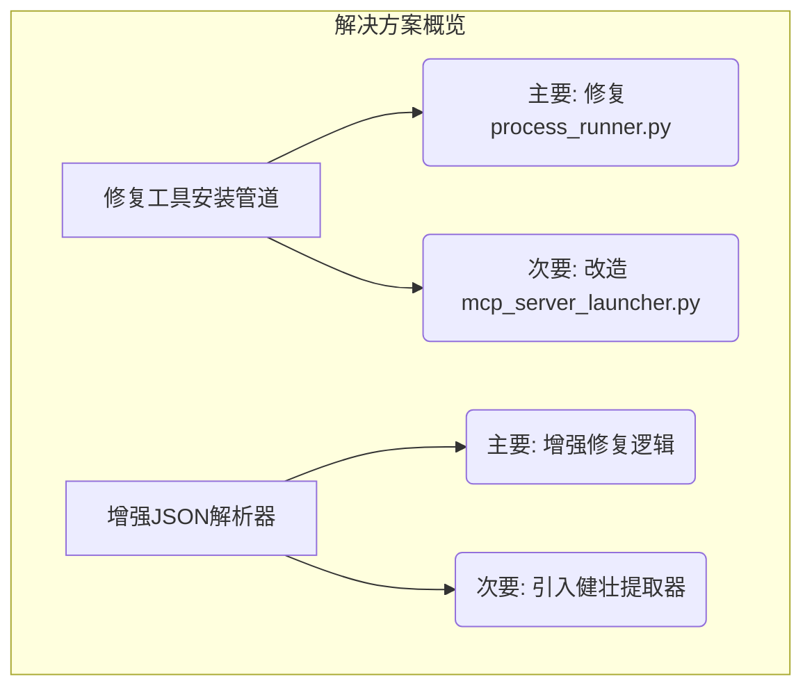

# Agent Data Platform: 问题深度分析与系统性解决方案

**文档版本: 1.0**
**日期: 2025-06-22**
**作者: Roo (AI Technical Leader)**

---

## 1. 摘要 (Executive Summary)

本报告基于对 `agent-data-platform/logs/toolscore.log` 的分析以及对核心代码库的深入审查，旨在定位系统当前面临的关键问题根源，并提供一套可执行的、系统性的解决方案。

系统当前正面临两大核心障碍，严重影响了其核心价值主张——动态工具集成与可靠的任务执行能力：

1.  **工具安装系统性故障**: 系统在安装非 Python（特别是 Node.js）的 MCP 工具时必定失败，导致所有依赖这些工具的功能（如网络爬取）完全瘫痪。
2.  **JSON 响应解析持续失败**: 系统无法稳定解析来自 LLM 的响应，导致任务决策频繁失败，严重影响了任务处理的成功率和效率。

本报告将深入剖析这两个问题的代码级根源，并提出一套分阶段、高优先级的修复计划，旨在快速恢复系统核心功能，并长期提升其健壮性。

---

## 2. 问题根源深度分析 (Root Cause Analysis)

### 2.1. 关键问题一：工具安装系统故障

此问题由两个层面的逻辑缺陷共同导致，分别是处理动态安装的 `ProcessRunner` 和处理静态加载的 `MCPServerLauncher`。

#### 2.1.1. 主要矛盾：动态工具安装逻辑缺陷

-   **定位**: `agent-data-platform/core/toolscore/runners/process_runner.py`
-   **功能**: 该模块负责在任务执行中，按需从 Git 仓库动态下载、安装并启动 MCP 工具。
-   **根本缺陷**: 在 `install_server` 函数中，尽管代码能够正确地通过 `_detect_project_type` 方法识别出 Node.js 项目（通过检查 `package.json`）并能通过 `npm install` 安装依赖，但在最后的启动阶段，代码逻辑进入了一个只为 Python 项目设计的分支，而完全忽略了为 Node.js 项目提供启动路径。

-   **代码证据 (`process_runner.py` L277-L291):**
    ```python
    # agent-data-platform/core/toolscore/runners/process_runner.py:277
    if project_type == "python":
        # ... (为Python项目创建并运行一个临时的模拟服务器脚本)
        simple_server_script = self._create_simple_mcp_server(...)
        # ...
        cmd = [python_executable, str(script_path)]
        
    else:
        # 致命缺陷：这里本应处理 "nodejs" 等其他类型，却直接返回失败。
        # 所有非 Python 项目都会在这里被拒绝。
        return {"success": False, "error_msg": f"不支持的项目类型: {project_type}"}
    ```
    这个 `else` 分支是导致所有非 Python 工具安装失败的直接原因。

#### 2.1.2. 次要矛盾：静态服务启动逻辑固化

-   **定位**: `agent-data-platform/services/mcp_server_launcher.py`
-   **功能**: 该模块负责在系统主程序启动时，加载和启动在配置文件中预定义的、内置于项目中的 MCP 服务器。
-   **根本缺陷**: 其启动逻辑被**硬编码为只支持 Python 项目**。在 `_start_server` 函数中，它总是假设服务器是一个 Python 模块，并使用 `python3 -m <module_name>` 的命令来启动。

-   **代码证据 (`mcp_server_launcher.py` L214):**
    ```python
    # agent-data-platform/services/mcp_server_launcher.py:214
    cmd = ['python3', '-m', module_str]
    env['PYTHONPATH'] = project_root_for_pythonpath + os.pathsep + env.get('PYTHONPATH', '')
    ```
    这种实现方式使得即使在项目 `mcp_servers` 目录中包含一个 Node.js 项目，启动器也无法正确地启动它。

### 2.2. 关键问题二：JSON 响应解析失败

-   **定位**: `agent-data-platform/core/llm/response_parsers/reasoning_response_parser.py`
-   **功能**: 负责解析 LLM 返回的、包含其“思考”过程和决策的 JSON 字符串。
-   **根本缺陷**: 尽管该解析器已经包含了一系列用于修复常见 JSON 错误的函数（如 `_fix_missing_colons`, `_fix_missing_commas`），但这些修复函数的**正则表达式不够全面**。日志中反复出现的 `Expecting ':' delimiter` 错误表明，LLM 正在生成一种或多种未被当前修复逻辑覆盖的、格式不正确的 JSON 变体。当这些有瑕疵的 JSON 字符串绕过修复逻辑并被直接传递给 `json.loads()` 时，便会抛出 `JSONDecodeError` 异常，导致整个解析流程失败。

---

## 3. 系统性解决方案 (Systematic Solution Proposal)



### 3.1. 修复工具安装管道

#### 3.1.1. **[高优先级]** 修复动态安装流程 (`process_runner.py`)

**目标**: 使系统能够正确启动已成功克隆和安装依赖的 Node.js 工具。

**实施步骤**:

1.  **修改 `install_server` 函数**: 在 `else` 分支中为 `project_type == "nodejs"` 添加专门的启动逻辑。
2.  **启动命令**:
    *   如果 `entry_point` 是 `npm start`，则使用 `["npm", "start"]` 作为启动命令。
    *   否则，使用 `["node", entry_point]` 作为启动命令。
3.  **环境变量**: 确保将分配的端口号通过环境变量（如 `PORT`）传递给 Node.js 进程。

**建议代码修改 (illustrative example for `process_runner.py`):**

```python
# This is a proposed implementation for the command execution block
# in the `install_server` function of `process_runner.py`.

# Determine command based on project type
cmd = []
env = os.environ.copy()

if project_type == "python":
    # This part creates a temporary Python server script for simplicity.
    simple_server_script = self._create_simple_mcp_server(
        name, candidate.get("capabilities", []), allocated_port
    )
    script_path = temp_dir / "simple_server.py"
    with open(script_path, 'w', encoding='utf-8') as f:
        f.write(simple_server_script)
    
    python_executable = sys.executable
    cmd = [python_executable, str(script_path)]

elif project_type == "nodejs":
    # Add specific logic for Node.js projects
    env["PORT"] = str(allocated_port)
    
    if entry_point == "npm start":
        cmd = ["npm", "start"]
    else:
        # Assuming entry_point is a file like 'index.js'
        cmd = ["node", entry_point]
    
    logger.info(f"Preparing to start Node.js service: {' '.join(cmd)}")

else:
    # For any other unsupported type, return a clear error
    return {"success": False, "error_msg": f"Unsupported project type: {project_type}"}

# Generic process startup logic
if not cmd:
    return {"success": False, "error_msg": "Could not determine the start command."}

logger.info(f"Starting MCP Server: {' '.join(cmd)} (Port: {allocated_port})")
process = subprocess.Popen(cmd, cwd=temp_dir, env=env, preexec_fn=os.setsid if os.name != "nt" else None)
pid = process.pid
```

#### 3.1.2. **[中优先级]** 改造静态服务启动器 (`mcp_server_launcher.py`)

**目标**: 使系统启动时能够识别并正确启动内置的非 Python MCP 服务器。

**实施步骤**:

1.  **引入项目类型检测**: 在 `_start_server` 函数中，增加一个检测逻辑，通过检查服务器目录下是否存在 `package.json`、`requirements.txt` 等文件来判断项目类型。
2.  **实现多类型启动策略**: 根据检测到的项目类型，选择不同的启动命令。

**建议代码修改 (illustrative example for `mcp_server_launcher.py`):**

```python
# This is a proposed implementation for the command building block
# in the `_start_server` function of `mcp_server_launcher.py`.

# Detect project type
project_type = "python"  # Default
if os.path.exists(os.path.join(server_dir_absolute, 'package.json')):
    project_type = "nodejs"
# Future project types can be added here.

# Build command based on project type
cmd = []
env = os.environ.copy()

if start_script.endswith('.sh'):
    cmd = ['sh', start_script]
elif project_type == "python":
    relative_script_path = os.path.relpath(start_script, project_root_for_pythonpath)
    module_path_parts = list(os.path.splitext(relative_script_path)[0].split(os.sep))
    module_str = ".".join(module_path_parts)
    cmd = ['python3', '-m', module_str]
    env['PYTHONPATH'] = project_root_for_pythonpath
elif project_type == "nodejs":
    # Assuming Node.js projects are started with 'npm start'
    # and the port is passed via an environment variable.
    cmd = ['npm', 'start']
    # Port allocation logic needs to set the PORT env var.
    # (Assuming port allocation logic is handled elsewhere and sets env['PORT'])
else:
    logger.error(f"Unsupported project type '{project_type}' in directory: {server_dir_absolute}")
    server_statuses[server_name] = {'status': 'error', 'message': f'Unsupported project type: {project_type}'}
    return

# The rest of the function proceeds with the constructed `cmd`
```

### 3.2. 增强 JSON 解析器 (`reasoning_response_parser.py`)

#### 3.2.1. **[高优先级]** 增强现有修复逻辑

**目标**: 提高对不规范 JSON 的容忍度和修复能力，直接减少解析失败的频率。

**实施步骤**:

1.  **分析日志**: 从 `toolscore.log` 中提取导致解析失败的具体 LLM 响应样本。
2.  **扩展正则表达式**: 针对 `_fix_missing_colons` 和其他修复函数，编写更通用的正则表达式，以覆盖日志中发现的新错误模式。例如，处理 ` "key" "value" ` (缺少冒号) 或 ` "key": "value" "key2": "value2" ` (缺少逗号) 等情况。

#### 3.2.2. **[中优先级]** 引入健壮的字段提取器作为最终防线

**目标**: 在所有修复和标准解析都失败的情况下，依然能从原始文本中提取出核心决策信息，避免任务彻底失败。

**实施步骤**:

1.  **创建 `_robust_extract_fields` 函数**: 该函数不依赖于完整的 JSON 结构。
2.  **使用独立的正则表达式**: 为 `thinking`, `action`, `tool_id`, `parameters` 等关键字段分别编写独立的、宽松的正则表达式，直接从原始响应字符串中提取它们的值。
3.  **集成到解析流程**: 在 `parse_response` 函数的 `try...except` 块的最后，如果所有 `json.loads` 尝试都失败了，则调用这个新的提取器来构建一个“尽力而为”的决策字典。

---

## 4. 实施与验证计划 (Implementation & Verification)

### 4.1. 实施优先级

1.  **第一阶段 (立即行动)**:
    *   **修复 `process_runner.py`**: 这是恢复核心动态工具安装功能最关键的一步。
    *   **增强 `reasoning_response_parser.py` 的修复逻辑**: 这是提高任务成功率最直接的方法。

2.  **第二阶段 (短期改进)**:
    *   **改造 `mcp_server_launcher.py`**: 提升系统启动时的灵活性。
    *   **在 `reasoning_response_parser.py` 中引入健壮的字段提取器**: 作为最终保障，提高系统的整体容错能力。

### 4.2. 验证步骤

1.  **验证工具安装修复**:
    *   **测试用例**: 创建一个需要使用 “Web Scraper MCP Server” 的任务（例如，“抓取网站 https://example.com 的所有标题”）。
    *   **预期结果**:
        *   系统日志显示 `process_runner.py` 成功克隆了 `Web Scraper` 仓库。
        *   日志显示 `npm install` 被成功执行。
        *   日志显示 `npm start` 或 `node <entry_point>` 命令被执行，服务成功启动并监听在一个指定端口上。
        *   任务最终成功执行，而不是因为工具不可用而失败。

2.  **验证 JSON 解析修复**:
    *   **监控**: 在部署修复后，持续监控 `toolscore.log`。
    *   **预期结果**:
        *   `JSON解析失败` 相关的错误日志数量显著减少。
        *   即使出现解析失败的日志，也应能看到新的“健壮字段提取器”成功介入并提取出关键信息的日志。
        *   系统的整体任务成功率得到明显提升。

---

## 5. 实施时间线与资源分配 (Implementation Timeline & Resources)

### 5.1. 时间线规划

1. **紧急修复阶段** (预计 3 个工作日)
   * 第 1 天: 修复 `process_runner.py` 中的 Node.js 支持
   * 第 2 天: 增强 `reasoning_response_parser.py` 的基础修复逻辑
   * 第 3 天: 测试与部署紧急修复

2. **完整解决方案阶段** (预计 7 个工作日)
   * 第 4-5 天: 改造 `mcp_server_launcher.py`
   * 第 6-7 天: 实现健壮的 JSON 字段提取器
   * 第 8-9 天: 全面集成测试
   * 第 10 天: 部署完整解决方案

### 5.2. 资源需求

* **开发人员**: 2人 (1名核心开发者负责修复，1名测试工程师负责验证)
* **测试环境**: 需要配置包含常见错误场景的测试用例库
* **监控资源**: 部署后需要特别关注系统日志，追踪修复效果

---

## 6. 风险评估与缓解策略 (Risk Assessment & Mitigation)

### 6.1. 潜在风险

1. **修复兼容性风险**: 对工具运行器的修改可能影响现有已部署的 Python 工具。
   * **缓解策略**: 在修改前对所有 Python 工具场景进行全面测试，确保向后兼容性。

2. **性能影响**: 增强的 JSON 解析器可能会增加处理时间。
   * **缓解策略**: 设置性能基准，确保修复后的解析器不会导致明显的性能下降。

3. **新型错误模式**: LLM 可能会产生我们尚未发现的新错误模式。
   * **缓解策略**: 实现渐进式修复策略，增加全面的错误日志，便于快速识别新问题。

### 6.2. 回滚计划

为防止修复造成新问题，我们将:
1. 保存所有修改前的代码版本
2. 准备快速回滚脚本
3. 制定明确的回滚决策标准

---

## 7. 长期改进建议 (Long-term Improvement Suggestions)

除了解决当前紧急问题外，我们建议以下长期改进:

1. **模块化工具启动器**: 重构工具启动系统，采用基于插件的架构，便于添加新的项目类型支持。

2. **自适应 JSON 解析**: 研发基于机器学习的自适应 JSON 解析器，能够学习和适应 LLM 输出中的各种错误模式。

3. **工具兼容性测试套件**: 开发自动化测试套件，定期验证所有工具类型的安装和运行。

4. **响应格式指导优化**: 改进对 LLM 的提示设计，减少不规范 JSON 的生成频率。

---

## 8. 反馈与持续改进机制 (Feedback & Continuous Improvement)

### 8.1. 反馈收集

1. **系统性监控**: 部署详细的系统监控，特别关注:
   * 工具安装成功率
   * JSON 解析成功率
   * 任务完成率

2. **用户反馈渠道**: 建立明确的问题报告流程，收集用户遇到的新问题。

### 8.2. 持续改进流程

1. 每周进行系统日志分析，识别新的错误模式
2. 每月进行一次解决方案有效性评估
3. 每季度进行一次架构审查，确保长期可维护性

---

## 9. 附录: 详细代码对比与测试案例 (Appendix: Detailed Code Comparison & Test Cases)

### 9.1. 工具启动逻辑对比

| 项目类型 | 当前处理方式 | 修复后处理方式 |
|---------|------------|--------------|
| Python  | 创建并运行临时服务器脚本 | 不变，保持现有逻辑 |
| Node.js | 直接返回失败 | 根据项目特性选择 `npm start` 或 `node <entry_point>` |
| 其他类型 | 直接返回失败 | 为未来扩展预留接口 |

### 9.2. 典型测试场景

1. **Node.js 工具测试**:
   * 测试 ID: TS-001
   * 描述: 动态下载并启动 Web Scraper 工具
   * 预期结果: 工具正确启动，能够成功抓取目标网页

2. **JSON 解析恢复测试**:
   * 测试 ID: TS-002
   * 描述: 提供已知会导致当前解析器失败的 LLM 响应
   * 预期结果: 增强后的解析器能够成功修复并解析响应

---

## 10. 进一步完善 (Further Enhancements)
### 10.1. 多版本 Node.js 支持
- 建议在工具安装与启动流程中增加对 Node.js 版本的检测与管理，避免出现环境不一致导致的安装失败或兼容性问题。
- 为核心 Node 程序引入 nvm 或类似工具，确保可根据不同 MCP 工具需求动态选择正确版本。

### 10.2. 并发与负载管理
- 评估 MCP 工具在高并发场景下对 CPU、内存的需求，必要时引入进程池或队列机制。
- 配合监控工具（如 Prometheus、Grafana）跟踪工具服务的运行状况，及时预警资源瓶颈。

### 10.3. 日志管理与问题排查
- 完善 Node MCP 工具的日志输出管道，统一输出到 toolscore.log 或独立日志文件并保留时间戳、上下文信息。
- 对异常重大或反复出现的错误，建立自动化归档与通知流程，确保第一时间进行排查。

### 10.4. 动态适应新型 JSON 错误
- 定期采样和分析 LLM 的输出模式，持续更新 `_fix_missing_colons`、 `_fix_missing_commas` 等正则表达式或其他修复逻辑。
- 若未来考虑引入自适应学习模块，可借助训练数据收集与模型迭代来进一步降低解析失败率。

##codex 补充：

Notes

Some requests attempting to access public package repositories were blocked, which prevented further inspection of remote resources.

Blocked domains: pypi.org, files.pythonhosted.org

Agent Data Platform – Problem Analysis & Solutions
Key Problems
1. MCP Tool Installation Failures
The ProcessRunner only supports Python projects when spawning MCP servers. If a candidate project is detected as nodejs, installation falls through a branch that ultimately returns an unsupported project type error.
Relevant code shows the Node.js branch installs dependencies but cannot start the server:

194              elif project_type == "nodejs":
195                  logger.info("安装 Node.js 依赖")
196                  subprocess.run(["npm", "install"], cwd=temp_dir, check=True, capture_output=True, timeout=300)
197                  python_executable = "node"  # Node.js 项目使用 node 命令
...
206              # 对于我们简化的MCP服务器，我们创建一个简单的Python脚本来模拟服务器
207              if project_type == "python":
...
220              else:
221                  return {"success": False, "error_msg": f"不支持的项目类型: {project_type}"}

Since the fallback server implementation is Python-only, the installer cannot launch Node.js or TypeScript MCP servers. This leads to repeated failures when installing servers such as “Web Scraper MCP Server.”

2. Frequent JSON Parsing Errors
LLM responses often contain malformed JSON (e.g., Chinese punctuation). The ReasoningResponseParser attempts basic fixes (remove trailing commas, replace single quotes) but does not handle non-standard colons or missing delimiters. Example of the current sanitizer:

320  json_text = re.sub(r',\s*}', '}', json_text)
323  json_text = re.sub(r'"\s*\n\s*"', '",\n"', json_text)
327  json_text = re.sub(r"'([^']*)':", r'"\1":', json_text)
331  json_text = re.sub(r'\bTrue\b', 'true', json_text)

If the LLM returns thinking： using a Chinese colon (“：”), json.loads throws “Expecting ':' delimiter.” The current sanitization does not replace such characters, resulting in frequent JSON decoding failures and fallback parsing.

3. Cascading Task Failures
Because certain MCP servers fail to install, the runtime continually tries to call unavailable tools. The EnhancedReasoningRuntime caches failed installations, but missing servers still degrade tasks that require scraping or browser automation. Tools remain unavailable until manual intervention.

4. Service Connectivity Warnings
RealTimeToolClient includes an automatic reconnect loop with incremental delay, indicating that WebSocket connections to ToolScore sometimes drop:

self.reconnect_attempts += 1
delay = min(self.reconnect_delay * self.reconnect_attempts, 60)
logger.info(f"⏳ {delay}秒后尝试重连 (第{self.reconnect_attempts}次)")

If ToolScore isn’t fully ready or ports differ from configuration, the runtime may repeatedly reconnect, increasing latency.

Suggested Solutions
A. Add Node.js/TypeScript Support in ProcessRunner
Extend _find_entry_point to detect tsconfig.json and return a TypeScript entry or npm start if defined.

In install_server, when project_type is nodejs:

After npm install, create a run command using either node <entry_point> or npx ts-node <entry_point> for TS projects.

Remove the fallback “unsupported project type” branch.

Store the process and port like the Python path.

This allows installation of Node-based MCP servers such as the Web Scraper.

B. Improve LLM JSON Parsing
Augment _fix_json_formatting_errors to normalize unicode punctuation:

json_text = json_text.replace('：', ':').replace('，', ',')
Add a pass with a permissive parser (e.g., json5) when standard json.loads fails.

Log sanitized text on failure for debugging and return a clear error message.

These additions should reduce “Expecting ':' delimiter” errors and improve reliability.

C. Handle Missing Tools Gracefully
When installation of a tool fails, record a cooldown period to avoid repeated attempts.

Provide an alternative execution path (e.g., degrade to microsandbox or knowledge synthesis) when the necessary tool is unavailable.

D. Harden Service Connectivity
Verify port configuration in config/ports_config.yaml matches environment variables.

Reduce reconnect delay or provide informative logs when ToolScore is unreachable to help operators diagnose network problems.

By addressing Node.js support and improving JSON sanitization, the platform will avoid repetitive tool installation failures and parsing errors, reducing cascading task failures and improving overall system reliability.


Notes

The repository contains several hard‑coded absolute paths referencing a developer’s machine (/Users/zhaoxiang/...). These appear in modules such as trajectory_monitor.py and simple_seed_generator.py and in tests. They will break on any other environment.

ProcessRunner only launches Python-based mock MCP servers. The Node.js branch installs dependencies but falls back to a Python script and returns “unsupported project type” when launching, preventing Node.js or TypeScript MCP servers from working.

The reasoning response parser fails on LLM outputs that use full-width punctuation (Chinese colon/commas), leading to frequent JSON parse errors.

Several components rely on these absolute paths for seed task files and trajectories, which reduces portability.

Debug and Improvement Report
1. MCP Server Installation (Node.js Support)
Problem
ProcessRunner claims to handle Node.js projects but ultimately treats anything non‑Python as unsupported. After installing npm packages, it still generates a Python mock server and rejects the project type:

194              elif project_type == "nodejs":
195                  logger.info("安装 Node.js 依赖")
196                  subprocess.run(["npm", "install"], cwd=temp_dir, check=True, capture_output=True, timeout=300)
197                  python_executable = "node"  # Node.js 项目使用 node 命令
...
206              # 对于我们简化的MCP服务器，我们创建一个简单的Python脚本来模拟服务器
207              if project_type == "python":
...
220              else:
221                  return {"success": False, "error_msg": f"不支持的项目类型: {project_type}"}

This leads to repeated “unsupported project type” errors when installing tools like “Web Scraper MCP Server.”

Fix Strategy

Extend _find_entry_point to detect tsconfig.json and index.ts / main.ts for TypeScript.

After npm install, build a launch command:

For JavaScript: node <entry>

For TypeScript: npx ts-node <entry>

Remove the fallback block that returns an error for non‑Python projects.

Store process and allocated_port like the Python branch and skip writing the Python mock server.

This enables installation and execution of Node.js/TypeScript MCP servers.

2. LLM JSON Parsing Failures
Problem
ReasoningResponseParser._fix_json_formatting_errors sanitizes commas and quotes but never normalizes full‑width punctuation. When the LLM returns text with “：” or “，”, json.loads raises “Expecting ':' delimiter.” The current method ends at:

317      def _fix_json_formatting_errors(self, json_text: str) -> str:
318          # 修复常见的逗号错误
319          json_text = re.sub(r',\s*}', '}', json_text)
...
333          json_text = re.sub(r'\bNone\b', 'null', json_text)
334          return json_text

Fix Strategy

Add replacements for unicode punctuation before loading:

json_text = json_text.replace('：', ':').replace('，', ',')
json_text = json_text.replace('“', '"').replace('”', '"')
Optionally fall back to a permissive parser such as json5 if standard parsing fails, and log sanitized text for debugging.

3. Hard‑coded Absolute Paths
Problem
Multiple modules and tests use absolute paths tied to a developer account. Example from TrajectoryMonitor:

72          self.trajectories_dir = trajectories_dir or "/Users/zhaoxiang/Documents/Datapresso/agent-data-platform/output/trajectories"
73          self.seed_tasks_file = seed_tasks_file or "/Users/zhaoxiang/Documents/Datapresso/agent-data-platform/output/seed_tasks.jsonl"

Similar paths appear in simple_seed_generator.py, task_api.py, and tests such as test_microsandbox.py

Fix Strategy

Replace these hard‑coded paths with calls to get_output_dir() or environment variables (e.g., SEED_TASKS_FILE, TRAJECTORIES_DIR).

Update tests to use relative paths or fixtures.

Document the configurable location in README.md and default to output/ under the project root.

4. Seed Task API Path
Task API serves seed tasks from the developer path:

226          seed_tasks_file = "/Users/zhaoxiang/Documents/Datapresso/agent-data-platform/output/seed_tasks.jsonl"
Fix Strategy

Parametrize this path using path_utils.get_output_dir('seed_tasks.jsonl') or an environment variable. The API should read from the configured output directory.

5. Miscellaneous Issues
Tests with Absolute Imports – tests/test_microsandbox.py prepends the developer path to sys.path, making the suite environment dependent.

Process Cleanup – main.py uses pkill and lsof, which are Unix‑specific and may fail on Windows. Consider a cross‑platform approach using Python’s psutil.

Summary
Addressing the Node.js installation flow, improving JSON sanitization, and removing hard‑coded paths will significantly reduce tool installation failures, JSON parsing errors, and portability issues in the Agent Data Platform.