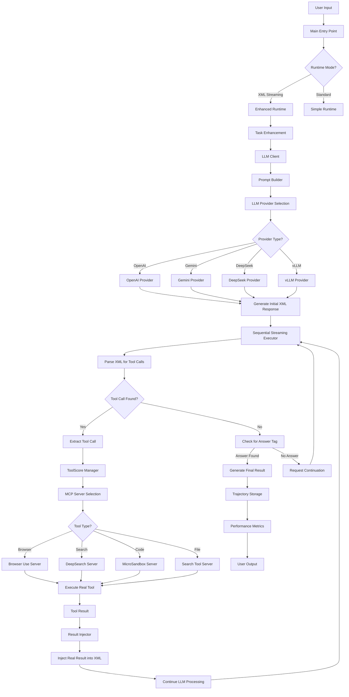
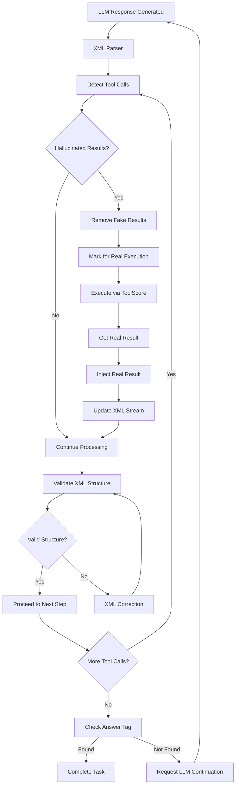
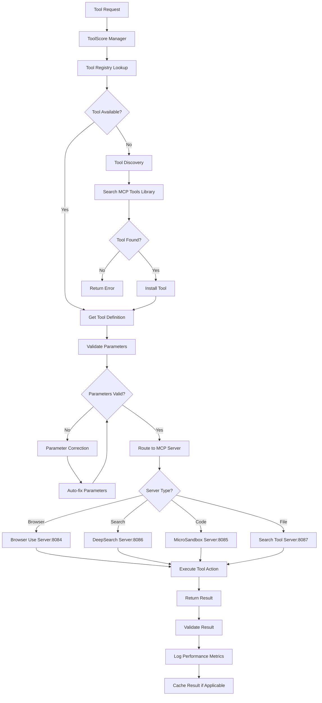
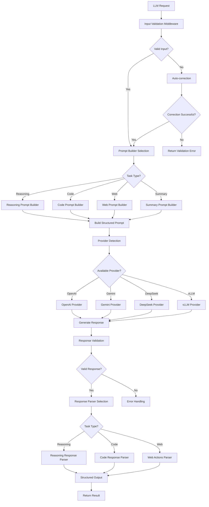
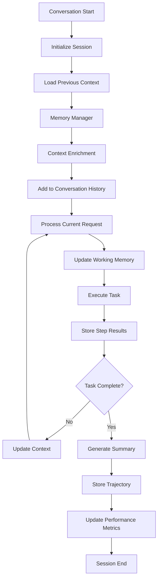
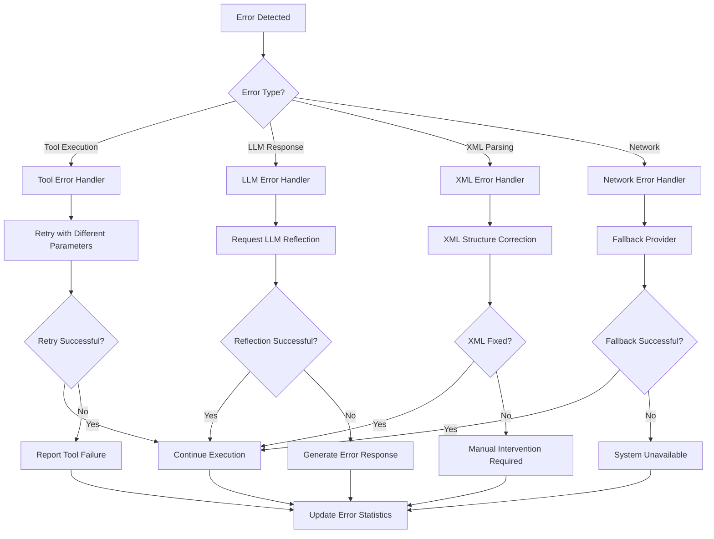
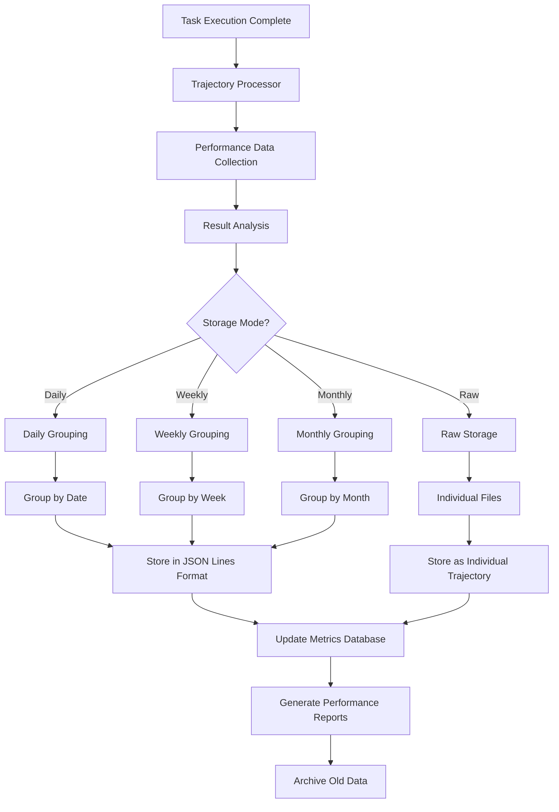

# Agent Data Platform - System Architecture Flowchart

## Main System Flow

## Anti-Hallucination System Flow

## Tool Management Flow

## LLM Client Architecture

## Memory and Context Management

## Error Recovery and Validation

## Data Storage and Trajectory Management

This flowchart provides a comprehensive view of the Agent Data Platform's architecture, showing the main execution flow, anti-hallucination mechanisms, tool management, error handling, and data storage systems.