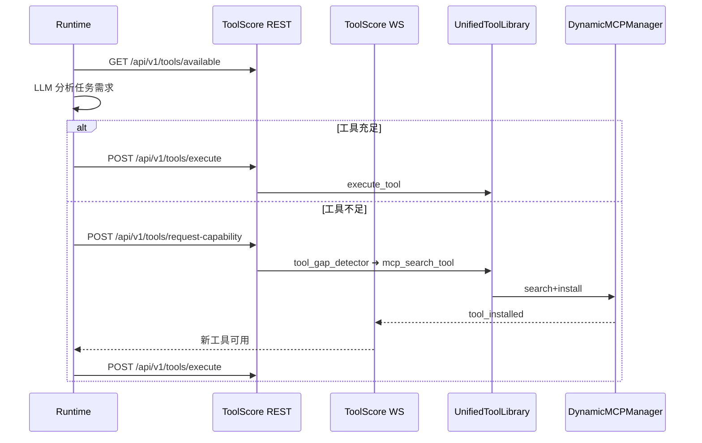

# 智能 Agent × ToolScore 工作流说明

## 1. 项目定位

平台充当 **LLM-Agent 的工具商店 / API 总线**：

* 运行时（Reasoning / Web 导航 / 代码沙箱…）只需专注"思考 + 任务拆解"，其余生命周期动作（搜索、安装、注册、监控工具）全部由 ToolScore 处理。
* ToolScore 支持 Function Tool、外部 MCP Server、Docker Hub 镜像等多形态工具的统一管理并通过 HTTP/WS 网关暴露。

## 2. 关键模块一览

| 层级 | 模块 | 作用 |
|------|------|------|
| **core** | `interfaces.py` | 数据模型：任务、执行步骤、轨迹 等 |
| | `llm_client.py` | LLM 统一访问层 + 交互记录 |
| **core/toolscore** | `unified_tool_library.py` | 对外 API：注册 / 查询 / 执行 / 动态安装 |
| | `core_manager.py` | Docker/Redis/WebSocket/Cache 整合管理 |
| | `dynamic_mcp_manager.py` | 搜索→安装→启动 MCP Server |
| | `tool_gap_detector.py` | LLM 判定缺口 |
| | `mcp_search_tool.py` | LLM 选型并触发安装 |
| | `monitoring_api.py` | REST+WS 网关 (`/api/v1` & `/admin`) |
| **runtimes/reasoning** | `EnhancedReasoningRuntime` | LLM 推理，调用 ToolScore 执行工具 |
| | `ToolScoreClient` | 轻量级 REST 客户端 |
| | `RealTimeToolClient` | WebSocket 订阅工具事件 |

## 3. 端到端执行流程



## 4. 轨迹记录

* `ExecutionStep` 记录：step_id / action / tool_input & output / 成功标记 / 错误信息 / LLM交互等。
* `TrajectoryResult` 聚合所有步骤 + 最终结果，落盘逻辑在 `EnhancedReasoningRuntime._save_trajectory()`。

---

# 能力评估：是否已满足「先用已有工具→不足再安装→全程记录」

| 需求 | 现状 | 结论 |
|------|------|------|
| **(1) 任务开始即分析需求** | `EnhancedReasoningRuntime` 调用 `LLMClient.analyze_task_requirements()` ✅ | 已满足 |
| **(2) 优先使用已注册工具** | 运行时把 `/api/v1/tools/available` 注入 prompt，LLM 会生成工具调用 ✅ | 已满足*（依赖 LLM 提示工程）* |
| **(3) 工具不足时自动安装** | 目前分为两条路径：<br>① LLM 在计划中显式调用 `mcp-search-tool`；<br>② 运行时可主动调用 `toolscore_client.request_tool_capability()` —— **代码中尚未自动触发** | 部分满足，需要改进 |
| **(4) 轨迹完整记录** | 每步 `ExecutionStep` + 最终 `TrajectoryResult` 均写入文件/DB ✅ | 已满足 |

### 结论

* **✔ 已实现**：任务需求分析、已有工具调用、WebSocket 实时安装通知、轨迹记录。
* **⚠ 待完善**：
  1. 若依赖 LLM 主动调用 `mcp-search-tool`，效果取决于 prompt；
  2. 代码未在「检测到缺口」后自动调用 `request_tool_capability()`，可在任务分析阶段加入逻辑：当 `has_sufficient_tools == False` 时调用接口并阻塞等待新工具就绪。

## 建议改进方向

1. **自动缺口修复**
   ```python
   # 在 EnhancedReasoningRuntime.execute() 早期插入
   gap = await self.toolscore_client.analyze_tool_gap(task.description)
   if not gap['has_sufficient_tools']:
       await self.toolscore_client.request_tool_capability(task.description,
                                                          gap['gap_analysis']['missing_capabilities'])
       # 等待 WS 事件确认安装完成
   ```
2. **Prompt 强化**：在系统提示中加入"除非必要不要调用 mcp-search-tool"。
3. **Trajectory 保存位置**：可配置写入数据库或对象存储，便于后期检索与评估。 