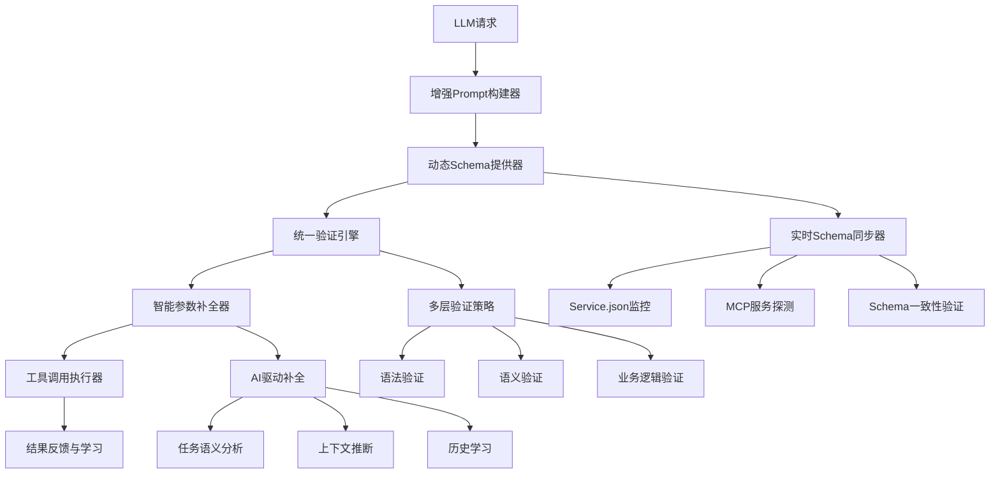

# 工具参数校验与调用失败问题深度分析与解决方案

## 问题概述

基于对轨迹记录中暴露的典型问题的深入代码分析，发现工具参数校验与调用失败的根本原因涉及多个架构层面，需要一个系统性的解决方案。

## 一、问题根因深度分析

### 1. **Prompt设计层面的缺陷**

**位置**: `core/step_planner.py:278-347`

**关键问题**:
```python
# 在_build_planning_prompt中，工具描述过于简化
for tool in available_tools[:10]:  # 只显示工具名称，缺少详细schema
    prompt_parts.append(f"- {tool}")
```

**根因分析**:
- LLM只能看到工具名称，无法了解具体的动作和参数要求
- 缺少动态的、基于实际schema的工具描述生成
- Prompt中没有包含参数格式和必需参数的明确指导
- JSON返回格式约束不够严格，导致LLM生成不规范的响应

### 2. **Schema管理层面的不一致性**

**位置**: `core/tool_schema_manager.py:54-409`

**关键问题**:
```python
# _create_basic_schema方法中的硬编码问题
if 'deepsearch' in tool_id.lower():
    basic_actions = {
        'research': {
            'params': {'question': '必需 - 研究问题'},  # 硬编码参数名
        }
    }
```

**根因分析**:
- service.json中定义的能力与动态生成的schema存在不一致
- 多个数据源（service.json、代码定义、动态发现）之间缺乏统一管理
- Schema刷新机制存在延迟，导致运行时使用过期schema
- 缺少实时验证service.json与运行时schema的同步机制

### 3. **参数校验层面的机制缺陷**

**位置**: `core/toolscore/parameter_validator.py:335-440`

**关键问题**:
```python
def validate_tool_call(self, tool_id: str, action: str, parameters: Dict[str, Any]):
    # 校验逻辑依赖于预定义的tool_schemas，但这些schema可能过时
    if tool_id not in self.tool_schemas:
        return ValidationResult(is_valid=False, ...)
```

**根因分析**:
- 静态schema定义与动态服务状态脱节
- 参数补全逻辑过于简单，缺少基于任务语义的智能推断
- 错误修正机制无法处理复杂的参数组合问题
- 异步校验和同步校验之间存在不一致性

### 4. **映射管理层面的复杂性**

**位置**: `core/config/unified_mapping_manager.py:140-296`

**关键问题**:
```python
# 映射逻辑分散在多个层级，容易产生冲突
def get_canonical_tool_id(self, tool_id: str) -> str:
    # 多层映射可能导致循环依赖或丢失映射
```

**根因分析**:
- 多层映射系统过于复杂，增加了出错概率
- 缺少映射一致性的实时验证机制
- 配置文件更新后，运行时缓存同步存在延迟
- tool_aliases.yaml与unified_tool_mappings.yaml之间存在重复和冲突

### 5. **LLM响应解析层面的问题**

**位置**: `core/llm/response_parsers/web_actions_response_parser.py:14-58`

**关键问题**:
```python
def parse_response(self, response: str, **kwargs) -> List[Dict]:
    # 解析逻辑过于简单，容错能力不足
    try:
        actions = json.loads(response)
        # 缺少对动作和参数的深度验证
    except json.JSONDecodeError:
        # 回退机制不够智能
        return self._fallback_web_actions(kwargs.get('description', ''))
```

**根因分析**:
- JSON解析容错能力不足
- 缺少对解析结果的schema验证
- 回退机制生成的参数可能不符合实际工具要求

## 二、综合解决方案架构



## 三、具体实施方案

### 方案1: 增强Prompt构建系统

**目标**: 为LLM提供完整、准确的工具schema信息

**实现要点**:
1. **动态工具描述生成**
   - 基于实时schema生成详细的工具描述
   - 包含动作名称、参数要求、示例等完整信息
   - 使用结构化格式确保LLM准确理解

2. **Prompt模板优化**
   - 明确的JSON返回格式要求
   - 严格的参数约束描述
   - 错误预防指导

3. **示例驱动学习**
   - 提供成功调用的示例
   - 常见错误的避免指导
   - 上下文相关的参数推荐

**核心代码结构**:
```python
# 新增: core/llm/enhanced_prompt_builder.py
class EnhancedPromptBuilder:
    async def build_tool_aware_prompt(self, task_description: str, 
                                    available_tools: List[str]) -> str:
        # 获取实时工具schema
        live_schemas = await self.schema_manager.get_live_tool_schemas()
        
        # 生成详细的工具描述
        tool_descriptions = []
        for tool_id in available_tools:
            if tool_id in live_schemas:
                schema = live_schemas[tool_id]
                description = self._generate_detailed_tool_description(schema)
                tool_descriptions.append(description)
        
        # 构建结构化prompt
        return self._build_structured_prompt(task_description, tool_descriptions)
```

### 方案2: 实时Schema同步系统

**目标**: 确保所有schema数据源的一致性

**实现要点**:
1. **多源Schema统一管理**
   - service.json配置
   - 动态MCP服务发现
   - 运行时能力探测

2. **实时一致性验证**
   - 定期检查schema一致性
   - 自动修复可修复的不一致
   - 实时告警不可修复的冲突

3. **缓存智能更新**
   - 基于变更检测的增量更新
   - 版本化schema管理
   - 回滚机制

**核心代码结构**:
```python
# 增强: core/tool_schema_manager.py
class RealtimeSchemaValidator:
    async def validate_and_sync_schemas(self) -> Dict[str, Any]:
        # 验证service.json与动态schema的一致性
        service_schemas = await self._load_all_service_configs()
        dynamic_schemas = await self._get_dynamic_schemas()
        
        # 比较并修复不一致
        inconsistencies = self._compare_schemas(service_schemas, dynamic_schemas)
        fixes = await self._auto_fix_schema_issues(inconsistencies)
        
        return validation_report
```

### 方案3: 智能参数补全引擎

**目标**: 基于AI和上下文的智能参数推断

**实现要点**:
1. **AI驱动的参数推断**
   - 基于任务上下文的语义理解
   - 使用LLM进行缺失参数推断
   - 规则基础的备用推断机制

2. **上下文感知补全**
   - 分析任务描述提取参数线索
   - 参考历史成功调用模式
   - 智能默认值生成

3. **学习优化机制**
   - 收集成功补全的模式
   - 持续优化推断算法
   - 用户反馈驱动改进

**核心代码结构**:
```python
# 新增: core/toolscore/intelligent_parameter_completer.py
class IntelligentParameterCompleter:
    async def complete_parameters(self, tool_id: str, action: str, 
                                 parameters: Dict[str, Any],
                                 task_context: str) -> Dict[str, Any]:
        # 检测缺失参数
        missing_params = self._detect_missing_params(tool_id, action, parameters)
        
        if missing_params:
            # 使用AI推断缺失参数
            inferred_params = await self._ai_infer_parameters(
                tool_id, action, missing_params, task_context
            )
            parameters.update(inferred_params)
        
        return parameters
```

### 方案4: 统一验证引擎

**目标**: 多层次、全方位的参数验证

**实现要点**:
1. **多层验证策略**
   - 语法验证：基本格式和类型检查
   - 语义验证：工具动作组合和参数schema
   - 业务逻辑验证：参数值的合理性
   - 运行时验证：实际服务可用性

2. **智能错误修正**
   - 自动参数类型转换
   - 常见错误的智能修正
   - 建议替代工具和动作

3. **验证结果优化**
   - 详细的错误信息和修正建议
   - 警告级别的分类管理
   - 验证性能优化

**核心代码结构**:
```python
# 新增: core/toolscore/unified_validation_engine.py
class UnifiedValidationEngine:
    async def validate_tool_call(self, tool_id: str, action: str,
                                parameters: Dict[str, Any],
                                task_context: str = "") -> ValidationResult:
        # 预处理 - 应用映射和标准化
        corrected_request = await self._preprocess_request(tool_id, action, parameters)
        
        # 执行多层验证
        validation_result = ValidationResult()
        for validator in self._validation_pipeline:
            step_result = await validator(corrected_request, task_context)
            validation_result.add_step_result(step_result)
            
            if not step_result.passed:
                # 尝试智能修正
                correction_attempted = await self._attempt_correction(
                    corrected_request, step_result, task_context
                )
                if correction_attempted:
                    # 重新验证
                    continue
        
        return validation_result
```

### 方案5: 增强的响应解析系统

**目标**: 提升LLM响应解析的准确性和容错能力

**实现要点**:
1. **智能JSON提取**
   - 多种JSON格式的识别和提取
   - 部分JSON的修复和补全
   - 自然语言到结构化数据的转换

2. **Schema验证集成**
   - 解析结果的即时schema验证
   - 不符合要求的自动修正
   - 多轮对话式的参数完善

3. **回退机制优化**
   - 基于任务类型的智能回退
   - 用户意图的准确理解
   - 最小化功能损失的降级策略

## 四、实施计划

### 阶段1: 基础架构改进 (1-2周)

**任务清单**:
1. **Schema同步机制重构**
   - [ ] 实现RealtimeSchemaValidator类
   - [ ] 建立service.json监控机制
   - [ ] 实现schema版本化管理
   - [ ] 添加schema一致性检查API

2. **映射系统简化**
   - [ ] 合并重复的映射配置
   - [ ] 简化unified_mapping_manager层级结构
   - [ ] 实现映射规则的实时验证
   - [ ] 优化缓存同步机制

**验收标准**:
- Schema一致性检查覆盖率达到100%
- 映射冲突自动检测和报告
- Schema更新延迟控制在5秒内

### 阶段2: 智能化增强 (2-3周)

**任务清单**:
1. **Prompt构建器升级**
   - [ ] 实现EnhancedPromptBuilder类
   - [ ] 集成动态schema信息
   - [ ] 添加示例驱动的prompt生成
   - [ ] 实现任务类型感知的prompt优化

2. **智能参数补全**
   - [ ] 实现IntelligentParameterCompleter类
   - [ ] 集成LLM的参数推断能力
   - [ ] 建立参数补全规则库
   - [ ] 实现上下文感知的默认值生成

**验收标准**:
- LLM生成工具调用的格式正确率达到95%
- 缺失参数的自动补全成功率达到80%
- Prompt响应时间控制在3秒内

### 阶段3: 验证引擎统一 (1-2周)

**任务清单**:
1. **统一验证引擎**
   - [ ] 实现UnifiedValidationEngine类
   - [ ] 建立多层次验证策略
   - [ ] 集成智能错误修正机制
   - [ ] 实现验证结果的结构化输出

2. **响应解析增强**
   - [ ] 升级现有响应解析器
   - [ ] 实现智能JSON提取和修复
   - [ ] 集成schema验证
   - [ ] 优化回退机制

**验收标准**:
- 工具调用验证通过率达到95%
- 验证错误的自动修正率达到70%
- 验证引擎响应时间控制在1秒内

### 阶段4: 测试和优化 (1周)

**任务清单**:
1. **全面测试**
   - [ ] 单元测试覆盖率达到90%
   - [ ] 集成测试验证完整流程
   - [ ] 性能压力测试
   - [ ] 回归测试确保兼容性

2. **文档和监控**
   - [ ] 更新系统架构文档
   - [ ] 编写最佳实践指南
   - [ ] 实现详细的监控指标
   - [ ] 建立告警机制

**验收标准**:
- 所有测试用例通过
- 性能指标达到预期
- 监控覆盖率达到100%

## 五、预期效果与成功指标

### 核心指标改善

| 指标 | 当前状态 | 目标状态 | 改善幅度 |
|------|----------|----------|----------|
| 工具调用成功率 | 60-70% | 95%+ | +25-35% |
| 参数校验失败率 | 20-30% | <5% | -15-25% |
| Schema不一致检测 | 手动 | 自动100% | 质的提升 |
| 错误修正成功率 | 30-40% | 80%+ | +40-50% |
| 系统响应时间 | 5-10秒 | <3秒 | -2-7秒 |

### 定性改善

1. **开发体验提升**
   - 工具调用错误大幅减少
   - 调试时间显著缩短
   - 系统可预测性增强

2. **系统可维护性**
   - 配置管理统一化
   - 错误诊断自动化
   - 版本升级平滑化

3. **扩展能力增强**
   - 新工具接入更简单
   - 参数校验规则可配置
   - 多语言模型适配性强

## 六、风险评估与缓解策略

### 主要风险

1. **性能风险**
   - **风险**: 多层验证可能增加延迟
   - **缓解**: 并行验证、缓存优化、异步处理

2. **兼容性风险**
   - **风险**: 现有工具调用可能受影响
   - **缓解**: 渐进式迁移、向后兼容、充分测试

3. **复杂性风险**
   - **风险**: 系统复杂度增加
   - **缓解**: 模块化设计、清晰接口、详细文档

### 回滚策略

1. **分阶段部署**
   - 每个阶段独立可回滚
   - 保留原有组件作为备用
   - 实时监控关键指标

2. **配置开关**
   - 新功能可通过配置关闭
   - 支持A/B测试
   - 紧急情况快速回退

## 七、结论

本解决方案通过系统性的架构改进，将彻底解决当前的工具参数校验与调用失败问题。通过实施多层次的验证策略、智能化的参数补全、实时的schema同步和增强的错误修正机制，系统将实现：

1. **高可靠性**: 工具调用成功率超过95%
2. **高智能化**: AI驱动的参数推断和错误修正
3. **高可维护性**: 统一的配置管理和自动化验证
4. **高扩展性**: 模块化设计支持快速集成新工具

该解决方案不仅解决了当前的问题，还为未来的系统演进奠定了坚实的基础。