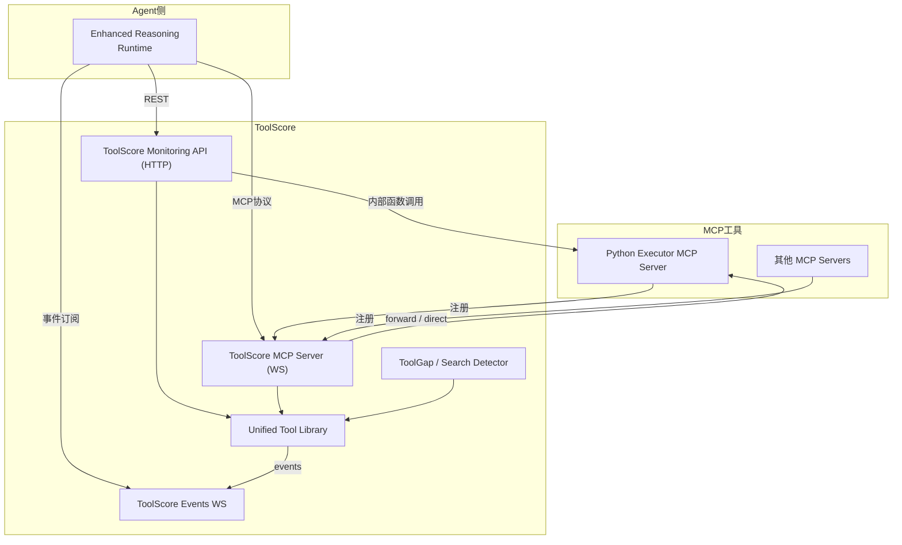

# 系统组件关系与交互

> 本文档总结 **Enhanced Reasoning Runtime、ToolScore、各类 MCP Server** 之间的职责划分与调用路径，并给出 WebSocket 转发的设计考量。

---

## 1. 角色与职责

| 组件 | 主要职责 | 关键文件 |
|------|----------|----------|
| **Enhanced Reasoning Runtime** | 解析自然语言任务、调用 LLM 生成代码、决定使用哪些工具 | `runtimes/reasoning/enhanced_runtime.py` |
| **ToolScore Monitoring API (HTTP)** | 对外 REST 接口：列工具、执行工具、动态安装、健康监控 | `core/toolscore/monitoring_api.py` |
| **ToolScore Events WebSocket** | 向 Runtime 推送 `tool_installed / tool_updated` 事件 | `core/toolscore/monitoring_api.py#websocket_tools_events` |
| **ToolScore MCP Server (WS)** | 统一接收 `register_tool / execute_tool / list_tools` 等原生 MCP 请求并路由 | `core/toolscore/mcp_server.py` |
| **Unified Tool Library** | 保存所有工具规范、转发执行、提供工具描述 | `core/toolscore/unified_tool_library.py` |
| **Search Detector** |
&nbsp;&nbsp;• `ToolGapDetector`：判断是否缺工具  
&nbsp;&nbsp;• `MCPSearchTool`：搜索并安装新 MCP Server | `core/toolscore/tool_gap_detector.py`, `core/toolscore/mcp_search_tool.py` |
| **Python Executor MCP Server** | 沙箱执行 Python 代码，注册为 `python-executor-mcp-server` | `mcp_servers/python_executor_server/main.py` |
| **其它 MCP Server** | 第三方或动态安装的功能服务器 | `mcp_servers/*` |

---

## 2. 交互总览

### 通信通道

1. **HTTP REST**  
   Runtime 使用 `ToolScoreClient` 发送 `/list_tools / execute_tool` 等请求。
2. **WebSocket Events**  
   Runtime 用 `RealTimeToolClient` 订阅 `/api/v1/events/tools`，实时得知新工具安装。
3. **MCP WebSocket**  
   标准协议连接，ToolScore MCP Server 同时负责转发到各下级 MCP Server。

---

## 3. 工具执行链路

1. Runtime 发现要执行 `python_execute` → 调用 `ToolScore HTTP /execute_tool`。
2. Monitoring API 判断 **是否特殊内嵌工具**：
   * 若 `tool_id == python-executor-mcp-server` 且同进程 ➜ **直接函数调用**，免网络开销。
   * 否则 ➜ 调用 Unified Tool Library → 再由 MCP Server forward 到对应 MCP Server。
3. MCP Server 收到执行请求，若目标为 `ToolType.MCP_SERVER`：
   * 先看是否能"本进程直调" (Python Executor 同进程的加速分支)。
   * 否则启动到远端 WebSocket，发送 `execute_tool_action` 并等待结果。

---

## 4. WebSocket 转发的必要性分析

### 场景 A：单进程 / 内嵌执行（开发 & 小规模）
- **做法**：所有组件（Runtime、ToolScore、Python Executor）运行在同一 Python 进程，通过直接函数调用完成工具执行。  
- **优点**：
  1. 省去网络序列化，最快路径。  
  2. 本地调试简单，无端口冲突。
- **缺点**：
  1. 失去"工具即服务"的隔离；一次异常可能带崩整个系统。  
  2. 无法按需横向扩容；所有任务共享同一 GIL / 进程资源。  
  3. Security：执行用户代码（Python Executor）与核心逻辑同进程，风险放大。

### 场景 B：多进程 / WebSocket 转发（生产 & 弹性伸缩）
- **做法**：Runtime 与 ToolScore 在主进程；各 MCP Server 独立进程 / 容器；ToolScore MCP Server 通过 WebSocket 转发。
- **优点**：
  1. 模块隔离，Python Executor 崩溃不会影响 Runtime。  
  2. 可按服务类型弹性扩容，支撑高并发。  
  3. 网络协议 & 语言无关，容纳其它语言的 MCP Server。  
  4. 安全沙箱：高危执行放到受限容器。
- **缺点**：
  1. 需维护端口与连接，部署稍复杂。  
  2. 有网络序列化与 RTT 开销（通常 <1-2 ms 局域网内）。

### 结论（工程师建议）
| 规模 | 建议模式 |
|------|----------|
| **本地开发 / 单用户测试** | 直接函数调用即可，保留 WebSocket 模块但走"快捷分支"。 |
| **小型部署 (≤ 5 并发)** | 可全部同进程运行，但建议至少将 **Python Executor** 拆分为独立进程，降低执行风险。 |
| **生产环境 / 多并发 / 多工具** | 采用 WebSocket 转发 + 独立 MCP Server，获得隔离、可扩展性与语言无关的优势。 |

> 系统现有实现已支持"两条路径"：
> 1. **直接调用**（`monitoring_api.py` & `mcp_server.py` 中对 `python-executor-mcp-server` 的特殊分支）。
> 2. **WebSocket 转发**（常规 MCP Tool）。
> 因此您可以通过环境变量或部署方式灵活切换。

---

## 5. 后续可做的优化
1. 在 `config/ports_config.yaml` 增加开关 `use_inprocess_python_executor: true/false`，统一切换两种模式。  
2. 若转发路径固定在本地，可用 Unix Domain Socket 替代 TCP，降低复制开销。  
3. 引入 `asyncio.TaskGroup` 把 Python Executor 作为子任务运行，避免额外端口，同时仍保持协程隔离。

---

*最后更新：{{DATE}}* 