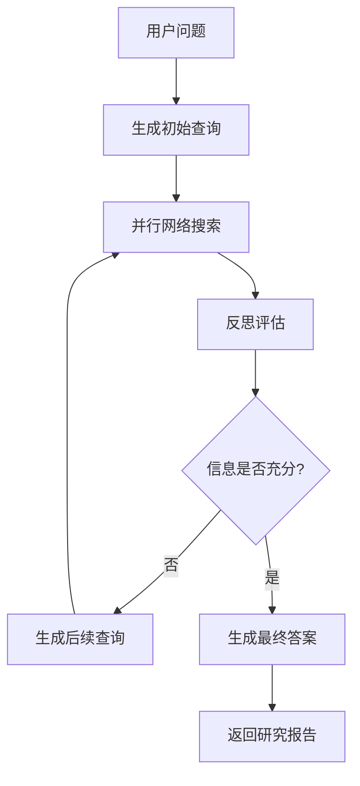

# Deep Research Module

基于 Gemini DeepResearch 的智能搜索研究模块，为 Reasoning Runtime 提供强大的深度研究能力。

## 概述

Deep Research 模块集成了 Google Gemini 的搜索能力和 LangGraph 的工作流管理，能够：

- 🔍 **智能查询生成** - 自动从用户问题生成多角度搜索查询
- 🌐 **网络搜索研究** - 使用 Google Search API 进行深度网络搜索
- 🤔 **反思评估** - 智能评估信息充分性，识别知识缺口
- 📊 **迭代优化** - 根据反思结果生成后续查询，持续完善研究
- 📝 **综合报告** - 生成结构化的最终研究报告

## 架构设计

```
deep_research/
├── __init__.py          # 模块导出
├── config.py           # 配置管理
├── graph.py            # LangGraph 实现
├── state.py            # 状态定义
├── nodes.py            # 节点实现
├── prompts.py          # 提示词管理
├── utils.py            # 工具函数
└── README.md           # 本文档
```

### 核心组件

1. **DeepResearchGraph** - 主要的 LangGraph 实现
2. **ResearchNodes** - 研究流程的各个节点
3. **StateManagement** - 状态管理和数据流
4. **PromptTemplates** - 智能提示词模板
5. **UtilityFunctions** - 辅助工具函数

## 使用方法

### 基本使用

```python
from deep_research import create_research_graph

# 创建研究图
graph = create_research_graph()

# 执行研究
result = await graph.ainvoke({
    "messages": [{"type": "human", "content": "人工智能的最新发展趋势"}]
})

print(result["final_answer"])
```

### 通过工具调用

```python
from tools.deep_research_tool import deep_research_tool

# 执行深度研究
result = await deep_research_tool.execute(
    query="人工智能的最新发展趋势",
    config={
        "initial_search_query_count": 3,
        "max_research_loops": 2
    }
)

print(result["final_answer"])
```

### 配置选项

```python
config = {
    "initial_search_query_count": 3,    # 初始查询数量
    "max_research_loops": 3,            # 最大研究循环
    "reasoning_model": "gemini-2.0-flash-exp",  # 推理模型
    "query_generator_model": "gemini-2.0-flash-exp"  # 查询生成模型
}
```

## 工作流程



### 详细步骤

1. **查询生成 (generate_query)**
   - 分析用户问题
   - 生成多角度搜索查询
   - 优化查询质量

2. **网络搜索 (web_research)**
   - 并行执行搜索查询
   - 提取关键信息
   - 收集引用源

3. **反思评估 (reflection)**
   - 评估信息充分性
   - 识别知识缺口
   - 生成后续查询建议

4. **最终答案 (finalize_answer)**
   - 综合所有研究结果
   - 生成结构化报告
   - 添加引用链接

## 环境变量

确保设置以下环境变量：

```bash
GEMINI_API_KEY=your_gemini_api_key
GEMINI_API_URL=optional_custom_url
DEBUG=false
LOG_LEVEL=INFO
```

## 配置模板

### 开发环境
```python
config = ConfigTemplates.development()
# - 2个初始查询，2个循环
# - 启用调试模式
```

### 生产环境
```python
config = ConfigTemplates.production()
# - 3个初始查询，3个循环
# - 优化性能设置
```

### 高质量研究
```python
config = ConfigTemplates.high_quality()
# - 5个初始查询，5个循环
# - 启用所有质量增强功能
```

### 快速模式
```python
config = ConfigTemplates.fast()
# - 1个初始查询，1个循环
# - 最小延迟设置
```

## API 接口

### DeepResearchTool.execute()

执行深度研究的主要接口。

**参数:**
- `query: str` - 研究查询问题
- `config: Dict[str, Any]` - 可选配置

**返回:**
```python
{
    "success": bool,
    "final_answer": str,
    "messages": List[Dict],
    "sources_gathered": List[Dict],
    "web_research_result": List[str],
    "search_query": List[str],
    "metadata": Dict
}
```

### 错误处理

模块包含完善的错误处理机制：

- **API 错误** - Gemini API 调用失败
- **网络错误** - 搜索服务不可用
- **配置错误** - 参数验证失败
- **超时错误** - 请求超时处理

## 性能优化

1. **并行搜索** - 多个查询同时执行
2. **智能缓存** - 避免重复搜索
3. **结果去重** - 自动去除重复内容
4. **资源管理** - 合理控制 API 调用频率

## 扩展功能

### 自定义节点

```python
async def custom_node(state, config):
    # 自定义节点逻辑
    return {"custom_result": "value"}

# 添加到图中
builder.add_node("custom_node", custom_node)
```

### 自定义提示词

```python
from prompts import PromptManager

prompt_manager = PromptManager(language="en")
custom_prompt = prompt_manager.get_search_prompt(query)
```

## 监控和日志

模块提供详细的日志记录：

```python
import logging
logging.getLogger("deep_research").setLevel(logging.DEBUG)
```

关键日志事件：
- 研究开始/结束
- 查询生成
- 搜索执行
- 反思评估
- 错误和异常

## 故障排除

### 常见问题

1. **API Key 错误**
   ```
   ValueError: GEMINI_API_KEY 环境变量未设置
   ```
   解决：设置正确的 GEMINI_API_KEY

2. **网络连接问题**
   ```
   搜索失败: 网络连接超时
   ```
   解决：检查网络连接，调整超时设置

3. **配置验证失败**
   ```
   ValueError: initial_search_query_count 必须在 1-10 之间
   ```
   解决：使用有效的配置参数

### 调试技巧

1. 启用调试模式：`DEBUG=true`
2. 调整日志级别：`LOG_LEVEL=DEBUG`
3. 使用开发配置：`ConfigTemplates.development()`
4. 检查网络连接和 API 密钥

## 版本历史

- **v1.0.0** - 初始版本，集成基础 DeepResearch 功能
- 支持多轮搜索和反思评估
- 完整的错误处理和日志记录
- 灵活的配置管理

## 贡献指南

欢迎提交 PR 和 Issue！请遵循以下规范：

1. 代码风格符合 PEP 8
2. 添加适当的类型注解
3. 包含测试用例
4. 更新相关文档

## 许可证

本模块遵循项目主许可证。